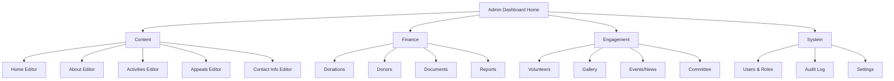

# Information Architecture
## Sai Yadadri Seva Ashram — Website & Donation Platform

| | |
|---|---|
| **Document Version** | 1.0 |
| **Phase** | 2 — Enterprise System Design & UI/UX |
| **Status** | Draft for Client Approval |
| **Date** | 2026-08-03 |
| **Source of Truth** | `documentation/` (Phase 1, unmodified) |

---

## 1. Purpose
Defines how content and functionality are organized, labeled, and related across the platform, so a first-time visitor (mobile, low digital-literacy, English **or** Telugu) can find what they need in ≤ 3 taps/clicks, and a donor can go from "curious visitor" to "completed donation" without confusion. This IA governs [02-Sitemap.md](02-Sitemap.md) and [05-Wireframes.md](05-Wireframes.md).

## 2. IA Principles for This Project

1. **Donate is always one tap away.** Every top-level page carries a persistent "Donate Now" affordance (header CTA + contextual in-page CTAs) — not buried in a menu.
2. **Trust before transaction.** Information architecture surfaces credibility signals (registration number, committee, transparency reports) at the same navigational depth as the donation flow, not hidden deeper.
3. **Program-first donation entry.** Donors think in terms of *what they're supporting* (Annaprasadam, Goshala, Building Fund) before *how much* — category selection precedes amount selection everywhere.
4. **Bilingual parity, not bilingual afterthought.** Every IA node exists identically in English and Telugu; language is a toggle on the same information architecture, not two separate site structures.
5. **Admin IA mirrors public IA.** Each admin content-management module maps 1:1 to the public section it manages (per [09-Admin-Modules.md](../documentation/09-Admin-Modules.md)), so non-technical admins never have to guess "where do I edit that?"

## 3. Content Inventory & Classification

| Content Type | Volatility | Owner | Public IA Node |
|---|---|---|---|
| Hero/Welcome messaging | Low (changes rarely) | Content Admin | Home |
| Impact stats | Medium (updated periodically) | Content Admin | Home |
| History / Vision-Mission / Founder / Committee | Low | Content Admin | About Us |
| Program descriptions (Annaprasadam, Goshala, etc.) | Low | Content Admin | Activities |
| Donation categories & pricing | Medium | Finance Admin / Super Admin | Donations |
| Events | High (frequent) | Content Admin | Events & News |
| News/Blog posts | High | Content Admin | Events & News |
| Gallery media | High | Content Admin | Gallery |
| Volunteer/Internship postings | Medium | Volunteer Coordinator | Volunteer |
| Reports/Compliance documents | Low (annual cadence) | Finance Admin / Super Admin | Reports & Transparency |
| Appeals (Building Fund, etc.) | Medium | Content Admin | Appeals & Current Needs |
| Contact details | Low | Super Admin | Contact Us |
| Donor recognition lists | Medium | Finance Admin | Donor Corner |

## 4. Top-Level Navigation Model

Primary navigation (header, both languages) — **7 items**, chosen to stay within the classic "7±2" cognitive-load guideline while keeping Donate maximally prominent:

1. Home
2. About Us
3. Activities
4. **Donate** *(visually emphasized — button style, not a text link)*
5. Gallery
6. Events & News
7. Get Involved *(groups Volunteer Registration + Contact Us in a dropdown — see §5)*

Secondary/footer navigation carries the remaining long-tail items: Donor Corner, Reports & Transparency, Appeals & Current Needs, Privacy Policy, Terms of Use, Social links.

> **Rationale for grouping "Get Involved":** Volunteer Registration and Contact Us are both *engagement* actions distinct from *giving money* — grouping them keeps the primary nav from exceeding 7 items while the Requirements doc's full module list ([PROJECT_CONTEXT.md §7](../docs/PROJECT_CONTEXT.md)) is still fully reachable within 2 clicks.

## 5. Full Site IA Tree

```mermaid
flowchart TD
    Root["🏠 Home"]

    Root --> About["About Us"]
    About --> A1["History"]
    About --> A2["Vision & Mission"]
    About --> A3["Founder"]
    About --> A4["Committee (2025–2028)"]
    About --> A5["Treasurer's Message"]
    About --> A6["Registration / PAN / 12A-80G"]

    Root --> Activities["Activities"]
    Activities --> Ac1["Vanaprasthasramam (Old Age Home)"]
    Activities --> Ac2["Wellness Centre / Infrastructure"]
    Activities --> Ac3["Annaprasadam"]
    Activities --> Ac4["Goshala / Goseva"]
    Activities --> Ac5["Daily Sevas"]
    Activities --> Ac6["Medical Camps"]
    Activities --> Ac7["Education / Vidya Daanam"]

    Root --> Donate["Donate (Primary CTA)"]
    Donate --> D1["Donation Categories"]
    Donate --> D2["Checkout"]
    Donate --> D3["Bank Transfer / UPI Details"]
    Donate --> D4["Confirmation / Receipt"]
    Donate --> D5["My Donations (returning donor)"]

    Root --> Gallery["Gallery"]
    Gallery --> G1["Photo Albums"]
    Gallery --> G2["Video Gallery"]

    Root --> Events["Events & News"]
    Events --> E1["Upcoming Events"]
    Events --> E2["Past Events"]
    Events --> E3["News / Blog"]

    Root --> Involved["Get Involved"]
    Involved --> I1["Volunteer Registration"]
    Involved --> I2["Internship Application"]
    Involved --> I3["Contact Us"]

    Root --> Footer["Footer-Level Pages"]
    Footer --> F1["Donor Corner"]
    Footer --> F2["Reports & Transparency"]
    Footer --> F3["Appeals & Current Needs"]
    Footer --> F4["Privacy Policy"]
    Footer --> F5["Terms of Use"]
```

## 6. Admin Information Architecture

Mirrors [09-Admin-Modules.md](../documentation/09-Admin-Modules.md) directly:

Admin nav is grouped by **job function** (Content / Finance / Engagement / System) rather than a flat 14-item list — directly supporting NFR-USE-02 (non-technical usability) from [04-Non-Functional-Requirements.md](../documentation/04-Non-Functional-Requirements.md), since each committee role in [10-Roles-and-Permissions.md](../documentation/10-Roles-and-Permissions.md) naturally lands in one group (Finance Admin → Finance; Content Admin → Content/Engagement; Volunteer Coordinator → Engagement/Volunteers).

## 7. Labeling System

| Requirement Term (Phase 1) | Public-Facing Label (EN) | Public-Facing Label (TE, transliteration guide) |
|---|---|---|
| Donation Categories | "Ways to Give" (page intro) / "Donate" (nav) | దానం చేయండి |
| Old Age Home | "Vanaprasthasramam" (kept as proper noun, glossed on first use) | వానప్రస్థాశ్రమం |
| Goshala/Goseva | "Goshala" / "Cow Care" | గోశాల |
| Volunteer & Internship | "Get Involved" (nav) → "Volunteer / Intern" (page) | సేవకు రండి |
| Reports & Transparency | "Transparency & Reports" | పారదర్శకత & నివేదికలు |

> **Note:** Telugu labels above are directional glosses for IA planning only — final translated copy must be reviewed by a native Telugu speaker/professional translator per the open dependency in [16-Assumptions-and-Dependencies.md](../documentation/16-Assumptions-and-Dependencies.md) (D-17). Not to be shipped verbatim without linguistic QA.

## 8. Findability Rules

- **Search is not required for MVP** (content volume is small — ≤ ~20 top-level pages plus events/gallery/news collections) — reinforced by the "Could Have" priority on FR-EVT-04 in [03-Functional-Requirements.md](../documentation/03-Functional-Requirements.md). Breadcrumbs + clear nav suffice.
- **Breadcrumbs** shown on all interior pages (Activity detail, Event/News detail, Gallery album) to reinforce location within the IA — critical for the "low digital-literacy" persona.
- **Every donation category detail** (within Activities) links directly into the Donate flow with the category pre-selected — collapsing IA depth for the single most important conversion path (see UC-01 in [06-Use-Cases.md](../documentation/06-Use-Cases.md)).

## 9. IA Validation Checklist

- [ ] Every module in [07-System-Modules.md](../documentation/07-System-Modules.md) has exactly one home in this IA tree.
- [ ] No IA node is more than 2 clicks from Home.
- [ ] "Donate" is reachable from every page (persistent header CTA), independent of the IA tree depth.
- [ ] Admin IA groupings map cleanly to the role groupings in [10-Roles-and-Permissions.md](../documentation/10-Roles-and-Permissions.md).

---
**Related Documents:** [02-Sitemap.md](02-Sitemap.md) · [03-User-Flows.md](03-User-Flows.md) · [05-Wireframes.md](05-Wireframes.md) · [../documentation/07-System-Modules.md](../documentation/07-System-Modules.md) · [SYSTEM_DESIGN.md](SYSTEM_DESIGN.md)
