# Sitemap
## Sai Yadadri Seva Ashram — Website & Donation Platform

| | |
|---|---|
| **Document Version** | 1.0 |
| **Phase** | 2 — Enterprise System Design & UI/UX |
| **Status** | Draft for Client Approval |
| **Date** | 2026-08-03 |

---

## 1. Purpose
Translates the Information Architecture ([01-Information-Architecture.md](01-Information-Architecture.md)) into concrete, SEO-friendly URLs for both public and admin surfaces, with bilingual routing strategy. Feeds directly into [11-SEO-Structure.md](11-SEO-Structure.md) and the Frontend Architect's routing implementation.

## 2. URL / Locale Strategy

**Pattern chosen: locale-prefixed path routing** — `/{locale}/{path}`, e.g. `/en/donate`, `/te/donate`.

| Option Considered | Verdict |
|---|---|
| Subdomain (`en.sysaindia.org`) | Rejected — unnecessary DNS/SSL complexity for two locales |
| Query param (`?lang=te`) | Rejected — poor SEO (not a distinct crawlable URL per Google guidance), breaks hreflang cleanliness |
| **Path prefix (`/en/...`, `/te/...`)** | **Selected** — clean hreflang mapping (FR-LANG, FR-SEO-04), works natively with Next.js i18n routing (per [11-Technology-Stack.md](../documentation/11-Technology-Stack.md)) |

Default locale: **English** (`/en/...`), with root `/` redirecting to `/en/` based on `Accept-Language` header on first visit, then persisted via cookie (per FR-LANG-01).

## 3. Public Sitemap

| Page | English URL | Telugu URL | Priority (SEO) | Change Frequency |
|---|---|---|---|---|
| Home | `/en/` | `/te/` | 1.0 | Weekly |
| About Us | `/en/about` | `/te/about` | 0.9 | Monthly |
| Activities (index) | `/en/activities` | `/te/activities` | 0.9 | Monthly |
| — Vanaprasthasramam | `/en/activities/old-age-home` | `/te/activities/old-age-home` | 0.8 | Monthly |
| — Wellness Centre | `/en/activities/wellness-centre` | `/te/activities/wellness-centre` | 0.6 | Monthly |
| — Annaprasadam | `/en/activities/annaprasadam` | `/te/activities/annaprasadam` | 0.9 | Monthly |
| — Goshala | `/en/activities/goshala` | `/te/activities/goshala` | 0.9 | Monthly |
| — Daily Sevas | `/en/activities/daily-sevas` | `/te/activities/daily-sevas` | 0.5 | Monthly |
| — Medical Camps | `/en/activities/medical-support` | `/te/activities/medical-support` | 0.7 | Monthly |
| — Education | `/en/activities/education` | `/te/activities/education` | 0.7 | Monthly |
| Donation Categories | `/en/donate` | `/te/donate` | 1.0 | Weekly |
| Donation Checkout | `/en/donate/checkout` | `/te/donate/checkout` | *noindex* | — |
| Donation Confirmation | `/en/donate/thank-you` | `/te/donate/thank-you` | *noindex* | — |
| My Donations | `/en/donate/history` | `/te/donate/history` | *noindex* (auth-gated) | — |
| Donor Corner | `/en/donors` | `/te/donors` | 0.6 | Monthly |
| Gallery | `/en/gallery` | `/te/gallery` | 0.7 | Weekly |
| Gallery Album detail | `/en/gallery/{album-slug}` | `/te/gallery/{album-slug}` | 0.5 | Monthly |
| Events & News (index) | `/en/news` | `/te/news` | 0.8 | Weekly |
| Event/News detail | `/en/news/{slug}` | `/te/news/{slug}` | 0.6 | On publish |
| Volunteer Registration | `/en/volunteer` | `/te/volunteer` | 0.8 | Monthly |
| Reports & Transparency | `/en/transparency` | `/te/transparency` | 0.8 | Quarterly |
| Appeals & Current Needs | `/en/appeals` | `/te/appeals` | 0.9 | Weekly |
| Appeal detail | `/en/appeals/{slug}` | `/te/appeals/{slug}` | 0.7 | Weekly |
| Contact Us | `/en/contact` | `/te/contact` | 0.7 | Monthly |
| Privacy Policy | `/en/privacy-policy` | `/te/privacy-policy` | 0.2 | Rarely |
| Terms of Use | `/en/terms` | `/te/terms` | 0.2 | Rarely |
| 404 Not Found | `/en/404` | `/te/404` | *noindex* | — |

## 4. Admin Sitemap (not publicly indexed — entire `/admin/*` tree is `noindex, nofollow` + robots-disallowed)

| Screen | URL |
|---|---|
| Login | `/admin/login` |
| Dashboard Home | `/admin/dashboard` |
| Content → Home Editor | `/admin/content/home` |
| Content → About Editor | `/admin/content/about` |
| Content → Activities Editor | `/admin/content/activities` |
| Content → Appeals Editor | `/admin/content/appeals` |
| Content → Contact Info | `/admin/content/contact` |
| Finance → Donations | `/admin/donations` |
| Finance → Donation Detail | `/admin/donations/{id}` |
| Finance → Add Manual Donation | `/admin/donations/new` |
| Finance → Donors | `/admin/donors` |
| Finance → Documents | `/admin/documents` |
| Finance → Reports | `/admin/reports` |
| Engagement → Volunteers | `/admin/volunteers` |
| Engagement → Gallery | `/admin/gallery` |
| Engagement → Events/News | `/admin/events` |
| Engagement → Committee | `/admin/committee` |
| System → Users & Roles | `/admin/users` |
| System → Audit Log | `/admin/audit-log` |
| System → Settings | `/admin/settings` |

## 5. Sitemap Diagram (Public)

```mermaid
flowchart TD
    Home["/{locale}/"] --> About["/about"]
    Home --> Activities["/activities"]
    Activities --> OldAge["/activities/old-age-home"]
    Activities --> Wellness["/activities/wellness-centre"]
    Activities --> Anna["/activities/annaprasadam"]
    Activities --> Goshala["/activities/goshala"]
    Activities --> Sevas["/activities/daily-sevas"]
    Activities --> Medical["/activities/medical-support"]
    Activities --> Edu["/activities/education"]
    Home --> Donate["/donate"]
    Donate --> Checkout["/donate/checkout"]
    Checkout --> Thanks["/donate/thank-you"]
    Donate --> History["/donate/history (auth)"]
    Home --> Donors["/donors"]
    Home --> Gallery["/gallery"]
    Gallery --> Album["/gallery/{slug}"]
    Home --> News["/news"]
    News --> NewsDetail["/news/{slug}"]
    Home --> Volunteer["/volunteer"]
    Home --> Transparency["/transparency"]
    Home --> Appeals["/appeals"]
    Appeals --> AppealDetail["/appeals/{slug}"]
    Home --> Contact["/contact"]
    Home --> Privacy["/privacy-policy"]
    Home --> Terms["/terms"]
```

## 6. XML Sitemap Generation Rules (for FR-SEO-02)

- Auto-generated `sitemap.xml` includes all `priority ≥ 0.5` pages from §3, both locales, with `<xhtml:link rel="alternate" hreflang="...">` pairing each EN/TE URL pair.
- Excludes: checkout, confirmation, donation history, admin routes, 404.
- Regenerated on every content publish event (event/news/appeal/gallery publish) — not just on deploy.
- `robots.txt` disallows `/admin/`, `/*/donate/checkout`, `/*/donate/history`, and API routes (`/api/`).

## 7. Redirect & Legacy URL Considerations

Per the open dependency in [16-Assumptions-and-Dependencies.md](../documentation/16-Assumptions-and-Dependencies.md) (A-01, D-02), if this project replaces the existing `sysaindia.org`:

- Existing indexed URLs (currently unknown structure — pending domain/hosting access) must be mapped to new equivalents with 301 redirects to preserve any existing search ranking/backlinks.
- This mapping cannot be finalized until DNS/hosting access is confirmed by the client — tracked as a Phase 9 (Go-Live) pre-requisite in [14-Project-Timeline.md](../documentation/14-Project-Timeline.md).

---
**Related Documents:** [01-Information-Architecture.md](01-Information-Architecture.md) · [11-SEO-Structure.md](11-SEO-Structure.md) · [../documentation/07-System-Modules.md](../documentation/07-System-Modules.md) · [SYSTEM_DESIGN.md](SYSTEM_DESIGN.md)
