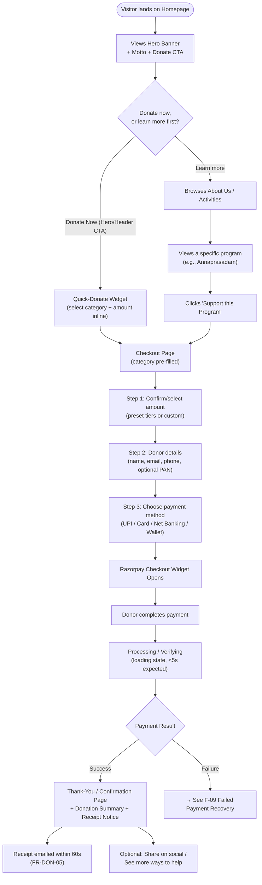
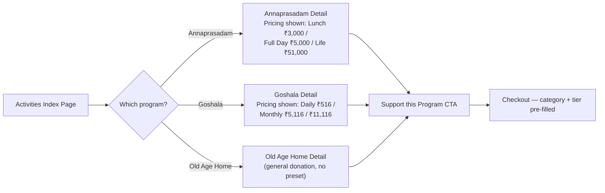
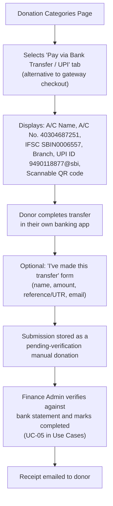
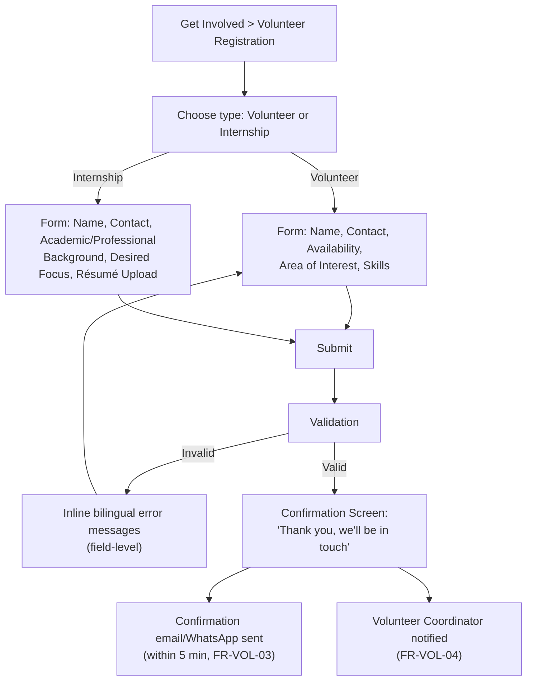
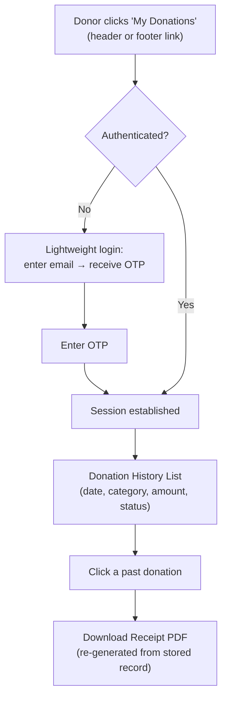
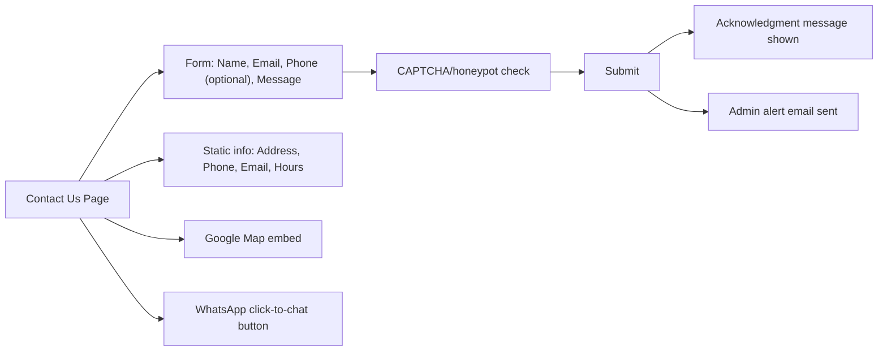
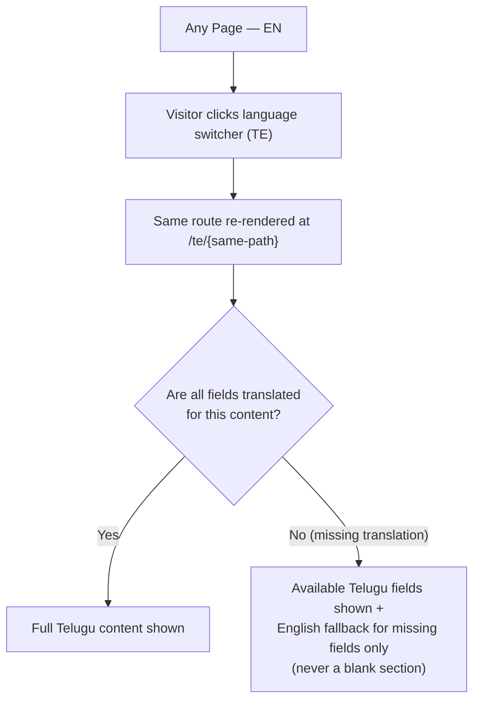
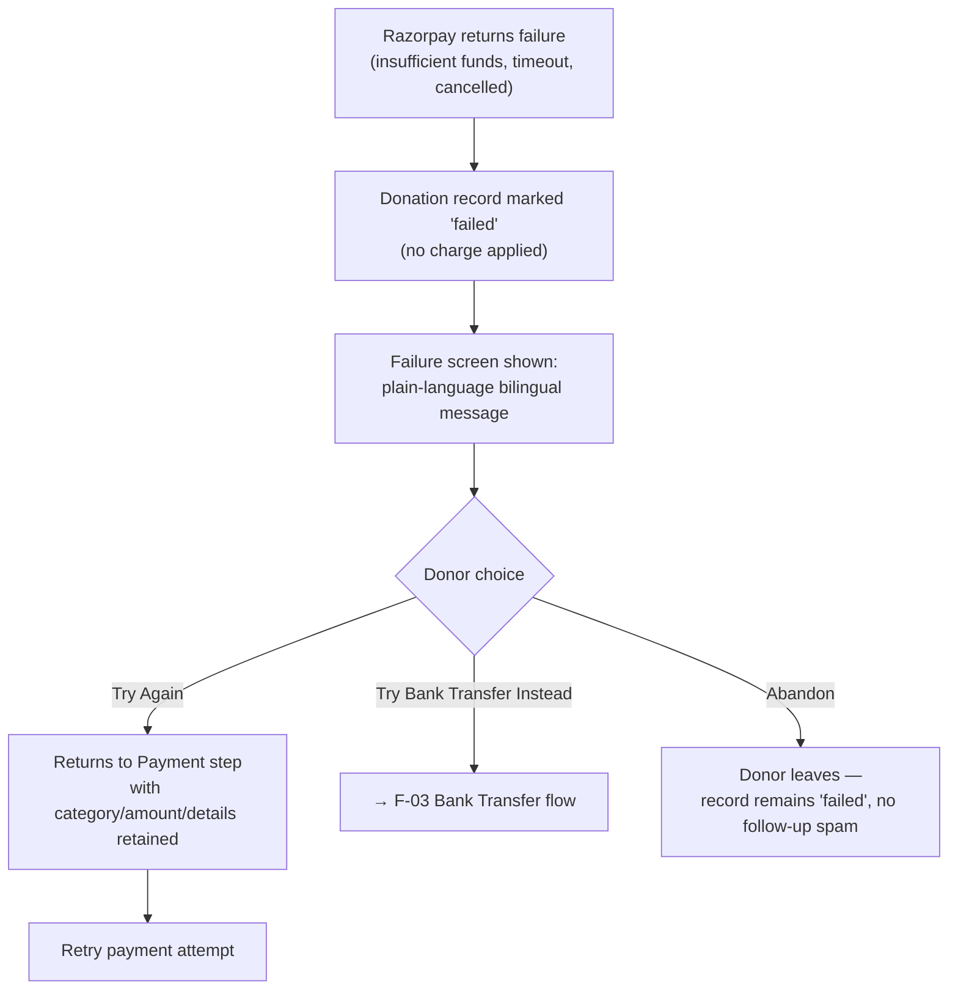

# User Flows
## Sai Yadadri Seva Ashram — Website & Donation Platform

| | |
|---|---|
| **Document Version** | 1.0 |
| **Phase** | 2 — Enterprise System Design & UI/UX |
| **Status** | Draft for Client Approval |
| **Date** | 2026-08-03 |
| **Traceability** | Elaborates [06-Use-Cases.md](../documentation/06-Use-Cases.md) into concrete UI-level flows |

---

## 1. Purpose
Maps every primary public user journey through actual screens/states, for use by the UI/UX Designer and Frontend Architect. Complements the actor/system-level Use Cases in Phase 1 with screen-by-screen UX detail.

## 2. Flow Index

| Flow | Priority |
|---|---|
| F-01 Homepage → Donation Success | Critical |
| F-02 Program Discovery → Category-Specific Donation | Critical |
| F-03 Bank Transfer / UPI Manual Donation | High |
| F-04 Volunteer Registration | High |
| F-05 Internship Application | Medium |
| F-06 Returning Donor — View History & Re-download Receipt | Medium |
| F-07 Contact Us | Medium |
| F-08 Language Switch (cross-cutting) | Critical |
| F-09 Failed Payment Recovery | Critical |

---

## 3. F-01: Homepage → Donation Success (Golden Path)

This is the single most important flow on the platform — the complete journey requested explicitly by the client ("Complete user journey from homepage to donation success").

### Screen-by-screen breakdown

| Step | Screen | Key UI Elements | Exit Criteria |
|---|---|---|---|
| 1 | Homepage | Hero, Quick-Donate widget, Impact stats, Testimonials, Upcoming events | Donor clicks any Donate CTA |
| 2 | Donation Categories (`/donate`) | Category cards (Annaprasadam, Goshala, Old Age Home, Building Fund, General) each with description + preset tiers | Donor selects a category |
| 3 | Checkout — Amount (`/donate/checkout`) | Preset amount chips (₹3,000/₹5,000/₹51,000 for Annaprasadam etc., per verified pricing in [PROJECT_CONTEXT.md §5](../docs/PROJECT_CONTEXT.md)) + custom amount field | Amount selected/entered, "Continue" enabled |
| 4 | Checkout — Donor Details | Name*, Email*, Phone*, PAN (optional, tooltip explains 80G use once available) | All required fields valid |
| 5 | Checkout — Payment | Razorpay Checkout (UPI/Card/NetBanking/Wallet tabs) | Payment attempted |
| 6a | Success — Thank You (`/donate/thank-you`) | Confirmation message, donation ID, amount, category, "Receipt sent to your email", social share, related programs | Donor may exit or explore further |
| 6b | Failure | See F-09 | — |

**Design mandate:** this entire flow (Step 2 → Step 6) must complete in **≤ 4 user-initiated steps** per NFR-USE-03 in [04-Non-Functional-Requirements.md](../documentation/04-Non-Functional-Requirements.md).

---

## 4. F-02: Program Discovery → Category-Specific Donation

This flow guarantees a donor who arrives via a specific program page never has to re-select the category — directly implementing FR-ACT-08 from [03-Functional-Requirements.md](../documentation/03-Functional-Requirements.md).

---

## 5. F-03: Bank Transfer / UPI Manual Donation

This flow exists because bank-transfer/UPI-QR is a currently-trusted, already-used donation method for this Ashram (printed on the brochure) — the platform must not force gateway usage (FR-DON-04).

---

## 6. F-04: Volunteer Registration

---

## 7. F-05: Internship Application
Shares the same flow shape as F-04 (see C2 branch above), differentiated by academic-background fields and résumé upload (PDF/DOC/DOCX, size-limited per SEC-DATA-04 in [12-Security-Requirements.md](../documentation/12-Security-Requirements.md)).

---

## 8. F-06: Returning Donor — View History & Re-download Receipt

---

## 9. F-07: Contact Us

---

## 10. F-08: Language Switch (Cross-Cutting)

This flow directly implements the fallback-with-warning behavior specified in FR-HOME-02/FR-LANG-02 of [03-Functional-Requirements.md](../documentation/03-Functional-Requirements.md) — the admin sees a warning when saving, the **public visitor never sees a broken/empty page**.

---

## 11. F-09: Failed Payment Recovery

**Design mandate:** no donor ever loses their entered details (amount, category, personal info) due to a failed payment — this is a hard UX requirement tied to NFR-USE-04 and FR-DON-10.

---

## 12. Flow-to-Requirement Traceability

| Flow | Use Cases | Functional Requirements |
|---|---|---|
| F-01, F-02 | UC-01 | FR-DON-01…03, FR-DON-09, FR-ACT-08 |
| F-03 | UC-01 (Alt), UC-05 | FR-DON-04 |
| F-04, F-05 | UC-02 | FR-VOL-01…04 |
| F-06 | UC-01 (related) | FR-DON-07 |
| F-07 | UC-07 | FR-CON-01 |
| F-08 | — | FR-LANG-01…03 |
| F-09 | UC-01 (Alt Flow 8a/9a) | FR-DON-10 |

---
**Related Documents:** [01-Information-Architecture.md](01-Information-Architecture.md) · [05-Wireframes.md](05-Wireframes.md) · [../documentation/06-Use-Cases.md](../documentation/06-Use-Cases.md) · [SYSTEM_DESIGN.md](SYSTEM_DESIGN.md)
