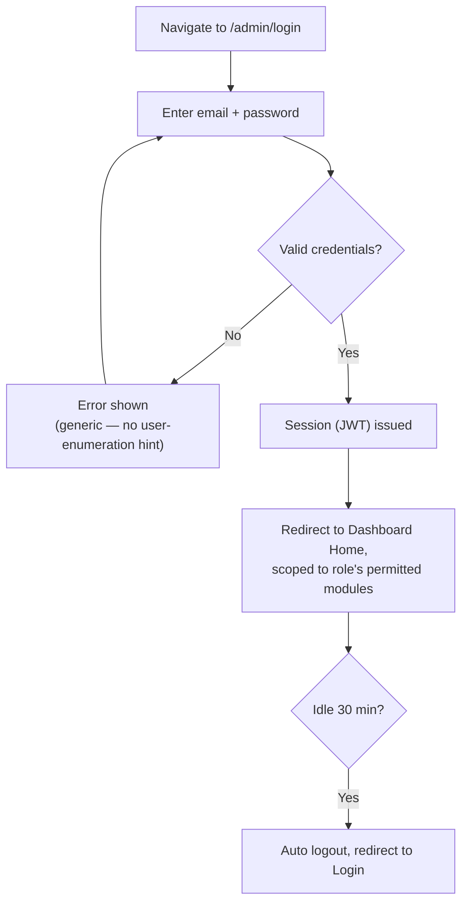
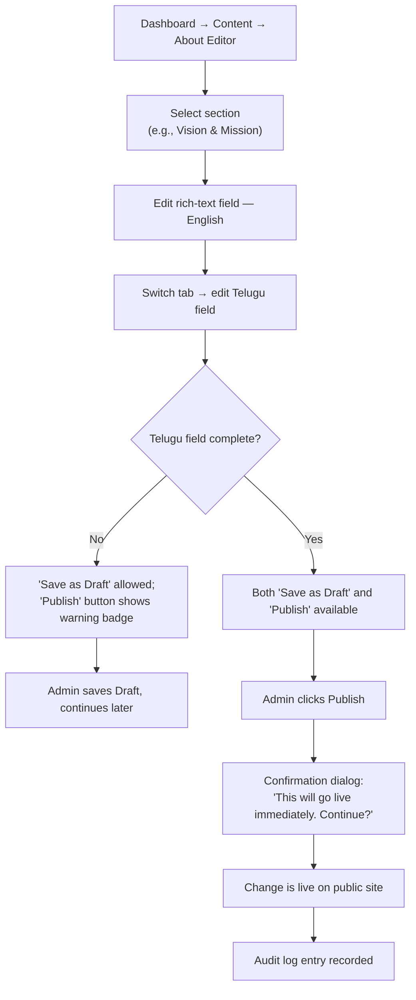
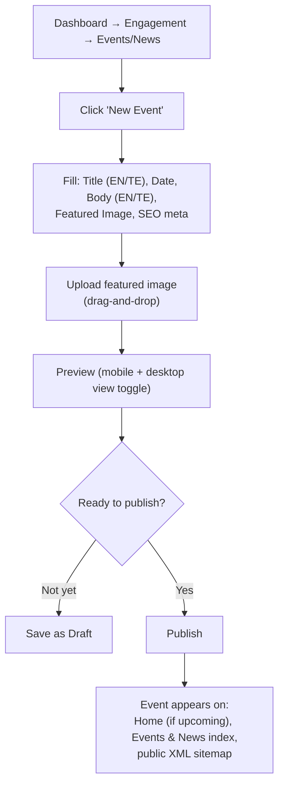
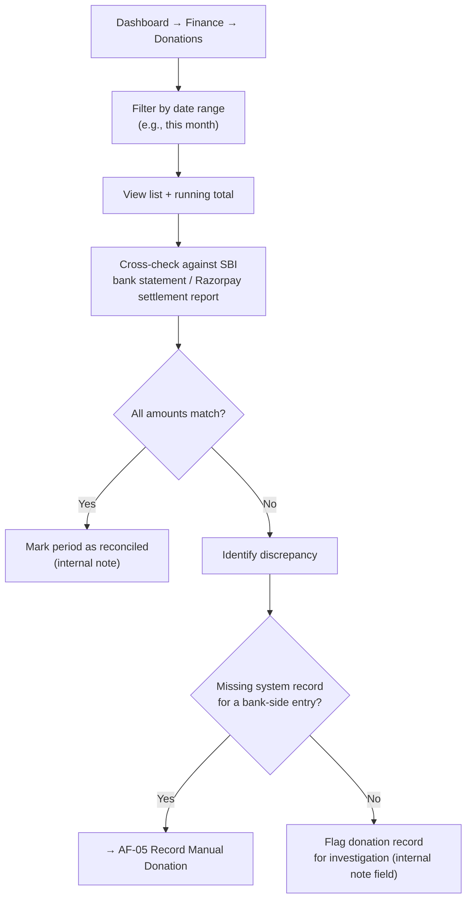
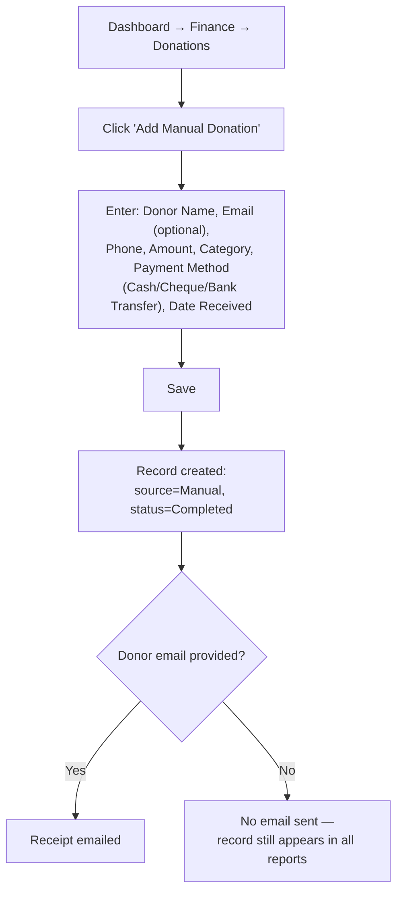
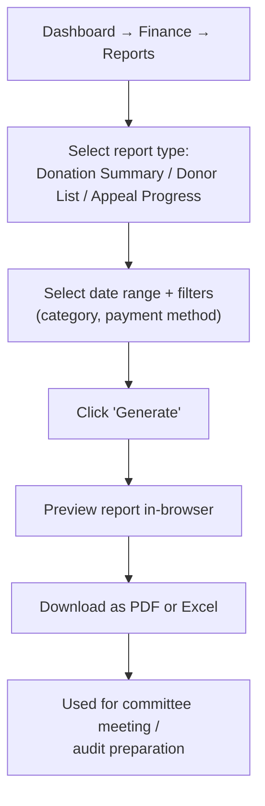
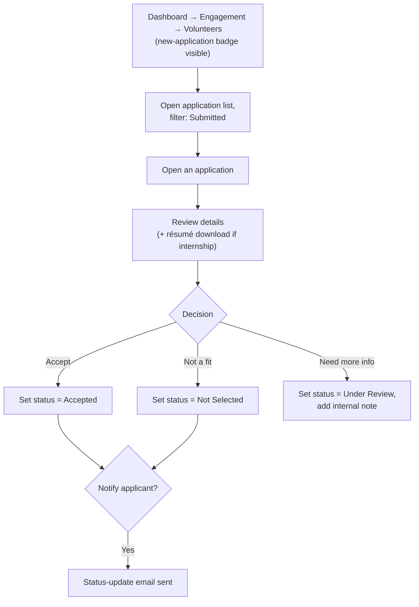
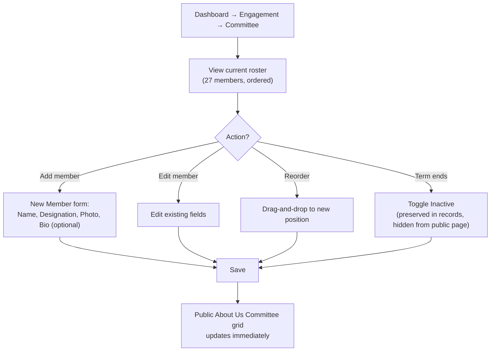
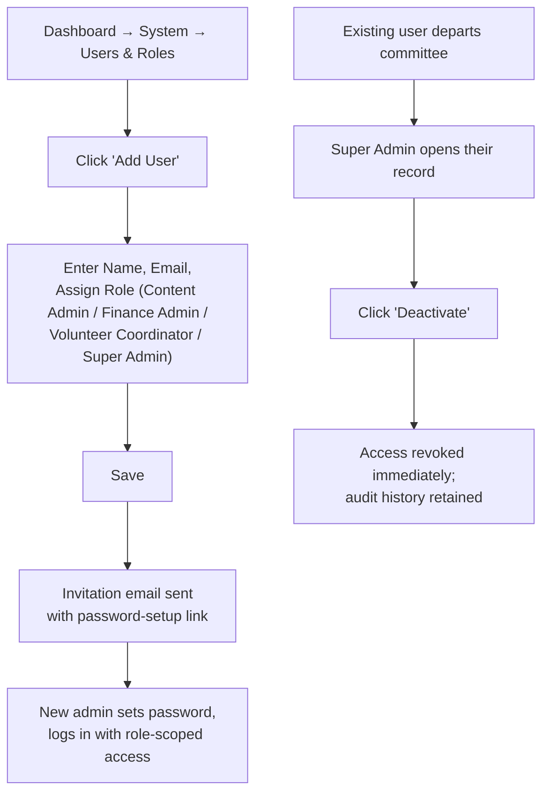
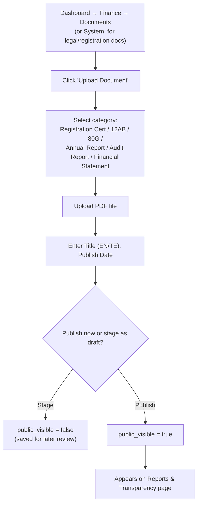

# Admin Flows
## Sai Yadadri Seva Ashram — Website & Donation Platform

| | |
|---|---|
| **Document Version** | 1.0 |
| **Phase** | 2 — Enterprise System Design & UI/UX |
| **Status** | Draft for Client Approval |
| **Date** | 2026-08-03 |
| **Traceability** | Elaborates [09-Admin-Modules.md](../documentation/09-Admin-Modules.md) and [06-Use-Cases.md](../documentation/06-Use-Cases.md) into screen-level admin flows |

---

## 1. Purpose
Details the operational workflows non-technical Ashram staff will follow inside the Admin Dashboard. Designed around the constraint that primary admins are **retired professionals with low-to-medium technical proficiency** ([02-SRS.md §2.3](../documentation/02-SRS.md)) — every flow favors clarity and confirmation steps over speed/power-user shortcuts.

## 2. Flow Index

| Flow | Primary Role |
|---|---|
| AF-01 Admin Login & Session | All admin roles |
| AF-02 Publish a Content Update | Content Admin |
| AF-03 Create & Publish an Event | Content Admin |
| AF-04 Reconcile Donations | Finance Admin |
| AF-05 Record a Manual/Offline Donation | Finance Admin |
| AF-06 Generate a Financial Report | Finance Admin |
| AF-07 Review a Volunteer Application | Volunteer Coordinator |
| AF-08 Manage Committee Roster | Content Admin |
| AF-09 Create/Edit an Admin User | Super Admin |
| AF-10 Upload a Compliance Document | Finance Admin / Super Admin |

---

## 3. AF-01: Admin Login & Session

Forgot-password sub-flow: Login screen → "Forgot Password" → enter email → reset link emailed → set new password (token expires in 30 min, per SEC-AUTH-05).

---

## 4. AF-02: Publish a Content Update (e.g., editing the Vision & Mission section)

This flow is the concrete UI implementation of UC-03 in [06-Use-Cases.md](../documentation/06-Use-Cases.md) and the missing-translation gate in FR-LANG-02.

---

## 5. AF-03: Create & Publish an Event

---

## 6. AF-04: Reconcile Donations (Finance Admin)

This is the UI-level detail behind UC-04 in [06-Use-Cases.md](../documentation/06-Use-Cases.md).

---

## 7. AF-05: Record a Manual/Offline Donation

---

## 8. AF-06: Generate a Financial Report

---

## 9. AF-07: Review a Volunteer Application

---

## 10. AF-08: Manage Committee Roster

**Data note:** initial roster load populates from the verified 27-member table (`COMMITTEE MEMBERS LIST.docx`) rather than the incomplete 25-member brochure subset, per [DOCUMENT_ANALYSIS.md](../docs/DOCUMENT_ANALYSIS.md).

---

## 11. AF-09: Create/Edit an Admin User (Super Admin only)

---

## 12. AF-10: Upload a Compliance Document

This flow supports the phased arrival of compliance documents from the client (see [16-Assumptions-and-Dependencies.md](../documentation/16-Assumptions-and-Dependencies.md)) without blocking launch.

---

## 13. Cross-Cutting Admin UX Rules

1. **Every destructive or "goes live publicly" action requires an explicit confirmation dialog** (Publish, Deactivate User, Delete Gallery Item) — never a silent one-click action.
2. **Every sensitive action is audit-logged transparently** — Super Admin can always answer "who changed this and when" without needing developer help (AF-11 implied: Dashboard → System → Audit Log, simple read-only filtered table).
3. **No admin screen requires understanding of underlying technical terms** (no "slug," "webhook," or "API" language exposed in the UI — these are developer-facing concepts confined to [13-API-Requirements.md](../documentation/13-API-Requirements.md) and never surfaced to committee users).
4. **Mobile/tablet usability for admin is a Should Have, not dismissed** — committee members may only have a tablet at home; critical flows (AF-04 Reconcile, AF-07 Review Volunteer) must remain usable at ≥768px width even though the primary admin design target is desktop (see [08-Responsive-Design.md](08-Responsive-Design.md)).

---
**Related Documents:** [09-Admin-Modules.md](../documentation/09-Admin-Modules.md) · [10-Roles-and-Permissions.md](../documentation/10-Roles-and-Permissions.md) · [05-Wireframes.md](05-Wireframes.md) · [SYSTEM_DESIGN.md](SYSTEM_DESIGN.md)
