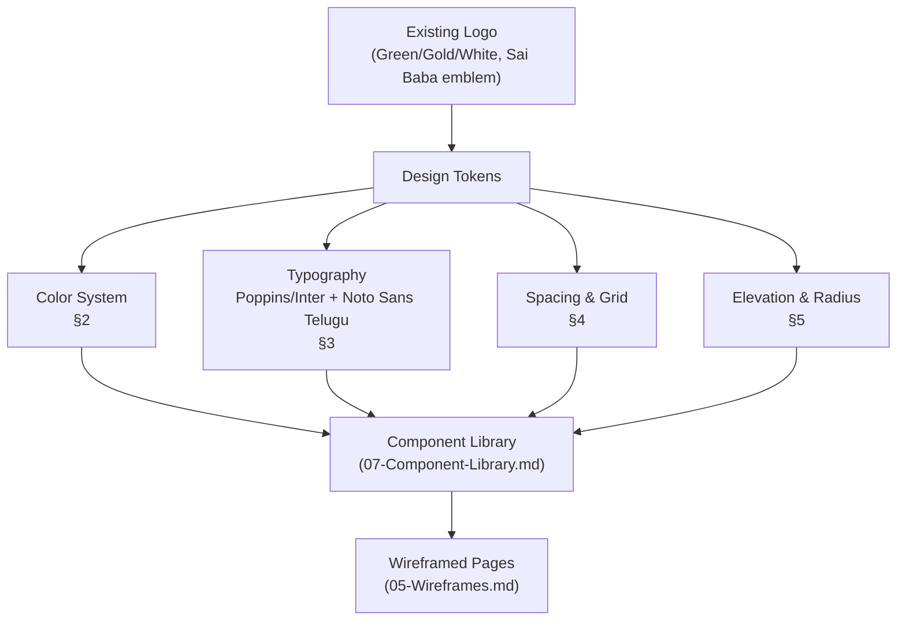

# Design System
## Sai Yadadri Seva Ashram — Website & Donation Platform

| | |
|---|---|
| **Document Version** | 1.0 |
| **Phase** | 2 — Enterprise System Design & UI/UX |
| **Status** | Draft for Client Approval |
| **Date** | 2026-08-03 |
| **Goal** | A premium, trustworthy NGO/donation-platform visual language, derived from the Ashram's existing brand (logo) and comparable to world-class charity sites (e.g., charity: water, Akshaya Patra, Save the Children) — warm, credible, donation-forward, never "generic template." |

---

## 1. Brand Foundation

Source: the Ashram's existing logo (`docs/LOGO final-1.pdf` → rendered `_logo_page1.png`) — a circular emblem with a green temple/Sai Baba silhouette on a green field, a yellow/gold outer ring, and a white background field. This design system extends that existing palette into a full digital system rather than introducing an unrelated new brand.

## 2. Color System

### 2.1 Primary Palette

| Token | Hex | Usage |
|---|---|---|
| `color-primary-green-900` | `#0F3D25` | Headers, high-emphasis text on light bg |
| `color-primary-green-700` | `#1B6B3F` | Primary buttons, links, active nav state |
| `color-primary-green-500` | `#2E9B5C` | Hover states, secondary emphasis |
| `color-primary-green-100` | `#E3F5EA` | Subtle section backgrounds, success-adjacent tints |
| `color-accent-gold-700` | `#B8860B` | Secondary accents, badges, dividers echoing the logo's yellow ring |
| `color-accent-gold-500` | `#D4A017` | Highlight/icon accents |
| `color-accent-gold-100` | `#FBF3DC` | Warm section backgrounds (e.g., pricing tier cards) |

### 2.2 Neutral Palette

| Token | Hex | Usage |
|---|---|---|
| `color-neutral-white` | `#FFFFFF` | Base background |
| `color-neutral-50` | `#F7F8F6` | Alternate section background |
| `color-neutral-200` | `#E2E5E1` | Borders, dividers |
| `color-neutral-500` | `#6B7269` | Secondary text |
| `color-neutral-900` | `#1A1D1A` | Primary body text |

### 2.3 Semantic Colors

| Token | Hex | Usage |
|---|---|---|
| `color-success` | `#1B6B3F` (= primary green 700) | Donation success, confirmation states |
| `color-warning` | `#B8860B` (= accent gold 700) | "Coming Soon" / pending-content badges |
| `color-error` | `#C23B3B` | Payment failure, form validation errors |
| `color-info` | `#2E6B9E` | Informational banners (e.g., trust/security notices) |

### 2.4 Accessibility Verification

All text/background combinations above meet **WCAG 2.1 AA contrast (≥ 4.5:1 for body text, ≥ 3:1 for large text/UI components)**, verified per NFR-ACC-03 in [04-Non-Functional-Requirements.md](../documentation/04-Non-Functional-Requirements.md) — full audit performed in [10-Accessibility.md](10-Accessibility.md).

### 2.5 Color Usage Principle

> **Green = trust and action. Gold = warmth and generosity. White space = credibility.**
> Avoid the "busy NGO brochure" look (the print brochure itself uses dense floral borders and saturated yellow backgrounds appropriate for print, not for a premium digital product). The digital system **desaturates and modernizes** the same palette — generous white space, restrained gold as an accent rather than a background fill, matching the calm, trustworthy tone of world-class charity websites.

## 3. Typography

### 3.1 Font Families

| Role | Latin (English) | Telugu | Rationale |
|---|---|---|---|
| Headings | **Poppins** (Semibold/Bold) | **Noto Sans Telugu** (Bold) | Poppins gives a warm, modern, rounded-geometric feel appropriate for an NGO (not corporate-cold); Noto Sans Telugu is Google's purpose-built, highly legible Telugu web font with full Unicode coverage — satisfies NFR-LOC-01/NFR-ACC requirements |
| Body | **Inter** (Regular/Medium) | **Noto Sans Telugu** (Regular) | Inter is a highly legible UI/body font at small sizes, pairs cleanly with Poppins |
| Numerals/Currency | Inter (tabular figures) | — | Ensures ₹ amounts align cleanly in tables/reports |

Both language stacks load as `font-display: swap` web fonts (self-hosted or Google Fonts) — never system-default fallback for headings, to preserve brand consistency; body text degrades gracefully to system sans-serif stacks if fonts fail to load (performance-safe fallback per NFR-PERF).

### 3.2 Type Scale (mobile-first; desktop scale in parentheses where it differs)

| Token | Size (mobile / desktop) | Line Height | Usage |
|---|---|---|---|
| `text-display` | 32px / 48px | 1.15 | Hero H1 |
| `text-h1` | 28px / 36px | 1.2 | Page titles |
| `text-h2` | 22px / 28px | 1.25 | Section headers |
| `text-h3` | 18px / 22px | 1.3 | Card titles |
| `text-body-lg` | 17px / 18px | 1.6 | Lead paragraphs |
| `text-body` | 15px / 16px | 1.6 | Standard body |
| `text-small` | 13px / 14px | 1.5 | Captions, metadata |
| `text-button` | 15px / 16px | 1 | Button labels |

**Telugu-specific adjustment:** Telugu script requires ~10–15% more vertical line-height than Latin at the same point size due to conjunct consonants and vowel marks — all `line-height` tokens above increase by 0.1–0.15 automatically when `lang="te"` is active (implemented via a CSS `:lang(te)` override, not a separate type scale).

## 4. Spacing & Layout Grid

### 4.1 Spacing Scale (4px base unit)

| Token | Value |
|---|---|
| `space-1` | 4px |
| `space-2` | 8px |
| `space-3` | 12px |
| `space-4` | 16px |
| `space-6` | 24px |
| `space-8` | 32px |
| `space-12` | 48px |
| `space-16` | 64px |
| `space-24` | 96px |

### 4.2 Grid System

| Breakpoint | Columns | Gutter | Margin |
|---|---|---|---|
| Mobile (≤480px) | 4 | 16px | 16px |
| Tablet (481–1024px) | 8 | 20px | 32px |
| Desktop (>1024px) | 12 | 24px | 64px (max content width 1280px, centered) |

Full responsive behavior detailed in [08-Responsive-Design.md](08-Responsive-Design.md).

## 5. Elevation & Radius

| Token | Value | Usage |
|---|---|---|
| `radius-sm` | 6px | Inputs, chips |
| `radius-md` | 12px | Cards |
| `radius-lg` | 20px | Modals, hero image containers |
| `radius-full` | 999px | Pills, avatar/photo crops, buttons |
| `shadow-sm` | `0 1px 3px rgba(15,61,37,0.08)` | Card resting state |
| `shadow-md` | `0 4px 12px rgba(15,61,37,0.12)` | Card hover, dropdown menus |
| `shadow-lg` | `0 12px 32px rgba(15,61,37,0.16)` | Modals, Razorpay checkout container |

## 6. Iconography & Imagery

- **Icon set**: Outline-style, 2px stroke, rounded caps (e.g., Phosphor Icons or Lucide) — consistent weight across the whole product, matching the rounded warmth of Poppins headings.
- **Photography style**: Real Ashram photography (from brochure/gallery) prioritized over stock imagery wherever available — authenticity is a trust signal for a donation platform. Where stock imagery is unavoidable (placeholder states pending client media, per [16-Assumptions-and-Dependencies.md](../documentation/16-Assumptions-and-Dependencies.md) D-10), use warm, editorial-style elderly-care/community imagery, never generic corporate stock.
- **Image treatment**: subtle warm-toned overlay gradient (`color-primary-green-900` at 20–40% opacity) on hero images to ensure white text legibility — consistent, on-brand, not a generic dark scrim.

## 7. Motion & Tone

Full specification in [09-Animation-Specifications.md](09-Animation-Specifications.md). Brand tone in one line: **calm, dignified, generous — never flashy, urgent-red, or guilt-driven.** Donation CTAs use the primary green (trust/action), not alarm-red, consistent with the organization's dignity-centered mission (elder care, not crisis fundraising).

## 8. Design System Governance

| Rule | Rationale |
|---|---|
| No new colors introduced outside the tokens in §2 without updating this document | Prevents visual drift as the CMS-driven site is extended over time |
| All bilingual pages use the same design tokens — spacing/color are language-agnostic; only typography and line-height adapt | Keeps EN/TE visually consistent (brand parity) |
| Component states (hover/focus/active/disabled) always defined together, never added ad hoc per screen | See [07-Component-Library.md](07-Component-Library.md) |

## 9. Design System Summary Diagram

---
**Related Documents:** [07-Component-Library.md](07-Component-Library.md) · [08-Responsive-Design.md](08-Responsive-Design.md) · [09-Animation-Specifications.md](09-Animation-Specifications.md) · [10-Accessibility.md](10-Accessibility.md) · [SYSTEM_DESIGN.md](SYSTEM_DESIGN.md)
