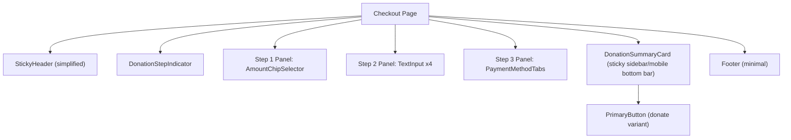

# Component Library
## Sai Yadadri Seva Ashram — Website & Donation Platform

| | |
|---|---|
| **Document Version** | 1.0 |
| **Phase** | 2 — Enterprise System Design & UI/UX |
| **Status** | Draft for Client Approval |
| **Date** | 2026-08-03 |
| **Scope** | Reusable UI component catalog — specification only (no code), for implementation by the Frontend Architect against the tokens in [06-Design-System.md](06-Design-System.md) |

---

## 1. Purpose
Defines every reusable component referenced across [05-Wireframes.md](05-Wireframes.md), with variants, states, and content rules, so the component set is built once and composed consistently rather than redesigned per page.

## 2. Component Inventory

| Category | Components |
|---|---|
| Navigation | StickyHeader, MobileMenuDrawer, LanguageSwitcher, Breadcrumb, Footer, WhatsAppFAB |
| Marketing/Content | HeroBanner, StatCard, TestimonialCarousel, ActivityCard, EventCard, GalleryGridItem, Lightbox, ProgressBar, Accordion, TrustBadge |
| Donation-Specific | QuickDonateWidget, DonationCategoryCard, AmountChipSelector, DonationStepIndicator, PaymentMethodTabs, DonationSummaryCard, ReceiptCard |
| Forms | TextInput, TextArea, Select, FileUpload, Checkbox, RadioGroup, FormFieldError, CaptchaWidget |
| Feedback | Toast, Modal/Dialog, ConfirmationDialog, Skeleton Loader, EmptyState, ErrorState, Badge |
| Admin-Specific | AdminSidebarNav, KPITile, DataTable, FilterBar, RichTextEditor, ImageUploadZone, StatusPill, AuditLogRow, RoleBadge |
| Buttons | PrimaryButton, SecondaryButton, TextLink, IconButton |

## 3. Core Components — Detailed Spec

### 3.1 PrimaryButton
- **Variants**: `default`, `donate` (uses `color-primary-green-700` bg, elevated shadow, slightly larger touch target — visually distinct as the platform's most important action), `full-width` (mobile forms)
- **States**: default, hover (`green-500`), active/pressed, focus-visible (2px outline `color-accent-gold-500`), disabled (40% opacity, no pointer events), loading (inline spinner replaces label)
- **Min touch target**: 44×44px (mobile accessibility)
- **Content rule**: label is always a verb phrase ("Donate Now", "Submit Application"), never a bare noun

### 3.2 StickyHeader
- **Composition**: Logo (links home) · Primary nav (7 items per [01-Information-Architecture.md §4](01-Information-Architecture.md)) · LanguageSwitcher · Donate button (always `donate` variant of PrimaryButton) · Hamburger icon (mobile, ≤1024px)
- **Behavior**: becomes elevated (`shadow-sm`) after 8px scroll; collapses to MobileMenuDrawer below tablet breakpoint; Donate button remains visible even when nav collapses into hamburger (never hidden inside the drawer)

### 3.3 LanguageSwitcher
- **Variant**: Two-state toggle pill, "EN | తె"
- **Behavior**: preserves current route (maps `/en/x` ⇄ `/te/x`); persists choice via cookie; on pages with a missing-translation fallback, shows a small info icon tooltip ("Some content shown in English") rather than failing silently

### 3.4 HeroBanner
- **Composition**: Background image/video, gradient overlay, H1 (`text-display`), subtext, 1 primary + 1 secondary CTA slot
- **Variants**: `homepage` (full-bleed, 70vh mobile / 80vh desktop), `interior-page` (compact, 30vh, used on About/Activities/etc. page-title banners)

### 3.5 QuickDonateWidget
- **Composition**: Category selector (5 chips) → AmountChipSelector (context-swaps per category) → PrimaryButton (`donate` variant)
- **States**: default, category-selected, amount-selected (button enables), validation error (custom amount below minimum, e.g. < ₹50)
- **Placement**: Homepage (card, elevated `shadow-md`), and reusable inline on any Activity detail page pre-filled to that program's category

### 3.6 DonationCategoryCard
- **Composition**: Icon/photo, category name, 1-line description, preset price range or "Any amount," "Give" link
- **Used in**: Donation Categories page grid, Home Activities Preview

### 3.7 AmountChipSelector
- **Composition**: Row of preset amount chips (e.g., ₹3,000 / ₹5,000 / ₹51,000 for Annaprasadam) + a "Custom Amount" chip that reveals a numeric input
- **Validation**: minimum donation amount enforced (recommend ₹50 floor to keep gateway fees proportionate — confirm with client during Phase 3 build), numeric-only input, ₹ prefix always visible

### 3.8 DonationStepIndicator
- **Composition**: 3-step horizontal tracker ("Amount → Details → Payment") desktop; condensed to a progress bar + step label on mobile
- **State**: current step highlighted `color-primary-green-700`, completed steps show checkmark, future steps muted

### 3.9 PaymentMethodTabs
- Thin wrapper around the embedded Razorpay Checkout widget — tabs for UPI / Card / Net Banking / Wallet are provided by Razorpay's own UI; this component defines the **surrounding container** (card, shadow-lg, trust badges: "Secured by Razorpay," SSL lock icon) per SEC-PAY guidance in [12-Security-Requirements.md](../documentation/12-Security-Requirements.md)

### 3.10 ProgressBar
- **Composition**: Track + filled bar + numeric label ("₹X raised of ₹2.25 Cr goal")
- **Used in**: Appeals & Current Needs (Building Fund), Home Current Appeal Banner
- **Accessibility**: exposes `role="progressbar"` with `aria-valuenow/min/max` (see [10-Accessibility.md](10-Accessibility.md))

### 3.11 EventCard / ActivityCard
- **Composition**: Image, category tag, title, date (events only), excerpt, "Read More"/"Support"/"Learn More" link
- **Variant**: `horizontal` (list view), `vertical` (grid view)

### 3.12 TestimonialCarousel
- **Composition**: Quote text, attribution (name/role or "Beneficiary Family"), auto-advance every 6s, pause on hover/focus, swipe-enabled on mobile
- **Empty state**: entire section unmounts (no placeholder shown) if zero published testimonials — per FR-HOME-05

### 3.13 TrustBadge
- **Variants**: `registered-ngo` (Regd. No. 423/2019), `secure-payment` (Razorpay/SSL), `tax-exempt` (12A/80G — rendered only once certified content is available)

### 3.14 EmptyState / "Coming Soon" Component
- **Composition**: Icon, message ("This section is being updated"), optional "Check back soon" subtext
- **Design principle**: never a broken layout, blank white box, or lorem-ipsum-style placeholder — always an intentional, on-brand empty state, per the content-gap handling defined throughout [03-Functional-Requirements.md](../documentation/03-Functional-Requirements.md)

## 4. Form Components

| Component | Key Behavior |
|---|---|
| TextInput | Floating label pattern; inline validation on blur; error state shows `color-error` border + message below field |
| FileUpload | Drag-and-drop + click-to-browse; shows file name/size once selected; enforces type/size allow-list client-side (mirrors SEC-DATA-04 server-side enforcement) |
| CaptchaWidget | Honeypot field (invisible to humans) as first line of defense; visible CAPTCHA challenge only if honeypot triggers repeated bot-like submissions (progressive friction, not default-shown on every form load) |

## 5. Admin Components

### 5.1 DataTable
- **Composition**: Column headers (sortable), filter bar slot above, row actions (view/edit/delete icons), pagination footer, "no results" empty state
- **Used in**: Donations list, Volunteer Applications list, Donors list, Audit Log

### 5.2 StatusPill
- **Variants**: `pending` (gold), `completed`/`accepted` (green), `failed`/`not-selected` (red), `draft` (neutral gray), `under-review` (info blue)

### 5.3 KPITile
- **Composition**: Label, large numeric value, trend indicator (▲/▼ vs. prior period, optional), icon
- **Used in**: Admin Dashboard Home

### 5.4 RichTextEditor
- **Toolbar**: Bold, Italic, Heading levels, Bullet/Numbered list, Link, Image insert — deliberately minimal (not a full desktop-publishing toolset) to match the non-technical admin persona (NFR-USE-02)

### 5.5 RoleBadge
- Small colored label next to an admin user's name reflecting their role (Super Admin / Content Admin / Finance Admin / Volunteer Coordinator), colors distinct from donation StatusPill palette to avoid confusion

## 6. Component Composition Diagram — Donation Checkout (example)

## 7. Component Governance Rules

1. Every component consumes design tokens from [06-Design-System.md](06-Design-System.md) exclusively — no component-local hardcoded colors/spacing.
2. Every interactive component defines all 5 states (default/hover/focus/active/disabled) before being considered "done" — enforced as a Definition of Done in the Frontend Architect's build checklist.
3. Every component that renders user-facing text supports bilingual content via the same prop/field pattern (`{ en: string, te: string }`), consistent with the data model in [08-Database-Requirements.md](../documentation/08-Database-Requirements.md).
4. Admin and public components are visually distinct families (different density/spacing scale — admin is denser, information-dense; public is spacious, marketing-grade) but share the same color/type tokens for brand consistency.

---
**Related Documents:** [06-Design-System.md](06-Design-System.md) · [05-Wireframes.md](05-Wireframes.md) · [08-Responsive-Design.md](08-Responsive-Design.md) · [10-Accessibility.md](10-Accessibility.md) · [SYSTEM_DESIGN.md](SYSTEM_DESIGN.md)
