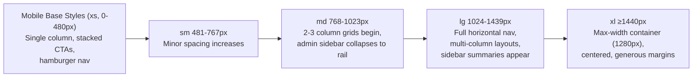

# Responsive Design Specification
## Sai Yadadri Seva Ashram — Website & Donation Platform

| | |
|---|---|
| **Document Version** | 1.0 |
| **Phase** | 2 — Enterprise System Design & UI/UX |
| **Status** | Draft for Client Approval |
| **Date** | 2026-08-03 |

---

## 1. Purpose & Strategy
Defines the mobile-first responsive strategy mandated by the client. **Mobile is the primary design target, not an adaptation of desktop** — most donors and beneficiary families are expected to access the site primarily via smartphone in line with general Indian NGO-donor traffic patterns. All wireframes in [05-Wireframes.md](05-Wireframes.md) are authored mobile-first per this document's breakpoints.

## 2. Breakpoint System

| Breakpoint | Range | Target Devices | Grid Columns |
|---|---|---|---|
| `xs` (base/mobile) | 0–480px | Small phones | 4 |
| `sm` (large mobile) | 481–767px | Large phones | 4 |
| `md` (tablet) | 768–1023px | Tablets, small laptops | 8 |
| `lg` (desktop) | 1024–1439px | Standard desktop/laptop | 12 |
| `xl` (large desktop) | ≥1440px | Large monitors | 12 (max content width 1280px, centered) |

CSS authored mobile-first: base styles target `xs`, with `min-width` media queries progressively enhancing for larger breakpoints — never the reverse (no `max-width` overrides fighting a desktop-first base).

## 3. Layout Adaptation Rules by Module

### 3.1 Navigation
| Breakpoint | Behavior |
|---|---|
| xs/sm | Logo + hamburger + Donate button in header; full nav in MobileMenuDrawer (slide-in from right, full-height overlay) |
| md | Same as mobile, but drawer width capped at 400px (not full-bleed) |
| lg/xl | Full horizontal nav visible in header; hamburger removed |

### 3.2 Home Page
| Section | xs/sm | md | lg/xl |
|---|---|---|---|
| Hero | Full-bleed, 60vh, stacked CTAs | 65vh, CTAs side-by-side | 80vh, CTAs side-by-side, larger type scale |
| Impact Stats | 2×2 grid | 4-column row | 4-column row, larger cards |
| Quick Donate Widget | Full-width card, chips wrap 2/row | Chips wrap 3/row | Chips single row |
| Activities Preview | 1-column stack | 2-column grid | 3-column grid |
| Events Strip | Horizontal scroll (swipe) | 2-column grid | 3-column grid |
| Testimonials | Single card, swipe | Single card, swipe | Single card, arrow nav visible |

### 3.3 Donation Categories & Checkout
| Element | xs/sm | md | lg/xl |
|---|---|---|---|
| Category selector | Horizontal scroll chips | Wrapped chip row | Full card grid (5 across) |
| Checkout steps | Single-column, one step visible at a time, sticky bottom summary bar | Same as mobile with more breathing room | 2-column: form (left, 65%) + sticky order summary sidebar (right, 35%) |
| Amount chips | 2 per row | 3 per row | Single row, 3 chips + custom |

**Critical rule (NFR-USE-01):** the donation checkout flow must remain fully completable with zero horizontal scrolling and zero pinch-zoom at 375px width — validated explicitly in QA per [04-Non-Functional-Requirements.md](../documentation/04-Non-Functional-Requirements.md).

### 3.4 Committee Grid (About Us)
| Breakpoint | Columns |
|---|---|
| xs | 2 |
| sm | 2 |
| md | 3 |
| lg/xl | 4 |

### 3.5 Gallery
| Breakpoint | Layout |
|---|---|
| xs/sm | 2-column masonry |
| md | 3-column masonry |
| lg/xl | 4-column masonry, lightbox opens centered modal (mobile: full-screen takeover) |

### 3.6 Admin Dashboard
| Breakpoint | Behavior |
|---|---|
| xs/sm | **Not a primary design target** (per [04-Admin-Flows.md §13](04-Admin-Flows.md#13-cross-cutting-admin-ux-rules)) — core read/review flows (view donations, review volunteer application, approve content) remain functional in a single-column stacked layout, but data-dense screens (DataTable) scroll horizontally within their container rather than attempting column-collapse |
| md (tablet) | Sidebar collapses to icon-only rail (expandable on tap); DataTables remain horizontally scrollable within a bounded container; this is the **minimum fully-supported admin breakpoint** |
| lg/xl | Full sidebar + multi-column layouts; primary designed admin experience |

## 4. Responsive Images

| Rule | Detail |
|---|---|
| `srcset`/`sizes` on all content images | Serves appropriately-sized assets per viewport (via Cloudinary/S3 responsive transforms, per [11-Technology-Stack.md](../documentation/11-Technology-Stack.md)) |
| Art direction for Hero | Distinct crop for mobile (portrait-friendly focal crop) vs. desktop (wide landscape crop) using `<picture>` source sets |
| Lazy loading | All below-the-fold images (`loading="lazy"`), except the Hero's first image (eager, to protect LCP per NFR-PERF-01) |

## 5. Touch & Input Considerations

- Minimum touch target 44×44px sitewide (buttons, chips, nav items, form controls) — WCAG 2.5.5 / mobile usability best practice.
- Form inputs use appropriate `inputmode`/`type` (e.g., `inputmode="numeric"` for amount and phone fields, `type="email"` for email) to trigger the correct mobile keyboard.
- No hover-only interactions — every hover-revealed affordance (e.g., gallery captions) has an equivalent tap/focus behavior on touch devices.

## 6. Responsive Testing Matrix

| Device Class | Representative Viewport | Priority |
|---|---|---|
| Small Android phone | 360×800 | Critical |
| iPhone SE-class | 375×667 | Critical |
| Standard iPhone | 390×844 | Critical |
| Tablet (iPad) | 768×1024 | High |
| Small laptop | 1280×800 | High |
| Large desktop | 1920×1080 | Medium |

Cross-referenced with cross-browser/device targets in [04-Non-Functional-Requirements.md §9](../documentation/04-Non-Functional-Requirements.md#9-portability--compatibility).

## 7. Responsive Flow Diagram

---
**Related Documents:** [06-Design-System.md](06-Design-System.md) · [07-Component-Library.md](07-Component-Library.md) · [05-Wireframes.md](05-Wireframes.md) · [10-Accessibility.md](10-Accessibility.md) · [SYSTEM_DESIGN.md](SYSTEM_DESIGN.md)
