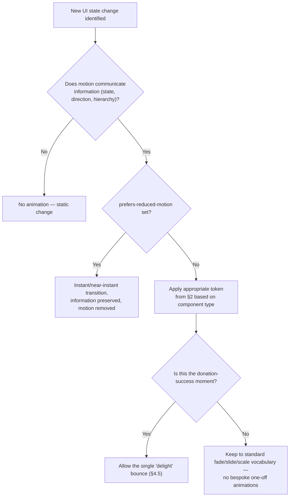

# Animation & Motion Specifications
## Sai Yadadri Seva Ashram — Website & Donation Platform

| | |
|---|---|
| **Document Version** | 1.0 |
| **Phase** | 2 — Enterprise System Design & UI/UX |
| **Status** | Draft for Client Approval |
| **Date** | 2026-08-03 |

---

## 1. Motion Philosophy
Animation on this platform serves **clarity and reassurance**, never decoration for its own sake. Given the audience includes elderly beneficiary families and donors of varying digital literacy, motion must always: (a) explain a state change, (b) never block or delay a task, (c) respect `prefers-reduced-motion`. This directly supports NFR-USE-01/04 and NFR-ACC-01 in [04-Non-Functional-Requirements.md](../documentation/04-Non-Functional-Requirements.md).

## 2. Motion Tokens

| Token | Value | Usage |
|---|---|---|
| `duration-instant` | 100ms | Micro-feedback (button press) |
| `duration-fast` | 180ms | Hover states, toggles |
| `duration-base` | 240ms | Card transitions, accordion expand |
| `duration-slow` | 400ms | Page-section reveal, modal open |
| `easing-standard` | `cubic-bezier(0.4, 0, 0.2, 1)` | Default for most transitions |
| `easing-decelerate` | `cubic-bezier(0, 0, 0.2, 1)` | Elements entering the screen |
| `easing-accelerate` | `cubic-bezier(0.4, 0, 1, 1)` | Elements leaving the screen |

## 3. Global Rule: Reduced Motion

```
@media (prefers-reduced-motion: reduce) {
  All non-essential animation/transition durations → 0ms or near-instant;
  Parallax, auto-advancing carousels → disabled/paused;
  Essential state-change feedback (e.g., form validation, loading spinners) → retained, since removing them would remove necessary information, not just decoration.
}
```
This is a **hard requirement**, not optional polish — tied to NFR-ACC-01 (WCAG 2.1 AA, which includes 2.3.3 Animation from Interactions).

## 4. Component-Level Motion Specs

### 4.1 Page/Section Load
- Hero content fades + slides up 12px on initial load (`duration-slow`, `easing-decelerate`) — once only, not on every scroll.
- Below-the-fold sections use a subtle fade-in-on-scroll (IntersectionObserver-triggered, `duration-base`), staggered 60ms between sibling cards in a grid (e.g., Activities Preview cards) — never more than 4 items staggered, to avoid a sluggish feel.

### 4.2 Buttons
- Hover: background color transition `duration-fast`.
- Press: scale to 0.97 (`duration-instant`) for tactile feedback, especially important on touch devices lacking hover.
- Loading state (e.g., "Processing Payment..."): label replaced by an inline spinner; button becomes non-interactive; no layout shift (button retains its width).

### 4.3 QuickDonateWidget / AmountChipSelector
- Selecting a chip: selected chip scales to 1.05 and fills with `color-primary-green-700` (`duration-fast`); unselected chips dim slightly — clear, immediate confirmation of selection with no ambiguity for less tech-savvy users.

### 4.4 DonationStepIndicator
- Step transitions slide horizontally (`duration-base`, `easing-standard`); completed step icon morphs into a checkmark (simple opacity/scale swap, not a complex path animation — keeps implementation and performance cost low).

### 4.5 Payment Processing State
- Post-payment "Processing / Verifying" screen (per [03-User-Flows.md §3](03-User-Flows.md)) shows an indeterminate progress indicator, not a fake determinate progress bar (never imply a false completion percentage for something whose duration is server-dependent).
- On success: checkmark icon animates in with a brief scale-bounce (`duration-slow`, single subtle bounce, not a cartoonish multi-bounce) — this is the platform's single moment of "delight" animation, deliberately reserved for the donation-success moment as positive reinforcement.

### 4.6 TestimonialCarousel
- Auto-advance every 6 seconds, cross-fade transition (`duration-slow`); pauses on hover/focus/touch; swipe gesture on mobile overrides auto-advance timer.

### 4.7 Modals & Dialogs
- Backdrop fades in (`duration-fast`); modal content scales from 0.96→1 + fades (`duration-base`, `easing-decelerate`).
- Closing is faster than opening (`duration-fast`, `easing-accelerate`) — closing should never feel slower than opening.

### 4.8 Toast Notifications
- Slide in from top (mobile) or top-right (desktop), auto-dismiss after 4s (donation/success toasts) or persist until manually dismissed (error toasts) — errors are never auto-hidden, since a donor/admin may need time to read and act on them.

### 4.9 Accordion (FAQ, Reports categories)
- Height auto-transition (`duration-base`, `easing-standard`); chevron icon rotates 180° in sync.

### 4.10 Admin DataTable
- Row hover: subtle background tint only (`duration-instant`) — admin screens favor speed/density over expressive motion, consistent with the denser admin component family defined in [07-Component-Library.md §7](07-Component-Library.md#7-component-governance-rules).
- Sort/filter changes: brief opacity cross-fade (`duration-fast`) on the table body, no sliding/reflow animation that could disorient a non-technical user scanning a data table.

## 5. Anti-Patterns (Explicitly Avoided)

| Avoided Pattern | Reason |
|---|---|
| Auto-playing background video with motion on Hero | Performance cost (NFR-PERF) + accessibility risk for vestibular-sensitive users |
| Scroll-jacking / hijacked scroll pace | Actively harms the low-digital-literacy persona's sense of control |
| Number "counting up" animations on Impact Stats | Cute but adds no informational value and risks jank on low-end Android devices common among the target donor base |
| Skeleton loaders that shimmer indefinitely on error | Must transition to an explicit ErrorState component (per [07-Component-Library.md](07-Component-Library.md)), never leave the user staring at a permanent loading illusion |
| Parallax scrolling effects | High performance cost, disabled outright, not just under reduced-motion |

## 6. Motion Decision Flow



## 7. Performance Budget for Motion

- All animations use GPU-accelerated properties only (`transform`, `opacity`) — never animate `width`, `height`, `top`/`left`, or `box-shadow` directly (causes layout thrashing).
- No animation may block the main thread long enough to delay Time to Interactive (NFR-PERF-02) — verified via Lighthouse's "Avoid non-composited animations" audit during QA.

---
**Related Documents:** [06-Design-System.md](06-Design-System.md) · [07-Component-Library.md](07-Component-Library.md) · [10-Accessibility.md](10-Accessibility.md) · [04-Non-Functional-Requirements.md](../documentation/04-Non-Functional-Requirements.md) · [SYSTEM_DESIGN.md](SYSTEM_DESIGN.md)
