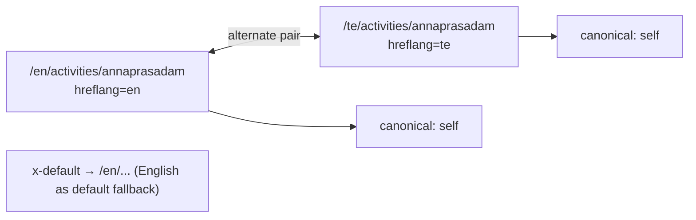
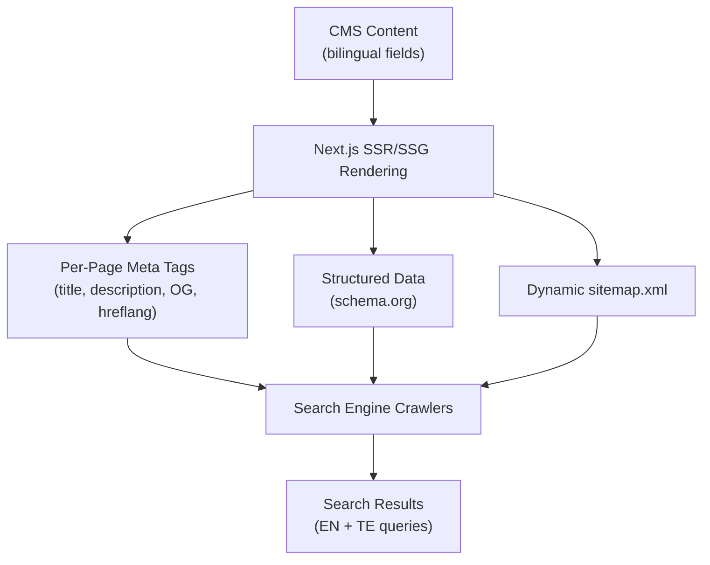

# SEO Structure
## Sai Yadadri Seva Ashram — Website & Donation Platform

| | |
|---|---|
| **Document Version** | 1.0 |
| **Phase** | 2 — Enterprise System Design & UI/UX |
| **Status** | Draft for Client Approval |
| **Date** | 2026-08-03 |
| **Traceability** | Elaborates FR-SEO-01…04 in [03-Functional-Requirements.md](../documentation/03-Functional-Requirements.md) into concrete architecture |

---

## 1. Purpose
Defines the technical and content SEO architecture so the platform is discoverable for high-intent searches ("donate old age home Hyderabad," "Annaprasadam donation Telangana," "Sai Yadadri Seva Ashram," etc.) in both English and Telugu, from launch.

## 2. URL Architecture
Built directly on [02-Sitemap.md](02-Sitemap.md) — clean, human-readable, keyword-relevant slugs (e.g., `/en/activities/annaprasadam`, not `/en/page?id=4`). No query-string-based content pages are indexed.

## 3. Meta Data Strategy

| Page Type | Title Pattern | Description Pattern |
|---|---|---|
| Home | `Sai Yadadri Seva Ashram — Old Age Home, Annaprasadam & Goshala Sevas, Hyderabad` | "Support elderly care, meals, and cow protection at Sai Yadadri Seva Ashram, a registered social service society (Regd. 423/2019) in Hyderabad." |
| About Us | `About Us — Sai Yadadri Seva Ashram` | Mission-focused summary, ≤160 chars |
| Activity detail | `{Program Name} — Sai Yadadri Seva Ashram` | Program-specific description including pricing keyword where natural (e.g., "Sponsor a full-day Annaprasadam meal from ₹5,000") |
| Donation Categories | `Donate — Sai Yadadri Seva Ashram \| Support Annaprasadam, Goshala & More` | Conversion-oriented, mentions payment methods (UPI, Card) for search intent match |
| Event/News detail | `{Event/Post Title} — Sai Yadadri Seva Ashram` | First 160 chars of body, or admin-set custom meta description |
| Gallery/Donor Corner/Contact/etc. | `{Page Name} — Sai Yadadri Seva Ashram` | Page-specific 1-sentence summary |

All titles/descriptions are **admin-editable per page** (FR-SEO-01) with the patterns above as defaults, never hardcoded/locked.

## 4. Structured Data (schema.org)

| Page | Schema Type | Key Properties |
|---|---|---|
| Home / About | `NGO` (subtype of `Organization`) | `name`, `logo`, `address`, `foundingDate` (2019-05-14 per PAN record), `sameAs` (social links, once supplied) |
| Donation Categories | `DonateAction` potential-action markup on the primary CTA | — |
| Event detail | `Event` | `name`, `startDate`, `location`, `image` |
| News detail | `Article` | `headline`, `datePublished`, `author` |
| Contact Us | `LocalBusiness`/`Place` sub-markup for address + geo (once map coordinates supplied) | `address`, `telephone`, `openingHours` |

All structured data validated against Google's Rich Results Test before launch (FR-SEO-03).

## 5. Hreflang & Canonical Strategy

- Every page emits `<link rel="alternate" hreflang="en" href=".../en/...">`, `hreflang="te"`, and `hreflang="x-default"` (pointing to the English version, the platform's default per [02-Sitemap.md §2](02-Sitemap.md#2-url--locale-routing-strategy)).
- Each locale variant is self-canonical (no cross-locale canonical collapsing) — this is standard practice for genuinely translated (not merely duplicated) content.
- Pages with an incomplete Telugu translation (fallback state, per FR-LANG-02) still emit the hreflang pair — Google is explicitly designed to handle partially-translated alternates correctly, better than omitting the tag.

## 6. Sitemap.xml & Robots.txt

Detailed generation rules already specified in [02-Sitemap.md §6](02-Sitemap.md#6-xml-sitemap-generation-rules-for-fr-seo-02). Summary:
- Dynamic `sitemap.xml`, regenerated on content publish, includes hreflang alternate links per URL entry.
- `robots.txt` disallows `/admin/`, `/api/`, checkout/history routes, and the `/en/404` / `/te/404` error pages.

## 7. Content SEO Guidance (for Content Admin / SEO Specialist)

| Guidance | Rationale |
|---|---|
| Every Activity detail page must use its program's real name + location keywords naturally in the first 100 words (e.g., "Vanaprasthasramam, Peddakonduru Village, Yadadri Bhuvanagiri District") | Long-tail local-intent search capture |
| Donation category pages should state exact preset amounts in visible text, not only in interactive chip components | Amounts in raw text are crawlable; JS-rendered-only chip labels are a lower-confidence signal for search engines (mitigated by Next.js SSR per [11-Technology-Stack.md](../documentation/11-Technology-Stack.md), but redundant textual mention remains best practice) |
| Gallery/Event images always carry descriptive, keyword-relevant `alt` text (bilingual) | Doubles as both SEO (image search) and accessibility (A11Y-PER-01) — one content requirement serving two goals |
| Internal linking: every Activity detail links to Donate (category pre-filled) and to at least one related Event/Gallery item | Distributes page authority internally, reinforces topical clustering for search engines |

## 8. Performance-as-SEO

Core Web Vitals directly affect search ranking; targets already defined in [04-Non-Functional-Requirements.md §2](../documentation/04-Non-Functional-Requirements.md#2-performance) (LCP < 2.5s, TTI < 3.5s) are treated as SEO requirements, not purely UX ones, and are monitored the same way (Lighthouse CI).

## 9. Local & Off-Site SEO Considerations

| Item | Status |
|---|---|
| Google Business Profile listing | **Client action recommended** — not part of platform scope, but strongly recommended for local search visibility; requires the office address/coordinates that are currently a pending dependency (see [16-Assumptions-and-Dependencies.md](../documentation/16-Assumptions-and-Dependencies.md) D-11/D-12) |
| Backlink/domain authority carryover | Contingent on resolving whether this is a redesign of `sysaindia.org` (preserving existing domain authority) vs. a new domain — see [01-BRD.md](../documentation/01-BRD.md) open question |
| Social share previews (Open Graph/Twitter Cards) | Implemented per-page (FR-EVT-03 pattern extended sitewide), using the featured image + meta description from §3 |

## 10. SEO Architecture Diagram

---
**Related Documents:** [02-Sitemap.md](02-Sitemap.md) · [../documentation/03-Functional-Requirements.md](../documentation/03-Functional-Requirements.md) · [../documentation/11-Technology-Stack.md](../documentation/11-Technology-Stack.md) · [SYSTEM_DESIGN.md](SYSTEM_DESIGN.md)
