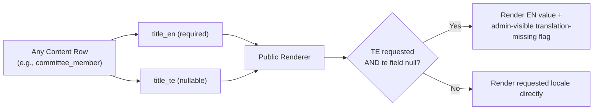
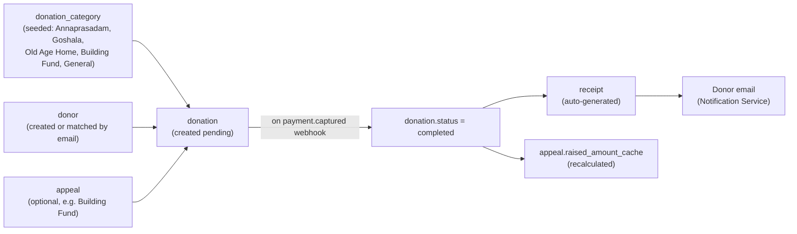

# Database Entity-Relationship Diagram
## Sai Yadadri Seva Ashram — Website & Donation Platform

| | |
|---|---|
| **Document Version** | 1.0 |
| **Phase** | 2 — Enterprise System Design & UI/UX |
| **Status** | Draft for Client Approval |
| **Date** | 2026-08-03 |
| **Builds On** | [08-Database-Requirements.md](../documentation/08-Database-Requirements.md) (Phase 1, unmodified) — this document adds full cardinality detail, bilingual-content modeling, and the content-management schema not fully expanded in Phase 1 |

---

## 1. Purpose
Phase 1's [08-Database-Requirements.md](../documentation/08-Database-Requirements.md) established the entity list and business rules. This document provides the complete architectural ERD — explicit cardinalities, the bilingual-content pattern, and the CMS content-block schema — as the direct input to the Database Architect's physical schema design. No Phase 1 content is altered; this extends it.

## 2. Bilingual Content Modeling Pattern

Rather than duplicating every table into `_en`/`_te` variants, the platform uses a **field-level bilingual pattern**: any user-facing text column exists as a pair (`{field}_en`, `{field}_te`), both nullable independently, with `_en` treated as the required fallback (per FR-LANG-02). This keeps the schema flat and query-simple while satisfying full bilingual parity.



## 3. Complete ERD with Cardinalities

```mermaid
erDiagram
    ROLE ||--o{ ADMIN_USER : "has many"
    ROLE ||--o{ ROLE_PERMISSION : "has many"
    PERMISSION ||--o{ ROLE_PERMISSION : "has many"
    ADMIN_USER ||--o{ AUDIT_LOG : "performs many"
    ADMIN_USER ||--o{ EVENT_NEWS_POST : "authors many"
    ADMIN_USER ||--o{ DOCUMENT_REPO : "uploads many"
    ADMIN_USER ||--o{ VOLUNTEER_APPLICATION : "reviews many"

    DONOR ||--o{ DONATION : "makes many"
    DONATION_CATEGORY ||--o{ DONATION : "classifies many"
    APPEAL ||--o{ DONATION : "receives many (optional)"
    DONATION ||--|| RECEIPT : "generates exactly one"
    APPEAL }o--|| DONATION_CATEGORY : "linked to one"

    GALLERY_ALBUM ||--o{ GALLERY_ITEM : "contains many"

    VOLUNTEER ||--o{ VOLUNTEER_APPLICATION : "submits many"

    COMMITTEE_MEMBER {
        uuid id PK
        string name
        string designation
        int display_order
        string photo_url
        text bio_en
        text bio_te
        boolean active
        timestamp created_at
        timestamp updated_at
    }

    DONOR {
        uuid id PK
        string name
        string email UK
        string phone
        string pan_number_masked
        boolean recognition_opt_in
        string donor_tier
        timestamp created_at
    }

    DONATION_CATEGORY {
        uuid id PK
        string code UK
        string name_en
        string name_te
        text description_en
        text description_te
        boolean has_preset_tiers
        boolean active
    }

    DONATION {
        uuid id PK
        uuid donor_id FK
        uuid category_id FK
        uuid appeal_id FK "nullable"
        decimal amount
        string currency
        string payment_method
        string payment_gateway_ref
        string status
        string source
        text internal_note
        timestamp created_at
        timestamp completed_at
    }

    RECEIPT {
        uuid id PK
        uuid donation_id FK UK
        string receipt_number UK
        string pdf_url
        timestamp issued_at
    }

    APPEAL {
        uuid id PK
        uuid category_id FK
        string title_en
        string title_te
        text description_en
        text description_te
        decimal target_amount
        decimal raised_amount_cache
        date start_date
        date end_date
        string status
    }

    VOLUNTEER {
        uuid id PK
        string name
        string email
        string phone
        timestamp registered_at
    }

    VOLUNTEER_APPLICATION {
        uuid id PK
        uuid volunteer_id FK
        string type
        text academic_background
        string resume_url
        string status
        text internal_note
        uuid reviewed_by FK
        timestamp submitted_at
        timestamp status_updated_at
    }

    EVENT_NEWS_POST {
        uuid id PK
        string type
        string title_en
        string title_te
        text body_en
        text body_te
        string slug UK
        date published_at
        string status
        string featured_image_url
        string meta_title_en
        string meta_description_en
        uuid author_admin_id FK
    }

    GALLERY_ALBUM {
        uuid id PK
        string name_en
        string name_te
        string category
        int display_order
    }

    GALLERY_ITEM {
        uuid id PK
        uuid album_id FK
        string media_type
        string media_url
        string alt_text_en
        string alt_text_te
        int display_order
    }

    DOCUMENT_REPO {
        uuid id PK
        string category
        string title_en
        string title_te
        string file_url
        date published_date
        boolean public_visible
        uuid uploaded_by FK
    }

    CONTACT_SUBMISSION {
        uuid id PK
        string name
        string email
        string phone
        text message
        string status
        timestamp submitted_at
    }

    ADMIN_USER {
        uuid id PK
        string name
        string email UK
        string password_hash
        uuid role_id FK
        boolean active
        timestamp last_login_at
        timestamp created_at
    }

    ROLE {
        uuid id PK
        string name UK
        string description
    }

    PERMISSION {
        uuid id PK
        string code UK
        string description
    }

    ROLE_PERMISSION {
        uuid role_id FK
        uuid permission_id FK
    }

    AUDIT_LOG {
        uuid id PK
        uuid admin_user_id FK
        string action
        string entity_type
        uuid entity_id
        json before_state
        json after_state
        timestamp timestamp
    }

    PAGE_CONTENT {
        uuid id PK
        string page_key UK
        json blocks_en
        json blocks_te
        timestamp updated_at
        uuid updated_by FK
    }
```

## 4. Cardinality Notes & Design Decisions

| Relationship | Cardinality | Design Rationale |
|---|---|---|
| `donor` → `donation` | 1:N | A donor may give multiple times across categories/appeals over years |
| `donation` → `receipt` | 1:1 (nullable until completed) | Receipt only created on `status = completed`, per the business rule in [08-Database-Requirements.md §4](../documentation/08-Database-Requirements.md#4-data-integrity--business-rules); a `pending`/`failed` donation has no receipt row |
| `appeal` → `donation` | 1:N, **optional FK** | Most donations are category-only (not tied to a specific time-bound appeal); only Building-Fund-style campaign donations set `appeal_id` |
| `appeal` → `donation_category` | N:1 | Every appeal must map to exactly one underlying category (e.g., Building Fund appeal → "Building Fund" category) so donations still roll up correctly in category-wise reports even when appeal-specific |
| `volunteer` → `volunteer_application` | 1:N | Same person may apply multiple times (e.g., volunteer this year, intern next year) without duplicating personal-detail rows |
| `role` ↔ `permission` | M:N via `role_permission` | Matches the matrix in [10-Roles-and-Permissions.md](../documentation/10-Roles-and-Permissions.md) exactly — new permissions can be added/reassigned without schema change |
| `admin_user` → `audit_log` | 1:N, **insert-only** | No update/delete permitted at the application layer (immutability rule from Phase 1 retained) |
| `page_content` | Single-row-per-page-key table | Home/About/Contact-style singleton content blocks (as opposed to repeatable collections like Events) modeled as one row per `page_key` with a JSON `blocks` structure — avoids an explosion of near-identical tables for every static page section while still keeping bilingual fields structured (`blocks_en`/`blocks_te` JSON mirrors each other's shape) |

## 5. New Elements Beyond Phase 1 Baseline

| Element | Why Added at Design Phase |
|---|---|
| `donor.pan_number_masked` (renamed from Phase 1's `pan_number`) | Reflects the display-masking security rule (SEC-DATA-06 in [12-Security-Requirements.md](../documentation/12-Security-Requirements.md)) directly in the schema naming to prevent accidental full-PAN exposure in list views; the actual unmasked value is stored in a separate access-restricted column/vault pattern, finalized by the Backend/Database Architect during implementation |
| `donation.internal_note` | Supports UC-04/UC-05 reconciliation workflows (flagging discrepancies) from [06-Use-Cases.md](../documentation/06-Use-Cases.md) |
| `volunteer_application.internal_note` | Supports AF-07 review workflow from [04-Admin-Flows.md](04-Admin-Flows.md) |
| `event_news_post.meta_title_en` / `meta_description_en` | Required by FR-SEO-01, formalized in [11-SEO-Structure.md](11-SEO-Structure.md) |
| `page_content` (new entity) | Phase 1's `PAGE_CONTENT ||--o{ CONTENT_BLOCK` sketch is now resolved into a concrete, implementable singleton-per-page-key structure with bilingual JSON blocks |
| `donation_category.code` | Stable machine-readable identifier (e.g., `ANNAPRASADAM`, `GOSHALA`) decoupled from the display name, so category renaming in the CMS never breaks category-based reporting/filtering logic |

## 6. Data Flow: How the ERD Serves the Donation Journey



## 7. Referential Integrity Summary

- All foreign keys enforced at the database level (not application-only) — non-negotiable for financial data integrity.
- `ON DELETE RESTRICT` on `donation_category`, `appeal`, `donor` referenced by `donation` — a category/appeal/donor can never be hard-deleted while donation history references it (soft-delete/`active` flag pattern used instead, consistent with `donation_category.active` and `appeal.status`).
- `ON DELETE CASCADE` acceptable only for genuinely dependent child rows with no independent reporting value (e.g., `gallery_item` cascades from `gallery_album`; `role_permission` cascades from either parent).

---
**Related Documents:** [../documentation/08-Database-Requirements.md](../documentation/08-Database-Requirements.md) · [13-API-Architecture.md](13-API-Architecture.md) · [../documentation/12-Security-Requirements.md](../documentation/12-Security-Requirements.md) · [SYSTEM_DESIGN.md](SYSTEM_DESIGN.md)
