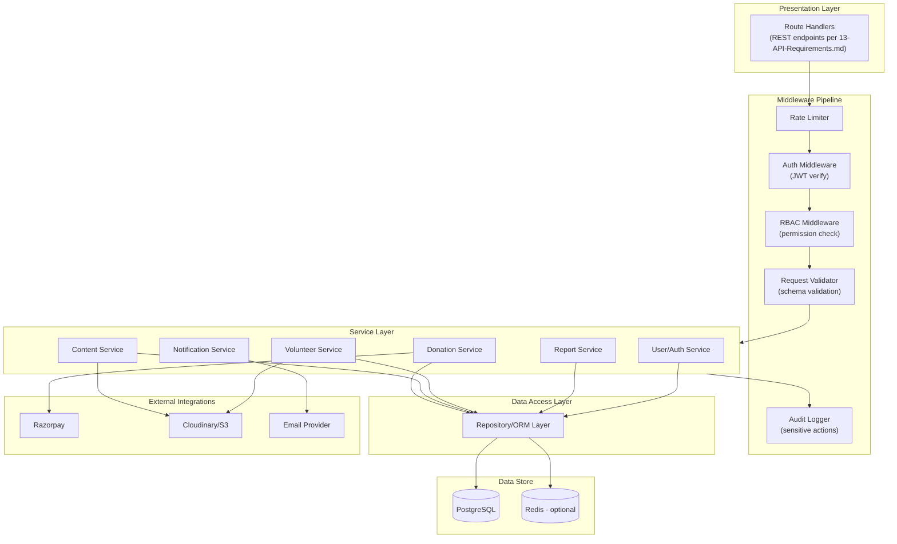
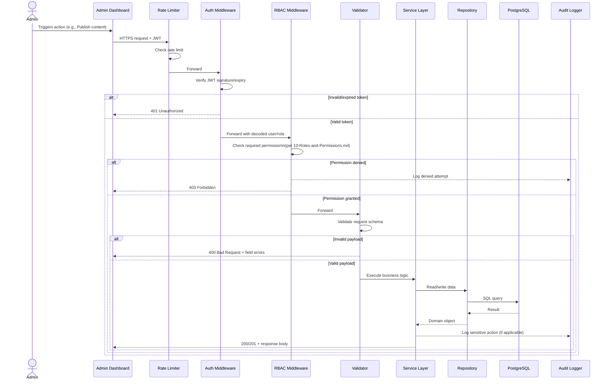
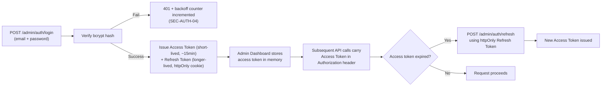
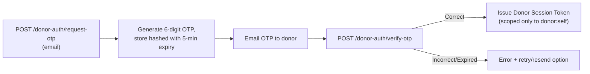
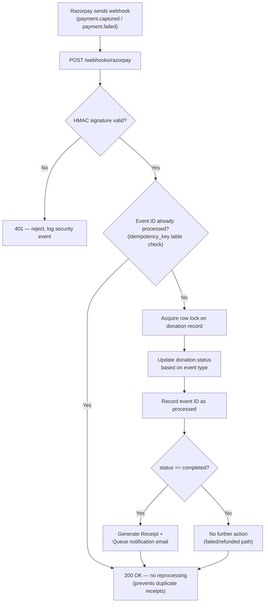
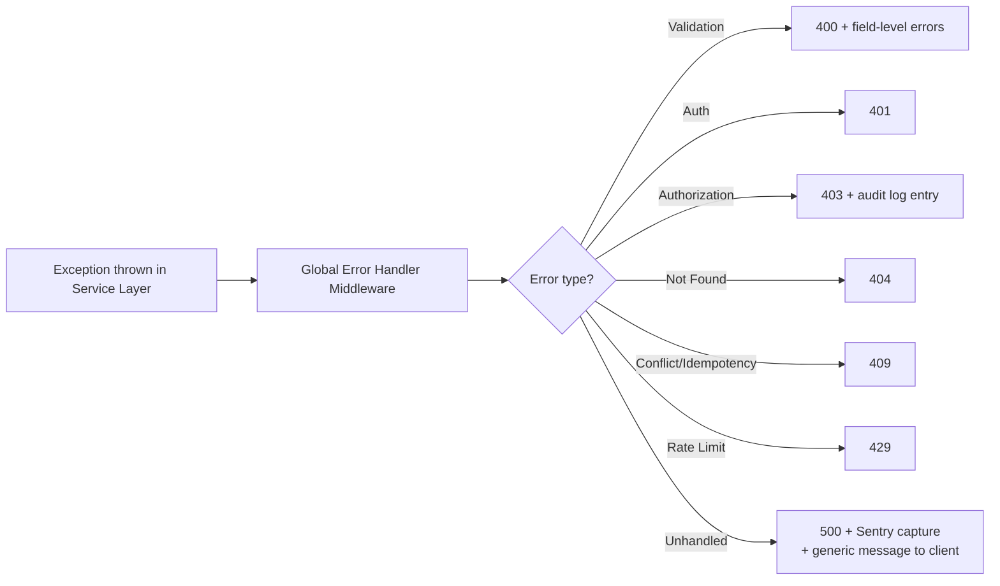

# API Architecture
## Sai Yadadri Seva Ashram — Website & Donation Platform

| | |
|---|---|
| **Document Version** | 1.0 |
| **Phase** | 2 — Enterprise System Design & UI/UX |
| **Status** | Draft for Client Approval |
| **Date** | 2026-08-03 |
| **Builds On** | [13-API-Requirements.md](../documentation/13-API-Requirements.md) (Phase 1, unmodified) — this document adds the layered architecture, request lifecycle, and auth-flow diagrams behind that endpoint catalogue |

> **Update (2026-08-04):** by explicit client decision, the implemented platform's database is **MySQL 8.0+**, not the PostgreSQL shown in this document's diagrams below. See [MYSQL_MIGRATION_REPORT.md](../MYSQL_MIGRATION_REPORT.md). The layering/request-lifecycle/auth-flow architecture itself is database-engine-agnostic and unaffected.

---

## 1. Purpose
Phase 1 defined *what* the API exposes (resources, endpoints, permissions). This document defines *how* the API is architected internally — layering, middleware pipeline, authentication flows, and the payment-webhook processing architecture — as direct input to the Backend Architect.

## 2. Layered Architecture

**Rationale for this layering:** strict separation between route handlers (HTTP concerns only), services (business logic — e.g., "what does it mean to complete a donation"), and the repository layer (data access only) means the business rules from [08-Database-Requirements.md §4](../documentation/08-Database-Requirements.md#4-data-integrity--business-rules) (e.g., "a receipt is only created when a donation is completed") live in exactly one place (Donation Service), not scattered across route handlers.

## 3. Request Lifecycle (Standard Authenticated Admin Request)

## 4. Authentication Architecture

### 4.1 Admin Authentication (JWT-based session)

**Design rationale:** short-lived access tokens minimize the blast radius of a leaked token; the refresh token in an `httpOnly` cookie is inaccessible to XSS-injected JavaScript, directly supporting SEC-AUTH-03 in [12-Security-Requirements.md](../documentation/12-Security-Requirements.md).

### 4.2 Donor Authentication (lightweight, optional — for FR-DON-07 donation history)

Deliberately lighter-weight than admin auth (no password to manage) — appropriate for an optional, low-friction donor convenience feature rather than a security-critical account system.

## 5. Payment Webhook Processing Architecture

This is the most security- and reliability-critical part of the API, elaborating SEC-PAY-02 and the idempotency requirement from [13-API-Requirements.md §7](../documentation/13-API-Requirements.md#7-idempotency--reliability):

**Fallback reconciliation job** (addresses UC-01 Alt Flow 10a from [06-Use-Cases.md](../documentation/06-Use-Cases.md)): a scheduled job runs every 15 minutes, queries Razorpay's payment-status API for any `donation` still `pending` for > 20 minutes, and reconciles status directly — ensuring no donation is ever permanently stuck due to a missed webhook.

## 6. API Versioning & Deprecation Strategy

- All routes prefixed `/api/v1/`. A breaking change (removed field, changed response shape) requires a new `/api/v2/` namespace rather than mutating `v1` behavior — protects the Admin Dashboard and any future integrations from silent breakage.
- Non-breaking additions (new optional fields, new endpoints) ship directly into the current version.

## 7. Error Handling Architecture

Consistent with the envelope defined in [13-API-Requirements.md §2](../documentation/13-API-Requirements.md#2-api-design-principles):

## 8. Caching Strategy

| Data | Cache? | TTL / Invalidation |
|---|---|---|
| Public content (Home, About, Activities) | Yes (Redis or CDN edge cache) | Invalidated immediately on admin Publish action (event-driven, not TTL-only) |
| Donation categories/pricing | Yes | Invalidated on admin content update |
| Donation records, donor data | No | Always fresh — financial data integrity requires no stale reads |
| Analytics/report aggregates | Yes, short TTL (5 min) | Reduces DB load for repeated dashboard views |

## 9. Rate Limiting Architecture

| Endpoint Group | Limit (per IP) | Rationale |
|---|---|---|
| `POST /donations/initiate` | 10/minute | Prevents donation-order-creation abuse without blocking legitimate rapid retries |
| `POST /contact`, `POST /volunteers/*` | 5/minute | Anti-spam, per SEC-INFRA-04 |
| `POST /admin/auth/login` | 5/minute, exponential backoff after failures | Anti-brute-force, per SEC-AUTH-04 |
| General public GET endpoints | 60/minute | Generous — protects against scraping/abuse without affecting normal browsing |

---
**Related Documents:** [../documentation/13-API-Requirements.md](../documentation/13-API-Requirements.md) · [12-Database-ERD.md](12-Database-ERD.md) · [../documentation/12-Security-Requirements.md](../documentation/12-Security-Requirements.md) · [15-Deployment-Architecture.md](15-Deployment-Architecture.md) · [SYSTEM_DESIGN.md](SYSTEM_DESIGN.md)
