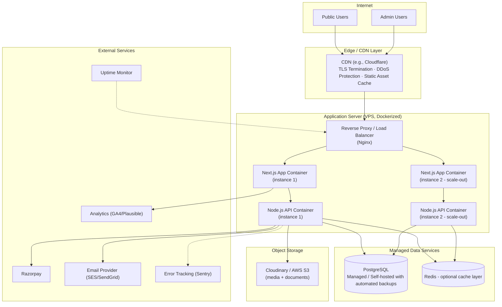
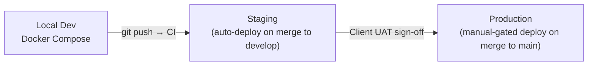
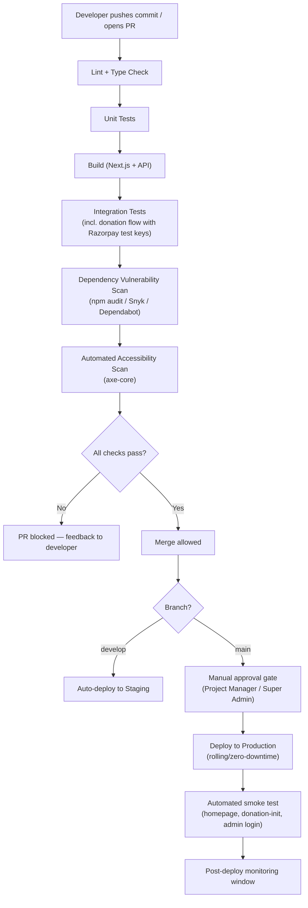
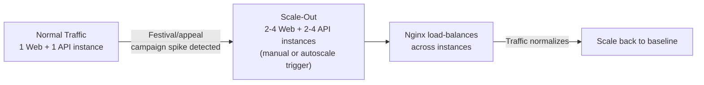
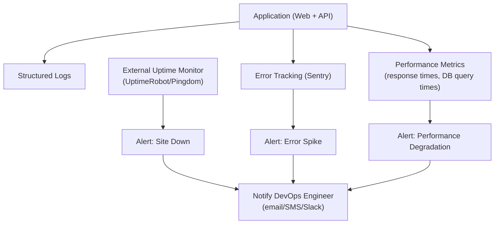
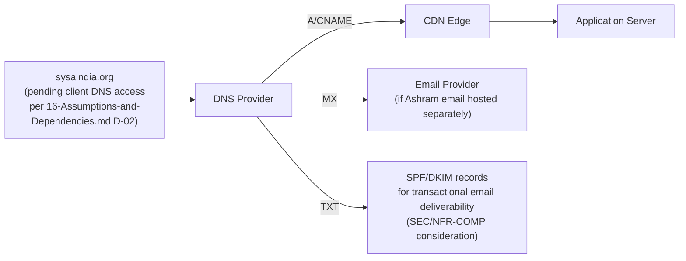

# Deployment Architecture
## Sai Yadadri Seva Ashram — Website & Donation Platform

| | |
|---|---|
| **Document Version** | 1.0 |
| **Phase** | 2 — Enterprise System Design & UI/UX |
| **Status** | Draft for Client Approval |
| **Date** | 2026-08-03 |
| **Builds On** | [11-Technology-Stack.md](../documentation/11-Technology-Stack.md) (Phase 1, unmodified) |

---

## 1. Purpose
Defines the deployment topology, environment strategy, and CI/CD pipeline for the platform — the DevOps Engineer's primary design input.

## 2. Deployment Topology

## 3. Environment Strategy

| Environment | Purpose | Infrastructure | Data |
|---|---|---|---|
| **Local Development** | Individual developer work | Docker Compose (Postgres + Redis + API + Web containers) | Seed/fixture data only |
| **Staging** | Client UAT ([14-Project-Timeline.md](../documentation/14-Project-Timeline.md) Phase 8), QA testing | Mirrors production topology at smaller scale (single instance each) | Anonymized/sample data; Razorpay in **Test Mode** |
| **Production** | Live public platform | Full topology per §2, horizontally scaled as needed | Real data; Razorpay in **Live Mode**; full monitoring/backup active |

## 4. CI/CD Pipeline

**Pipeline tooling**: GitHub Actions (per [11-Technology-Stack.md](../documentation/11-Technology-Stack.md)), Docker image build/push to a container registry, deployment via SSH/Docker Compose redeploy on the VPS (or a managed container platform if the client later migrates toward the AWS scale-up path already anticipated in Phase 1).

## 5. Containerization Strategy

| Container | Base Image Family | Notes |
|---|---|---|
| `web` (Next.js) | Node LTS Alpine | Multi-stage build (build stage discarded, only production artifact + `node_modules` in final image) |
| `api` (Express) | Node LTS Alpine | Same multi-stage pattern |
| `nginx` (reverse proxy) | Nginx Alpine | TLS termination (or delegated to CDN), routes `/api/*` → API container, everything else → Web container |
| `postgres` (local dev only) | Postgres Alpine | Production uses a managed Postgres service where possible, not a self-managed container, to offload backup/patching burden appropriate for a small non-profit ops team |

## 6. Scaling Strategy

Directly implements NFR-SCALE-01…04 from [04-Non-Functional-Requirements.md](../documentation/04-Non-Functional-Requirements.md):

- **Stateless application tier**: no session state stored in-process (JWT-based auth + Redis for any shared cache) — any instance can serve any request, enabling horizontal scaling without sticky sessions.
- **Database scaling path**: start single-instance Postgres; add a read replica for reporting/analytics queries once donation volume justifies it (keeps write-path — donations — on the primary for strict consistency).

## 7. Backup & Disaster Recovery

| Item | Strategy | Target (from [04-Non-Functional-Requirements.md](../documentation/04-Non-Functional-Requirements.md)) |
|---|---|---|
| Database | Automated daily full backup + continuous WAL archiving (point-in-time recovery) | RPO ≤ 24h (NFR-AVAIL-04) |
| Backup retention | 30 days rolling | NFR-AVAIL-03 |
| Backup encryption | At-rest encryption on backup storage | SEC-DATA-02 |
| Restore drill | Quarterly test restore to a scratch environment | Verifies RTO ≤ 8h (NFR-AVAIL-05) is actually achievable, not just theoretical |
| Object storage (Cloudinary/S3) | Provider-native redundancy (multi-AZ) | Inherent to managed service |

## 8. Monitoring & Observability

## 9. Domain & DNS Architecture

Until domain/DNS access is confirmed (open dependency), deployment proceeds against a staging subdomain (e.g., a provisioned `*.vercel.app`/`*.your-vps-provider.com` placeholder) so development is never blocked by this pending item — cutover to `sysaindia.org` happens only at Phase 9 Go-Live per [14-Project-Timeline.md](../documentation/14-Project-Timeline.md).

## 10. Deployment Readiness Checklist (maps to Phase 9 in the Timeline)

- [ ] Production environment provisioned and hardened (SEC-INFRA-01…03)
- [ ] Razorpay switched to Live Mode with verified webhook URL
- [ ] DNS cutover plan confirmed with client
- [ ] SSL certificate provisioned and auto-renewal configured
- [ ] Backup + restore drill completed successfully
- [ ] Monitoring/alerting active and tested (a deliberate test alert fired and received)
- [ ] Rollback procedure documented and rehearsed

---
**Related Documents:** [../documentation/11-Technology-Stack.md](../documentation/11-Technology-Stack.md) · [14-Folder-Structure.md](14-Folder-Structure.md) · [13-API-Architecture.md](13-API-Architecture.md) · [../documentation/12-Security-Requirements.md](../documentation/12-Security-Requirements.md) · [SYSTEM_DESIGN.md](SYSTEM_DESIGN.md)
