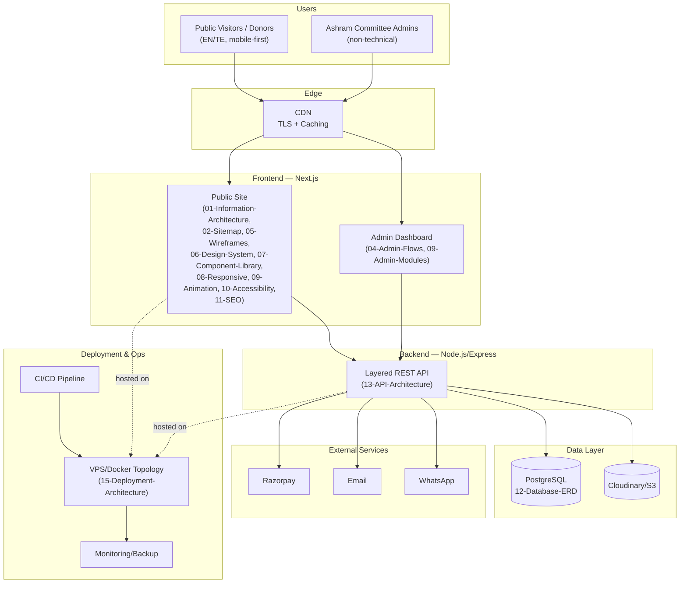

# System Design Summary
## Sai Yadadri Seva Ashram — Website & Donation Platform

| | |
|---|---|
| **Document Version** | 1.0 |
| **Phase** | 2 — Enterprise System Design & UI/UX (Complete) |
| **Status** | Draft for Client Approval |
| **Date** | 2026-08-03 |
| **Prepared By** | Vinofyx — acting as Solution Architect, UI/UX Designer, Frontend Architect, Backend Architect, Database Architect, and DevOps Engineer |
| **Source of Truth** | `documentation/` (Phase 1, unmodified) + `design/` (Phase 2, this package) |

---

## 1. Purpose

This is the top-level technical architecture summary for Phase 2, tying together the 15 design documents into one coherent system view. It is the design-layer counterpart to [documentation/MASTER_PROJECT_PLAN.md](../documentation/MASTER_PROJECT_PLAN.md). **No application code has been written** — this remains a design/architecture deliverable.

## 2. What Phase 2 Delivered

| # | Document | Answers |
|---|---|---|
| 1 | [01-Information-Architecture.md](01-Information-Architecture.md) | How is content organized and labeled? |
| 2 | [02-Sitemap.md](02-Sitemap.md) | What are the exact URLs, in both languages? |
| 3 | [03-User-Flows.md](03-User-Flows.md) | How does a visitor become a donor, step by step? |
| 4 | [04-Admin-Flows.md](04-Admin-Flows.md) | How does a non-technical committee member operate the system day-to-day? |
| 5 | [05-Wireframes.md](05-Wireframes.md) | What does every page/screen contain, section by section? |
| 6 | [06-Design-System.md](06-Design-System.md) | What are the colors, fonts, spacing — the visual language? |
| 7 | [07-Component-Library.md](07-Component-Library.md) | What reusable UI building blocks compose every screen? |
| 8 | [08-Responsive-Design.md](08-Responsive-Design.md) | How does the layout adapt from a 360px phone to a 1920px monitor? |
| 9 | [09-Animation-Specifications.md](09-Animation-Specifications.md) | How does the interface move, and why? |
| 10 | [10-Accessibility.md](10-Accessibility.md) | How does it work for users with disabilities, low vision, or motor impairment? |
| 11 | [11-SEO-Structure.md](11-SEO-Structure.md) | How is the platform found on Google, in two languages? |
| 12 | [12-Database-ERD.md](12-Database-ERD.md) | What is the complete, implementable data model? |
| 13 | [13-API-Architecture.md](13-API-Architecture.md) | How do the frontend, backend, and Razorpay actually talk to each other? |
| 14 | [14-Folder-Structure.md](14-Folder-Structure.md) | How is the codebase organized, before a single line is written? |
| 15 | [15-Deployment-Architecture.md](15-Deployment-Architecture.md) | Where does it run, how does it scale, how is it kept online? |

## 3. End-to-End Architecture — Single Diagram

## 4. Design Decisions Carried Forward from Phase 1 (Not Re-litigated)

| Decision | Locked In By | Design-Phase Elaboration |
|---|---|---|
| Next.js + Node.js/Express + PostgreSQL | [11-Technology-Stack.md](../documentation/11-Technology-Stack.md) | Layered architecture ([13-API-Architecture.md](13-API-Architecture.md)), folder structure ([14-Folder-Structure.md](14-Folder-Structure.md)) |
| Razorpay for payments | [11-Technology-Stack.md](../documentation/11-Technology-Stack.md) | Webhook processing architecture, PaymentMethodTabs component ([13-API-Architecture.md §5](13-API-Architecture.md#5-payment-webhook-processing-architecture), [07-Component-Library.md §3.9](07-Component-Library.md#39-paymentmethodtabs)) |
| RBAC model (4 admin roles) | [10-Roles-and-Permissions.md](../documentation/10-Roles-and-Permissions.md) | Admin IA grouped by role's job function ([01-Information-Architecture.md §6](01-Information-Architecture.md#6-admin-information-architecture)), auth architecture ([13-API-Architecture.md §4.1](13-API-Architecture.md#41-admin-authentication-jwt-based-session)) |
| Bilingual EN/TE requirement | [03-Functional-Requirements.md](../documentation/03-Functional-Requirements.md) FR-LANG | Locale-prefixed routing ([02-Sitemap.md](02-Sitemap.md)), field-level bilingual data pattern ([12-Database-ERD.md §2](12-Database-ERD.md#2-bilingual-content-modeling-pattern)), Noto Sans Telugu typography ([06-Design-System.md §3](06-Design-System.md#3-typography)) |
| Donation pricing (verified data) | [PROJECT_CONTEXT.md](../docs/PROJECT_CONTEXT.md) | Reflected verbatim in wireframes ([05-Wireframes.md §4.1/4.2](05-Wireframes.md#41-activity-detail--annaprasadam-enactivitiesannaprasadam)) and AmountChipSelector defaults ([07-Component-Library.md §3.7](07-Component-Library.md#37-amountchipselector)) |
| Content gaps (Vision/Mission, Founder bio, compliance docs, etc.) | [16-Assumptions-and-Dependencies.md](../documentation/16-Assumptions-and-Dependencies.md) | Every affected page has a defined "Coming Soon" empty state ([07-Component-Library.md §3.14](07-Component-Library.md#314-empty-state--coming-soon-component)) — the design does not block on missing content |
| CSR entity mismatch | [DOCUMENT_ANALYSIS.md](../docs/DOCUMENT_ANALYSIS.md) | Donor Corner CSR tab designed with an explicit "To be announced" state, never fabricated content ([05-Wireframes.md §6](05-Wireframes.md#6-donor-corner-enen-donors)) |

## 5. The Golden Path, Fully Traced Through Every Layer

The client's explicit ask — "complete user journey from homepage to donation success" — traced end-to-end through this entire design package:

```mermaid
flowchart LR
    IA["IA: Donate is 1 tap away\n(01-IA §2)"] --> Sitemap["URL: /en/donate → /checkout → /thank-you\n(02-Sitemap §3)"]
    Sitemap --> Flow["Flow: F-01 Golden Path\n(03-User-Flows §3)"]
    Flow --> Wireframe["Screens: Categories → Checkout → Confirmation\n(05-Wireframes §5)"]
    Wireframe --> Components["Components: QuickDonateWidget,\nAmountChipSelector, PaymentMethodTabs\n(07-Component-Library §3)"]
    Components --> Design["Visuals: Green='Donate' CTA,\nsuccess bounce animation\n(06-Design-System, 09-Animation §4.5)"]
    Design --> Responsive["Mobile-first: ≤4 steps,\nno horizontal scroll\n(08-Responsive §3.3)"]
    Responsive --> A11y["Accessible: live-region step announcements\n(10-Accessibility §7)"]
    A11y --> API["API: POST /donations/initiate →\nRazorpay → webhook → receipt\n(13-API-Architecture §5)"]
    API --> DB["Data: donation → receipt\n(12-Database-ERD §6)"]
    DB --> Deploy["Runs on: Dockerized VPS,\nmonitored, backed up\n(15-Deployment-Architecture)"]
```

Every layer of the stack — information architecture, URL, UX flow, screen content, reusable component, visual design, motion, responsive behavior, accessibility, API, data model, and infrastructure — has been explicitly specified for this single most important journey. No layer was left as an assumption.

## 6. Non-Functional Requirements — Where They're Implemented in Design

| NFR Category (from [04-Non-Functional-Requirements.md](../documentation/04-Non-Functional-Requirements.md)) | Implemented In |
|---|---|
| Performance | [08-Responsive-Design.md §4](08-Responsive-Design.md#4-responsive-images) (responsive images), [09-Animation-Specifications.md §7](09-Animation-Specifications.md#7-performance-budget-for-motion), [15-Deployment-Architecture.md §6](15-Deployment-Architecture.md#6-scaling-strategy) |
| Security | [13-API-Architecture.md §4-5](13-API-Architecture.md#4-authentication-architecture) (auth + webhook architecture) |
| Accessibility | [10-Accessibility.md](10-Accessibility.md) (dedicated document) |
| Scalability | [15-Deployment-Architecture.md §6](15-Deployment-Architecture.md#6-scaling-strategy) |
| Availability | [15-Deployment-Architecture.md §7-8](15-Deployment-Architecture.md#7-backup--disaster-recovery) |
| Usability | [04-Admin-Flows.md §13](04-Admin-Flows.md#13-cross-cutting-admin-ux-rules), [08-Responsive-Design.md](08-Responsive-Design.md) |
| Localization | [06-Design-System.md §3.2](06-Design-System.md#32-type-scale-mobile-first-desktop-scale-in-parentheses-where-it-differs) (Telugu line-height), [12-Database-ERD.md §2](12-Database-ERD.md#2-bilingual-content-modeling-pattern) |

## 7. Open Items Still Pending (Unchanged Since Phase 1 — Not Design Blockers)

Design proceeded without waiting on these, using explicit "pending" states throughout (see §4 table above). Full list remains authoritative in [documentation/16-Assumptions-and-Dependencies.md](../documentation/16-Assumptions-and-Dependencies.md) — nothing new was discovered during design that changes that register, though two items now have concrete design-phase relevance:

1. **Vector logo (SVG)** — [06-Design-System.md](06-Design-System.md) built the full color/type system from the existing PDF render; a vector source will let the Frontend Architect produce crisp favicons/app icons without re-tracing the emblem.
2. **Google Maps coordinates** — [05-Wireframes.md §12](05-Wireframes.md#12-contact-us-enen-contact) and [11-SEO-Structure.md §9](11-SEO-Structure.md#9-local--off-site-seo-considerations) both have a placeholder-ready Contact Us map slot waiting on this.

## 8. What Happens Next

This Phase 2 design package is now **complete and awaiting your approval**, per your instruction to stop at this gate.

Recommended next steps upon your approval:
1. Visual mockups (Figma or equivalent) produced directly from [05-Wireframes.md](05-Wireframes.md) + [06-Design-System.md](06-Design-System.md) — the first artifact with actual pixel-level visuals, since this documentation package is intentionally text/diagram-based.
2. Technical scaffolding of the repository per [14-Folder-Structure.md](14-Folder-Structure.md).
3. Phase 3: Core Development begins, per the roadmap already defined in [documentation/14-Project-Timeline.md](../documentation/14-Project-Timeline.md).

**No code will be written until you separately approve moving into the build phase.**

## 9. Full Phase 2 Document Index

1. [01-Information-Architecture.md](01-Information-Architecture.md)
2. [02-Sitemap.md](02-Sitemap.md)
3. [03-User-Flows.md](03-User-Flows.md)
4. [04-Admin-Flows.md](04-Admin-Flows.md)
5. [05-Wireframes.md](05-Wireframes.md)
6. [06-Design-System.md](06-Design-System.md)
7. [07-Component-Library.md](07-Component-Library.md)
8. [08-Responsive-Design.md](08-Responsive-Design.md)
9. [09-Animation-Specifications.md](09-Animation-Specifications.md)
10. [10-Accessibility.md](10-Accessibility.md)
11. [11-SEO-Structure.md](11-SEO-Structure.md)
12. [12-Database-ERD.md](12-Database-ERD.md)
13. [13-API-Architecture.md](13-API-Architecture.md)
14. [14-Folder-Structure.md](14-Folder-Structure.md)
15. [15-Deployment-Architecture.md](15-Deployment-Architecture.md)

*Phase 1 foundation: [../documentation/MASTER_PROJECT_PLAN.md](../documentation/MASTER_PROJECT_PLAN.md) and its 16 documents (unmodified).*
*Source data: [../docs/PROJECT_CONTEXT.md](../docs/PROJECT_CONTEXT.md), [../docs/DOCUMENT_ANALYSIS.md](../docs/DOCUMENT_ANALYSIS.md).*
