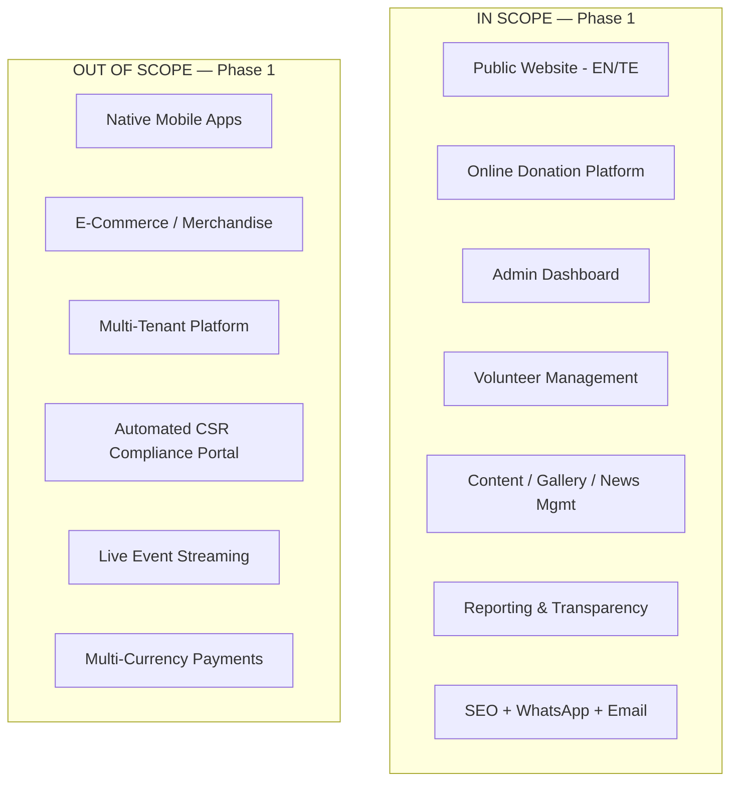

# Business Requirements Document (BRD)
## Sai Yadadri Seva Ashram — Website & Donation Platform

| | |
|---|---|
| **Document Version** | 1.0 |
| **Status** | Draft for Client Approval |
| **Date** | 2026-08-03 |
| **Prepared By** | Vinofyx — Business Analyst / Solution Architecture Team |
| **Prepared For** | Sai Yadadri Seva Ashram (Regd. No. 423/2019) |
| **Source of Truth** | `docs/PROJECT_CONTEXT.md`, `docs/DOCUMENT_ANALYSIS.md` |
| **Classification** | Internal / Client-Shared |

---

## 1. Document Purpose

This Business Requirements Document (BRD) defines the business case, objectives, scope, stakeholders, and success criteria for building a production-grade, enterprise website and donation platform for **Sai Yadadri Seva Ashram**, a registered social service society (Regd. No. 423/2019, PAN ABKAS9261K) headquartered in Uppal, Hyderabad, Telangana, operating a residential Old Age Home ("Vanaprasthasramam") in Peddakonduru Village, Yadadri Bhuvanagiri District.

This document is the top-level business reference. All downstream artifacts (SRS, Functional Requirements, Use Cases, etc.) trace back to the objectives and scope defined here.

## 2. Business Background

Sai Yadadri Seva Ashram was founded in 2019 under the presidentship of Sri Debbadi Ashok, growing from a small founding group (largely retired/serving BSNL employees) into an organization with hundreds of members and supporters. Its core service lines are:

1. **Vanaprasthasramam** — a residential Old Age Home providing free shelter, food, and medical care to elderly, needy, orphaned, and physically/mentally challenged individuals, operated in association with the Indian Red Cross Society (Yadadri Bhuvanagiri District).
2. **Annaprasadam** — sponsored meal programs for residents, funded by public donations tied to personal/family occasions.
3. **Goseva / Goshala** — maintenance of a cow shelter (10 cows, 10 calves) on 2 acres of dedicated fodder-cultivation land.
4. **Education (Vidya Daanam)** — adoption of primary schools, supply of study materials, tuition support, and funding of "Vidya Volunteers."
5. **Medical Support** — medical camps, eye camps, cataract-surgery funding, and financial aid for chronic-illness patients.

The Ashram currently operates a live website at **https://sysaindia.org**. The organization is planning to **expand its physical infrastructure** (a new G+2 building, ~₹2.25 Crore estimated cost, adding capacity for 50 more residents) and needs a **modern, professional, donation-enabled web platform** to support fundraising, transparency, volunteer engagement, and public outreach at a scale consistent with its growth.

> ⚠️ **Client Confirmation Required:** Whether this engagement is a **full redesign/replacement** of `sysaindia.org`, a **migration to new infrastructure**, or a **parallel new build**. This BRD assumes a full redesign/replatform onto the technology stack defined in [11-Technology-Stack.md](11-Technology-Stack.md), pending confirmation. See [16-Assumptions-and-Dependencies.md](16-Assumptions-and-Dependencies.md), Assumption A-01.

## 3. Business Objectives

| ID | Objective | Business Justification |
|---|---|---|
| BO-01 | Increase online donation volume and frequency through a secure, frictionless digital donation experience (UPI, cards, net banking, bank transfer) | Current donation collection relies on bank transfer/UPI QR printed on static brochures; no online payment gateway exists today |
| BO-02 | Establish public trust and transparency by publishing verifiable registration documents, financial reports, and donation impact | Donor trust is critical for a charitable organization with no prior formal online transparency reporting |
| BO-03 | Grow and formalize the volunteer base through an online registration and internship application workflow | No digital volunteer pipeline exists currently |
| BO-04 | Improve public awareness of Ashram programs (Annaprasadam, Goseva, Education, Medical Support) and their specific funding needs | Programs are currently only documented in a static print brochure |
| BO-05 | Provide the Ashram's committee/admin staff with a self-service content management and reporting system, removing dependency on developers for routine updates | Committee members are largely retired professionals, not technical staff — the admin experience must be simple and low-maintenance |
| BO-06 | Support the upcoming capital campaign for the new G+2 building expansion (₹2.25 Crore) with a dedicated Building Fund donation category and progress tracking | Explicitly named as a "Journey Ahead" priority in the Ashram's brochure |
| BO-07 | Enable bilingual (English/Telugu) access to reach both local Telugu-speaking donors/beneficiaries and a wider/diaspora English-speaking donor base | Explicit requirement in the client's Website Requirements document |
| BO-08 | Ensure the platform is built for long-term scalability and low operating cost, appropriate for a non-profit's ongoing budget constraints | Non-profit sustainability requires low total cost of ownership (TCO) |

## 4. Scope

### 4.1 In Scope

- Public-facing marketing/informational website (bilingual EN/TE) covering Home, About Us, Activities, Donation Categories, Donor Corner, Events & News, Gallery, Volunteer Registration, Reports & Transparency, Appeals & Current Needs, Contact Us.
- Online donation platform supporting UPI, card, net banking (via payment gateway integration — Razorpay recommended), and displayed bank-transfer details, with automated receipts and donation history.
- Admin dashboard for donation management, donor management, content management (pages, events, news, gallery), volunteer management, reporting/export, and role-based access control.
- Volunteer/internship registration and application workflow.
- Document repository for compliance documents (Society Registration Certificate, 12AB, 80G, audit reports — pending client supply, see §7).
- SEO foundation (metadata, sitemap.xml, structured data for a non-profit organization).
- WhatsApp click-to-chat integration and email notification workflows (donation receipts, volunteer confirmations, contact form).
- Analytics dashboard for admin (donation trends, visitor trends, top donation categories).
- Responsive design for mobile, tablet, and desktop.

### 4.2 Out of Scope (for this phase)

- Native mobile applications (iOS/Android) — website will be a responsive Progressive Web App (PWA)-ready site, not a compiled native app, unless explicitly commissioned in a later phase.
- E-commerce (physical merchandise sales) — not indicated anywhere in source documents.
- Multi-organization / multi-tenant support — this platform is scoped to Sai Yadadri Seva Ashram only.
- CSR partner portal with automated CSR-1 compliance reporting — deferred pending resolution of the CSR entity mismatch flagged in [DOCUMENT_ANALYSIS.md](../docs/DOCUMENT_ANALYSIS.md) §5. Basic "CSR Partner" recognition/listing on the Donor Corner page is in scope; automated compliance workflows are not.
- Live streaming of events/pujas — not requested in any source document; can be considered as a future enhancement.
- International payment gateway support (multi-currency) — Razorpay's domestic INR flows are assumed sufficient unless the client confirms an NRI/diaspora donation requirement.

### 4.3 Scope Boundary Diagram

## 5. Stakeholders

| Stakeholder | Role | Interest / Responsibility |
|---|---|---|
| Sri D. Ashok (President) | Executive Sponsor | Final business approval, public representation |
| J. Yanadi Setty (General Secretary) | Business Owner | Day-to-day organizational decisions, content approval |
| K. Vidyasagar Reddy (Treasurer) | Finance Stakeholder | Donation reconciliation, financial reporting requirements |
| Organizing Secretaries (P. Vijaya Kumar, A. Raja Shekar, Smt. M. Padma Sarma, V. Appa Rao, A. Raja Sekhar) | Content/Operations Contributors | Program updates, event content, volunteer coordination |
| Executive Committee (18 members) | Governance | Committee-page representation, oversight |
| Donors (individual, monthly, CSR partners) | End User | Donation experience, transparency, receipts |
| Volunteers / Interns | End User | Registration, application status |
| General Public / Beneficiary Families | End User | Information access, Annaprasadam sponsorship |
| Vinofyx (Development Team) | Delivery Partner | Design, build, deploy, maintain |

## 6. Current State vs. Future State

| Aspect | Current State | Future State |
|---|---|---|
| Donations | Manual bank transfer / UPI QR from printed brochure; no online tracking | Integrated payment gateway, automated receipts, donor donation history |
| Content Updates | Static print brochure, existing website of unknown CMS capability | Self-service CMS-backed admin dashboard |
| Volunteer Intake | Informal / offline | Structured online registration + admin workflow |
| Transparency Reporting | Not published digitally | Dedicated Reports & Transparency page with downloadable documents |
| Language Support | Brochure is bilingual (print); website language coverage unknown | Fully bilingual EN/TE website with language switcher |
| Analytics | None | Admin analytics dashboard (traffic + donation trends) |
| Committee Visibility | Printed brochure grid only | Dynamic, admin-editable Committee page |

## 7. Information Gaps Requiring Client Input

The following items are **required for a complete, accurate build** and were not present in the supplied source documents. These are not assumed or fabricated — see also [16-Assumptions-and-Dependencies.md](16-Assumptions-and-Dependencies.md):

1. Formal **Vision & Mission** statement text (distinct from the narrative history in the brochure).
2. **Society Registration Certificate**, **12AB Certificate**, **80G Certificate** — scanned copies for the compliance/document repository and donor tax-benefit messaging.
3. Confirmed **CSR registration status for Sai Yadadri Seva Ashram itself** — the CSR-1 letter supplied is registered to a different legal entity ("Sri Shiridi Sai Seva Society," Adilabad). This must be resolved before any CSR claims are published (see [DOCUMENT_ANALYSIS.md](../docs/DOCUMENT_ANALYSIS.md) §5).
4. **Annual Reports, Audit Reports, Financial Statements** for the Reports & Transparency page.
5. **Founder biography** for the Ashram itself (brochure documents the Old Age Home's founders, Sri Mayreddi Satyanarayana Reddy & Smt. Janakamma Garlu, but not the Ashram's own founder narrative beyond naming the President).
6. **Treasurer's Message** (text).
7. **Testimonials** (beneficiary/donor quotes).
8. **Event/news content**, **gallery photos & videos** (usable, rights-cleared media beyond the low-resolution images embedded in the brochure PDF).
9. **Official contact details**: general office phone/email, WhatsApp business number, Google Maps location pin, office timings, social media profile links.
10. **Domain name and hosting access** for `sysaindia.org` (registrar login, DNS access) — required to determine migration path.
11. **Razorpay merchant account status** (or authorization to create one on the Ashram's behalf) for online payment processing.
12. **Vector logo source file** (SVG/AI) — only a flattened PDF render was supplied.
13. Reconciliation of the **two conflicting mobile numbers** for the President and Treasurer (see [DOCUMENT_ANALYSIS.md](../docs/DOCUMENT_ANALYSIS.md) Open Conflicts).
14. Suggested/preset donation amounts for "Old Age Home (general)" and "General Donation" categories (pricing exists for Annaprasadam and Goseva only).

Project planning proceeds in parallel with these gaps, but **content-dependent modules (Reports & Transparency, compliance document repository, CSR partner listing, Founder/Vision-Mission sections) cannot go live** until this information is supplied. This is tracked as a formal dependency in [16-Assumptions-and-Dependencies.md](16-Assumptions-and-Dependencies.md).

## 8. Success Criteria / Business KPIs

| KPI | Target (Year 1 post-launch) | Measurement Method |
|---|---|---|
| Online donation conversion rate | ≥ 3% of donation-page visitors complete a donation | Analytics + payment gateway reporting |
| Average online donation processing time | < 90 seconds end-to-end | Admin dashboard donation timestamps |
| Volunteer applications received online | ≥ 20 per quarter | Admin dashboard volunteer module |
| Site uptime | ≥ 99.5% | Hosting/monitoring reports |
| Mobile traffic share supported without degradation | 100% (fully responsive) | Analytics device breakdown |
| Page load time (LCP) | < 2.5 seconds on 4G | Lighthouse / Core Web Vitals |
| Admin content-update turnaround (no developer involvement) | Same-day for text/image updates | Admin usage logs / stakeholder feedback |
| Bilingual content coverage | 100% of public-facing pages available in EN + TE | Content audit |

## 9. Assumptions (Business-Level)

See full technical/dependency assumptions in [16-Assumptions-and-Dependencies.md](16-Assumptions-and-Dependencies.md). Key business-level assumptions:

- The Ashram will designate at least one point of contact authorized to approve content, provide compliance documents, and confirm payment-gateway KYC details.
- Donation amounts quoted in this documentation set (Annaprasadam, Goseva, Life Membership) are treated as **current and accurate as printed** in the 2025 brochure and will be kept in sync by the Ashram if they change.
- The Ashram will independently resolve and confirm banking/KYC details required by the payment gateway provider (Razorpay) — Vinofyx will not hold or process the Ashram's funds directly.

## 10. Constraints

- **Budget**: Not specified by client — technology stack (§11 of Technology Stack doc) is selected for low ongoing TCO appropriate to a non-profit.
- **Timeline**: Not specified by client — a phased delivery plan is proposed in [14-Project-Timeline.md](14-Project-Timeline.md), subject to client confirmation.
- **Regulatory**: As a registered society soliciting public donations, the platform must support display of registration numbers, PAN, and (once resolved) 12A/80G tax-exemption status per Indian charitable-trust norms.
- **Language**: All public content must ship in English and Telugu at minimum.

## 11. Approval

| Name | Role | Signature | Date |
|---|---|---|---|
| _Pending_ | Sai Yadadri Seva Ashram — Authorized Signatory | | |
| _Pending_ | Vinofyx — Project Sponsor | | |

---
**Related Documents:** [02-SRS.md](02-SRS.md) · [16-Assumptions-and-Dependencies.md](16-Assumptions-and-Dependencies.md) · [MASTER_PROJECT_PLAN.md](MASTER_PROJECT_PLAN.md)
