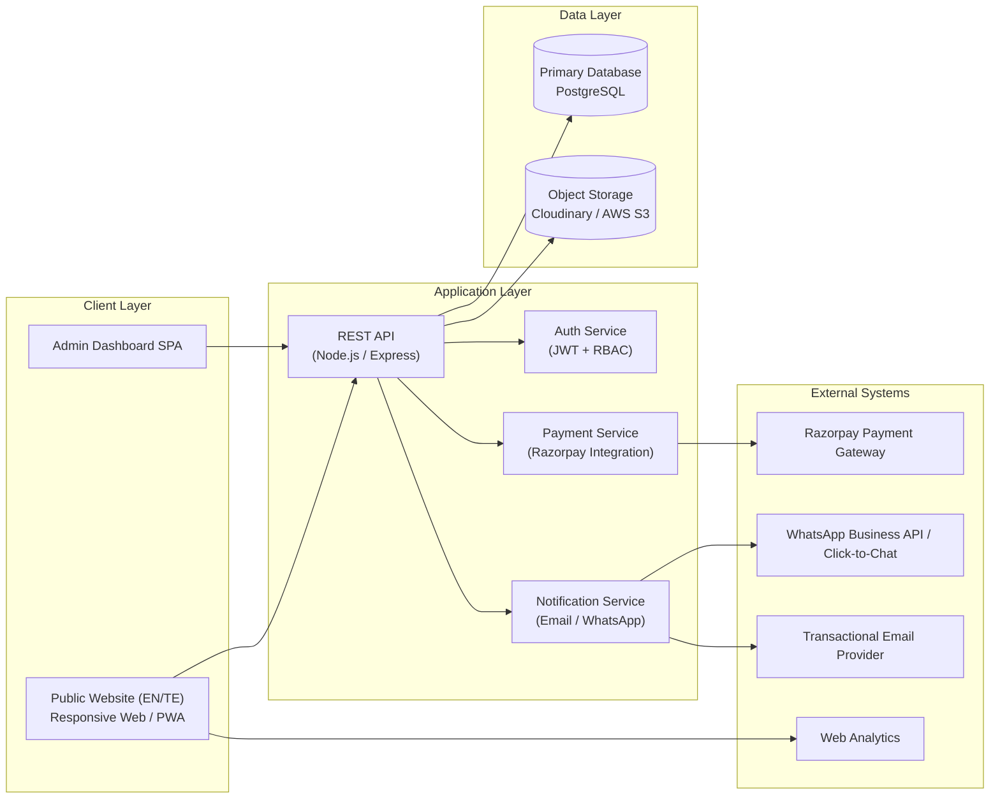
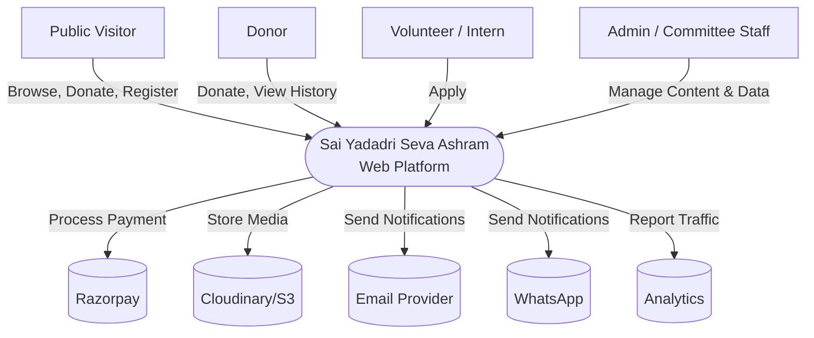
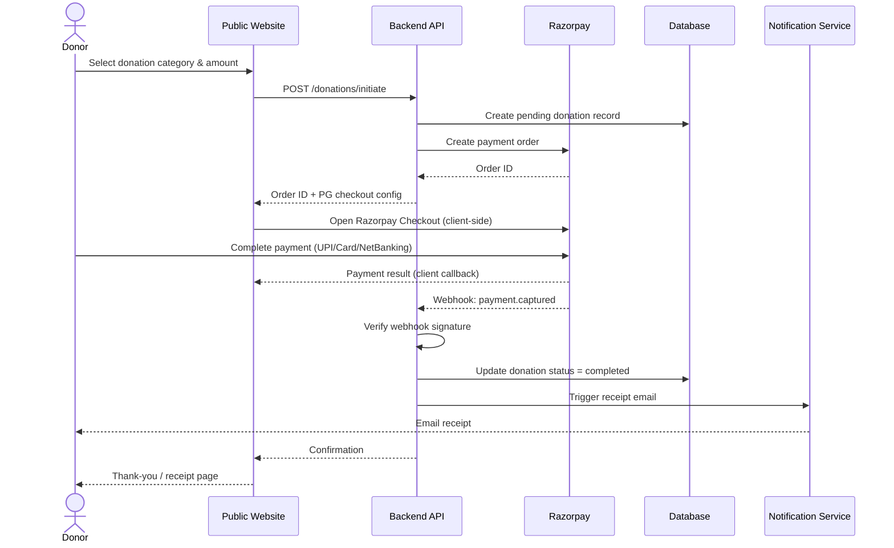

# Software Requirements Specification (SRS)
## Sai Yadadri Seva Ashram — Website & Donation Platform

| | |
|---|---|
| **Document Version** | 1.0 |
| **Standard Basis** | IEEE 830 / ISO/IEC/IEEE 29148 (adapted) |
| **Status** | Draft for Client Approval |
| **Date** | 2026-08-03 |
| **Traceability** | Derived from [01-BRD.md](01-BRD.md); elaborated in [03-Functional-Requirements.md](03-Functional-Requirements.md) and [04-Non-Functional-Requirements.md](04-Non-Functional-Requirements.md) |

---

## 1. Introduction

### 1.1 Purpose
This SRS specifies the complete software requirements for the Sai Yadadri Seva Ashram Website & Donation Platform ("the System"). It is intended for use by the Solution Architect, Frontend/Backend Architects, Database Architect, QA Engineer, and DevOps Engineer as the authoritative technical requirements baseline.

### 1.2 Scope
The System is a bilingual (English/Telugu), public-facing website with an integrated online donation platform and a role-based administrative back office, as bounded in [01-BRD.md §4](01-BRD.md#4-scope).

### 1.3 Definitions, Acronyms, Abbreviations

| Term | Definition |
|---|---|
| Ashram | Sai Yadadri Seva Ashram (the client organization) |
| Donor | Any individual or organization making a monetary contribution via the platform |
| CMS | Content Management System |
| RBAC | Role-Based Access Control |
| PG | Payment Gateway (Razorpay, per recommended stack) |
| PWA | Progressive Web App |
| EN/TE | English / Telugu (the two supported site languages) |
| SSR | Server-Side Rendering |
| API | Application Programming Interface |
| CSR | Corporate Social Responsibility |
| 12AB / 80G | Indian Income Tax Act provisions governing charitable-trust tax exemption and donor tax deduction |

### 1.4 References
- [01-BRD.md](01-BRD.md) — Business Requirements Document
- `docs/PROJECT_CONTEXT.md` — extracted client source data
- `docs/DOCUMENT_ANALYSIS.md` — source document audit and flagged conflicts
- All numbered documents 03–16 in this `documentation/` folder

### 1.5 Overview
Section 2 describes the System in context. Section 3 defines external interface requirements. Section 4 summarizes functional requirement categories (detailed fully in document 03). Section 5 summarizes non-functional requirements (detailed fully in document 04). Section 6 defines system models and data requirements at a conceptual level.

---

## 2. Overall Description

### 2.1 Product Perspective

The System replaces/replatforms the Ashram's existing static presence (`sysaindia.org`) with a dynamic, database-backed application composed of three logical tiers:

### 2.2 Product Functions (Summary)

1. Public content delivery (bilingual) — Home, About Us, Activities, Donations, Donor Corner, Events & News, Gallery, Volunteer Registration, Reports & Transparency, Appeals, Contact.
2. Online donation processing with multiple payment methods and automated receipting.
3. Volunteer/internship application intake and admin review workflow.
4. Admin CMS for all public content, media, and structured data (events, committee, gallery).
5. Donation and donor management, including recognition tiers (major donors, monthly donors, CSR partners).
6. Reporting and data export (financial summaries, donor lists, volunteer lists).
7. RBAC-secured admin access with audit logging.
8. SEO, analytics, and multi-channel notification (email, WhatsApp).

### 2.3 User Classes and Characteristics

| User Class | Technical Proficiency | Primary Goals |
|---|---|---|
| Public Visitor | Low–Medium (general public, mobile-first) | Learn about the Ashram, donate, contact |
| Donor (guest or registered) | Low–Medium | Donate securely, receive receipt, view donation history |
| Volunteer/Intern Applicant | Low–Medium | Register interest, submit application, check status |
| Content Admin (Organizing Secretaries) | Low (non-technical, retired professionals) | Update pages, events, gallery without developer help |
| Finance Admin (Treasurer / Asst. Treasurer) | Low–Medium | View/reconcile donations, export financial reports |
| Super Admin (General Secretary / technical delegate) | Medium | Full system configuration, user/role management |
| Volunteer Coordinator | Low | Review and manage volunteer applications |

Full role definitions in [10-Roles-and-Permissions.md](10-Roles-and-Permissions.md).

### 2.4 Operating Environment

- **Client side**: Modern evergreen browsers (Chrome, Safari, Edge, Firefox — last 2 major versions), iOS Safari and Android Chrome for mobile.
- **Server side**: Linux-based cloud VPS or managed cloud platform (see [11-Technology-Stack.md](11-Technology-Stack.md)).
- **Database**: PostgreSQL (managed or self-hosted).
- **Third-party dependencies**: Razorpay (payments), Cloudinary/AWS S3 (media storage), transactional email provider, WhatsApp Business click-to-chat or API.

### 2.5 Design and Implementation Constraints

- Must support English and Telugu content parity across all public pages (client-stated requirement).
- Must not process or store raw payment card data on Ashram-controlled servers (PCI-DSS scope minimization via Razorpay Checkout/hosted fields — see [12-Security-Requirements.md](12-Security-Requirements.md)).
- Must be operable and maintainable by non-technical committee staff for day-to-day content updates.
- Must accommodate the organization's low/non-profit operating budget (informs hosting and stack choices).

### 2.6 Assumptions and Dependencies
See [16-Assumptions-and-Dependencies.md](16-Assumptions-and-Dependencies.md) for the full register. Critical dependency: resolution of open items in [01-BRD.md §7](01-BRD.md#7-information-gaps-requiring-client-input) before certain modules (Reports & Transparency, CSR Partner listing) can launch with real content.

---

## 3. External Interface Requirements

### 3.1 User Interfaces
- Responsive public website: mobile-first, breakpoints for mobile (≤480px), tablet (481–1024px), desktop (>1024px).
- Language switcher (EN ⇄ TE) persistently available in the site header/footer.
- Admin dashboard: SPA (Single Page Application) with left-nav module structure, optimized for desktop/tablet use by admin staff; must remain usable on tablets given older-generation committee users may not have dedicated office desktops.
- WCAG 2.1 AA accessibility target for public pages (see [04-Non-Functional-Requirements.md](04-Non-Functional-Requirements.md)).

### 3.2 Hardware Interfaces
None — the System is a standard web application with no direct hardware interface requirements.

### 3.3 Software Interfaces

| Interface | Purpose | Protocol |
|---|---|---|
| Razorpay Payment Gateway | Donation processing (UPI, card, net banking, wallets) | REST API + Webhooks (HTTPS/JSON) |
| Cloudinary or AWS S3 | Media asset storage (gallery photos/videos, document repository) | REST API / SDK |
| Transactional Email Provider (e.g., SendGrid/Amazon SES) | Donation receipts, volunteer confirmations, contact-form notifications | SMTP / REST API |
| WhatsApp Business (Click-to-Chat or Cloud API) | Donor/visitor support channel | `wa.me` deep link (Phase 1) or WhatsApp Cloud API (Phase 2, if approved) |
| Google Maps Embed API | Office location display on Contact Us page | Embed / JavaScript API |
| Web Analytics (e.g., Google Analytics 4 / Plausible) | Traffic and behavior tracking | JavaScript snippet / API |

### 3.4 Communications Interfaces
- All client-server communication over HTTPS (TLS 1.2+) — no unencrypted HTTP in production.
- Webhooks from Razorpay must be signature-verified server-side.

---

## 4. Functional Requirements Summary

Full itemized functional requirements with IDs, priorities, and acceptance criteria are specified in **[03-Functional-Requirements.md](03-Functional-Requirements.md)**. Categories:

1. Public Content Management (Home, About, Activities, Events, Gallery)
2. Donation Processing & Donor Management
3. Volunteer/Internship Management
4. Contact & Communication
5. Reports & Transparency / Document Repository
6. Admin Authentication & RBAC
7. Search Engine Optimization
8. Analytics & Reporting
9. Multi-language Content Delivery
10. Notifications (email/WhatsApp)

---

## 5. Non-Functional Requirements Summary

Full non-functional requirements with measurable targets are specified in **[04-Non-Functional-Requirements.md](04-Non-Functional-Requirements.md)**. Categories: Performance, Scalability, Availability, Security, Usability, Accessibility, Maintainability, Portability, Compliance, Localization.

---

## 6. System Models

### 6.1 Context Diagram

### 6.2 High-Level Data Flow — Online Donation

Full data model in [08-Database-Requirements.md](08-Database-Requirements.md); full use case narrative in [06-Use-Cases.md](06-Use-Cases.md) UC-01.

### 6.3 Data Requirements (Conceptual)
Core entities: `User/Admin`, `Role`, `Donor`, `Donation`, `DonationCategory`, `Volunteer`, `VolunteerApplication`, `Event`, `NewsPost`, `GalleryItem`, `CommitteeMember`, `Page/Content Block`, `Document` (compliance repository), `ContactSubmission`, `AuditLog`. Fully specified in [08-Database-Requirements.md](08-Database-Requirements.md).

---

## 7. Other Requirements

- **Legal/Regulatory**: Display of Society Registration Number (423/2019), PAN (ABKAS9261K), and (once supplied) 12A/80G exemption status on relevant pages, per Indian non-profit disclosure norms.
- **Localization**: All user-facing strings externalized for EN/TE translation; Telugu Unicode (Noto Sans Telugu or equivalent) font support required.
- **Data Retention**: Donation and donor records retained indefinitely for audit/compliance purposes unless the Ashram specifies a retention/deletion policy (see [16-Assumptions-and-Dependencies.md](16-Assumptions-and-Dependencies.md)).

---

## 8. Appendix — Requirement Traceability Map

| SRS Section | Elaborated In |
|---|---|
| §4 Functional Requirements | [03-Functional-Requirements.md](03-Functional-Requirements.md) |
| §5 Non-Functional Requirements | [04-Non-Functional-Requirements.md](04-Non-Functional-Requirements.md) |
| §2.3 User Classes | [05-User-Stories.md](05-User-Stories.md), [10-Roles-and-Permissions.md](10-Roles-and-Permissions.md) |
| §6.2 Data Flows | [06-Use-Cases.md](06-Use-Cases.md) |
| Modules implied throughout | [07-System-Modules.md](07-System-Modules.md), [09-Admin-Modules.md](09-Admin-Modules.md) |
| §6.3 Data Requirements | [08-Database-Requirements.md](08-Database-Requirements.md) |
| §2.4/2.5 Environment/Constraints | [11-Technology-Stack.md](11-Technology-Stack.md) |
| §3.3 Interfaces | [13-API-Requirements.md](13-API-Requirements.md) |
| Security implications throughout | [12-Security-Requirements.md](12-Security-Requirements.md) |

---
**Related Documents:** [01-BRD.md](01-BRD.md) · [03-Functional-Requirements.md](03-Functional-Requirements.md) · [MASTER_PROJECT_PLAN.md](MASTER_PROJECT_PLAN.md)
