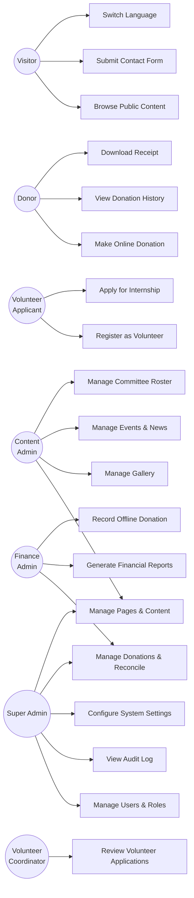

# Use Case Specifications
## Sai Yadadri Seva Ashram — Website & Donation Platform

| | |
|---|---|
| **Document Version** | 1.0 |
| **Status** | Draft for Client Approval |
| **Date** | 2026-08-03 |

---

## 1. Use Case Diagram — Overview

---

## 2. UC-01: Make Online Donation

| Field | Detail |
|---|---|
| **ID** | UC-01 |
| **Actor(s)** | Donor (guest or registered) |
| **Preconditions** | Donation module and payment gateway are live; donor has a valid payment method |
| **Trigger** | Donor clicks "Donate Now" from Home, Activities, Donation Categories, or an Appeal page |
| **Postconditions (Success)** | Donation record created with status `completed`; receipt emailed; donation reflected in admin dashboard |
| **Postconditions (Failure)** | Donation record created with status `failed`; no charge applied; donor shown retry option |

**Main Flow:**
1. Donor selects a donation category (Annaprasadam, Goshala, Old Age Home, Building Fund, General Donation).
2. System displays preset amount tiers (where defined) and a custom-amount field.
3. Donor selects/enters an amount and proceeds to checkout.
4. System presents donor details form (name, email, phone, optional PAN).
5. Donor submits the form; system validates required fields.
6. System creates a `pending` donation record and requests a payment order from Razorpay.
7. System opens the Razorpay Checkout widget with the order details.
8. Donor selects a payment method (UPI/Card/Net Banking/Wallet) and completes payment.
9. Razorpay confirms payment success to the client and sends a server-side webhook.
10. System verifies the webhook signature and updates the donation record to `completed`.
11. System triggers an automated receipt email to the donor.
12. System displays a confirmation/thank-you page with the donation summary.

**Alternate Flows:**
- **4a.** Donor arrived via a "Support this Program" link with category pre-selected — system skips to step 4 with the category locked.
- **8a.** Donor abandons the Razorpay Checkout widget without completing payment — donation record remains `pending`, expires after a configurable timeout (e.g., 30 minutes), and can be cleaned up by a scheduled job.
- **9a.** Payment fails at the gateway — Razorpay returns a failure result; system updates donation record to `failed`; donor is shown a clear failure message with a "Try Again" CTA (returns to step 3 with prior entries retained).
- **10a.** Webhook delivery is delayed or fails — system reconciles via a fallback polling job against Razorpay's payment status API within a defined SLA (e.g., 15 minutes) to avoid a donation being stuck in `pending` despite a successful charge.

**Business Rules:**
- No payment card data is captured or stored by the Ashram's own systems (PCI scope stays with Razorpay).
- A donation is only considered `completed` after webhook signature verification — client-side callback alone is never trusted for fulfillment.

**Related Requirements:** FR-DON-01 through FR-DON-10

### Sequence Diagram
*(See [02-SRS.md §6.2](02-SRS.md#62-high-level-data-flow--online-donation) for the full sequence diagram of this flow.)*

---

## 3. UC-02: Register as Volunteer

| Field | Detail |
|---|---|
| **ID** | UC-02 |
| **Actor(s)** | Volunteer Applicant, Volunteer Coordinator (secondary) |
| **Preconditions** | Volunteer Registration page is live |
| **Trigger** | Visitor navigates to Volunteer Registration & Internship page |
| **Postconditions (Success)** | Application stored with status `Submitted`; applicant and coordinator both notified |

**Main Flow:**
1. Applicant navigates to the Volunteer Registration page.
2. Applicant chooses "Volunteer" or "Internship" application type.
3. Applicant fills in personal details, area of interest/skills (and academic background + résumé upload if Internship).
4. Applicant submits the form.
5. System validates required fields and file type/size (for résumé upload).
6. System stores the application with status `Submitted`.
7. System sends a confirmation email/WhatsApp message to the applicant.
8. System notifies the Volunteer Coordinator via email.

**Alternate Flows:**
- **5a.** Validation fails (missing field, oversized file) — system highlights the specific field(s) with a bilingual error message; form data is retained.

**Related Requirements:** FR-VOL-01 through FR-VOL-04

---

## 4. UC-03: Manage Public Content (Admin CMS)

| Field | Detail |
|---|---|
| **ID** | UC-03 |
| **Actor(s)** | Content Admin, Super Admin |
| **Preconditions** | Actor is authenticated with `content:edit` permission (see [10-Roles-and-Permissions.md](10-Roles-and-Permissions.md)) |
| **Trigger** | Admin logs into the dashboard and selects a content module (Pages, Events, Gallery, Committee, Appeals) |

**Main Flow:**
1. Admin logs in via the Admin Dashboard login page.
2. System authenticates credentials and establishes a session (JWT).
3. Admin selects a content module from the navigation.
4. Admin creates or edits a content record (e.g., an Event) using the CMS form, entering both EN and TE fields.
5. Admin saves as Draft or Publishes immediately.
6. System validates the record and persists it.
7. If Published, the change is immediately reflected on the public site.
8. System logs the action (actor, timestamp, record) to the audit log.

**Alternate Flows:**
- **4a.** Admin leaves the Telugu field blank — system allows saving as Draft but flags the missing translation before allowing Publish (per FR-LANG-02).
- **6a.** Validation fails — system shows inline errors; record is not persisted until corrected.

**Related Requirements:** FR-LANG-02, and the full Admin Module set in [09-Admin-Modules.md](09-Admin-Modules.md)

---

## 5. UC-04: Reconcile Donations & Generate Financial Report

| Field | Detail |
|---|---|
| **ID** | UC-04 |
| **Actor(s)** | Finance Admin, Super Admin |
| **Preconditions** | Actor has `donations:view` and `reports:generate` permissions |
| **Trigger** | Finance Admin needs to reconcile a period's donations against the bank statement or prepare a committee report |

**Main Flow:**
1. Finance Admin navigates to Donation Management.
2. Admin filters transactions by date range, category, and/or payment status.
3. System displays the filtered donation list with running totals.
4. Admin cross-checks totals against the SBI bank statement / Razorpay settlement report.
5. Admin navigates to Reports and selects a report type (e.g., "Category-wise Summary", "Donor List") and date range.
6. System generates the report and offers PDF/Excel export.
7. Admin downloads the report for committee presentation or audit purposes.

**Alternate Flows:**
- **2a.** Admin identifies a discrepancy (e.g., a bank-side entry with no matching system record) — admin uses UC-05 (Record Offline Donation) or flags the record for investigation via an internal note field.

**Related Requirements:** Admin Donation Management & Reports in [09-Admin-Modules.md](09-Admin-Modules.md)

---

## 6. UC-05: Record Offline Donation

| Field | Detail |
|---|---|
| **ID** | UC-05 |
| **Actor(s)** | Finance Admin |
| **Preconditions** | Actor has `donations:create` permission |
| **Trigger** | A donor contributes via cash, cheque, or direct bank transfer outside the online gateway |

**Main Flow:**
1. Finance Admin opens "Add Manual Donation" in Donation Management.
2. Admin enters donor details, amount, category, payment method (Cash/Cheque/Bank Transfer/UPI-direct), and date received.
3. System saves the record with `source = Manual` and `status = completed`.
4. System optionally triggers a receipt email if a donor email was provided.
5. Record appears in all reports alongside online donations, tagged by source for auditability.

**Related Requirements:** Admin Donation Management in [09-Admin-Modules.md](09-Admin-Modules.md)

---

## 7. UC-06: Manage Users & Roles

| Field | Detail |
|---|---|
| **ID** | UC-06 |
| **Actor(s)** | Super Admin |
| **Preconditions** | Actor has `users:manage` permission (Super Admin only) |
| **Trigger** | A new committee member needs admin access, or a role change is required |

**Main Flow:**
1. Super Admin navigates to User Management.
2. Super Admin creates a new admin account (name, email, assigned role) or edits an existing one.
3. System sends an invitation/password-setup email to the new admin.
4. New admin sets a password and logs in.
5. System enforces the assigned role's permission scope on every subsequent action.

**Alternate Flows:**
- **2a.** Super Admin deactivates a departing committee member's account — access is revoked immediately; historical audit-log entries for that user are retained.

**Related Requirements:** FR-AUTH-01, FR-AUTH-02, [10-Roles-and-Permissions.md](10-Roles-and-Permissions.md)

---

## 8. UC-07: Contact the Ashram

| Field | Detail |
|---|---|
| **ID** | UC-07 |
| **Actor(s)** | Visitor |
| **Preconditions** | Contact Us page is live |
| **Trigger** | Visitor has a question or wants to get in touch |

**Main Flow:**
1. Visitor navigates to Contact Us.
2. Visitor fills in name, email, phone (optional), and message.
3. Visitor submits the form (protected by CAPTCHA/honeypot).
4. System validates and stores the submission.
5. System sends an acknowledgment email to the visitor and an alert email to the designated admin recipient.
6. Admin views and responds to the submission from the Admin Dashboard "Contact Submissions" list, or directly via email/phone/WhatsApp.

**Related Requirements:** FR-CON-01, FR-NOTIF-01, FR-NOTIF-03

---

## 9. Use Case Traceability Matrix

| Use Case | Primary Module | Functional Requirements | User Stories |
|---|---|---|---|
| UC-01 Make Online Donation | Donations | FR-DON-01…10 | US-06 – US-12 |
| UC-02 Register as Volunteer | Volunteer | FR-VOL-01…04 | US-13, US-14, US-15 |
| UC-03 Manage Public Content | Admin CMS | FR-LANG-02, Admin Modules | US-19, US-20, US-21 |
| UC-04 Reconcile Donations & Report | Admin Finance | Admin Modules | US-22, US-23 |
| UC-05 Record Offline Donation | Admin Finance | Admin Modules | US-24 |
| UC-06 Manage Users & Roles | Admin System | FR-AUTH-01, FR-AUTH-02 | US-25 |
| UC-07 Contact the Ashram | Contact | FR-CON-01, FR-NOTIF-01/03 | US-16 |

---
**Related Documents:** [03-Functional-Requirements.md](03-Functional-Requirements.md) · [05-User-Stories.md](05-User-Stories.md) · [07-System-Modules.md](07-System-Modules.md) · [MASTER_PROJECT_PLAN.md](MASTER_PROJECT_PLAN.md)
