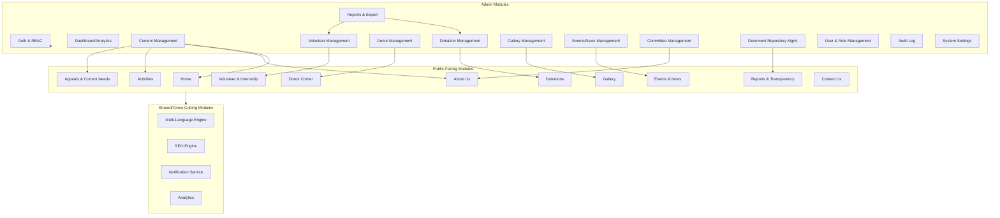

# System Modules
## Sai Yadadri Seva Ashram — Website & Donation Platform

| | |
|---|---|
| **Document Version** | 1.0 |
| **Status** | Draft for Client Approval |
| **Date** | 2026-08-03 |

---

## 1. Purpose
This document enumerates every module (public and administrative) that composes the System, its purpose, key components, data touchpoints, and dependencies on other modules. It is the architectural companion to [03-Functional-Requirements.md](03-Functional-Requirements.md).

## 2. High-Level Module Architecture

## 3. Public Module Specifications

### 3.1 Home Module
- **Purpose**: Primary entry point; drives donation conversion and orientation.
- **Components**: Hero banner, welcome message block, quick-donate widget, upcoming events preview, testimonials carousel, impact stats block.
- **Data Sources**: Content Management (hero/welcome text), Donations module (categories for quick-donate), Events module (upcoming events), Testimonials content type.
- **Dependencies**: Multi-Language Engine, Donations Module.

### 3.2 About Us Module
- **Purpose**: Establishes organizational credibility and trust.
- **Components**: History section, Vision & Mission section, Founder section, Committee grid, Treasurer's Message, Registration/PAN/12A-80G disclosure block.
- **Data Sources**: Content Management, Committee Management (admin module A9).
- **Dependencies**: Multi-Language Engine.
- **Content Gaps**: Vision & Mission, Founder bio, Treasurer's Message — pending client supply (renders "Coming Soon" until published; see [01-BRD.md §7](01-BRD.md#7-information-gaps-requiring-client-input)).

### 3.3 Activities Module
- **Purpose**: Details each program area to drive category-specific donations.
- **Components**: Vanaprasthasramam (Old Age Home) section, Wellness/Infrastructure section, Annaprasadam section (with pricing), Goshala/Goseva section (with pricing), Daily Sevas section, Medical Support section, Education section — each with a "Support this Program" CTA.
- **Data Sources**: Content Management, Donations Module (for CTA linking and pricing display).
- **Dependencies**: Donations Module, Multi-Language Engine.

### 3.4 Donations Module
- **Purpose**: Core revenue-generating module — donation category browsing, checkout, payment processing, and receipt issuance.
- **Components**: Donation Categories listing, Checkout form, Payment Gateway integration (Razorpay), Bank Transfer/UPI display, Receipt generator, Donation history (for returning donors).
- **Data Sources**: `DonationCategory`, `Donation`, `Donor` entities (see [08-Database-Requirements.md](08-Database-Requirements.md)).
- **Dependencies**: Notification Service (receipts), Multi-Language Engine, Analytics (conversion tracking).
- **External Integration**: Razorpay (payment processing).

### 3.5 Donor Corner Module
- **Purpose**: Recognizes and thanks contributors, reinforcing donor retention.
- **Components**: Major Donors list, Monthly Donors list, CSR Partners list.
- **Data Sources**: `Donor` entity with opt-in recognition flag; admin-curated selection.
- **Dependencies**: Donation Management (admin), Consent/Privacy controls.
- **Content Gaps**: CSR Partners — pending resolution of the CSR entity mismatch (see [DOCUMENT_ANALYSIS.md](../docs/DOCUMENT_ANALYSIS.md) §5).

### 3.6 Events & News Module
- **Purpose**: Keeps the public informed of activities and organizational news.
- **Components**: Event listing, Event detail page, News/blog listing, News detail page.
- **Data Sources**: `Event`, `NewsPost` entities.
- **Dependencies**: Admin Events/News Management (A8), SEO Engine (per-article metadata).

### 3.7 Gallery Module
- **Purpose**: Visual proof of impact; supports donor trust and social sharing.
- **Components**: Photo gallery (album/category grid), Video gallery (embedded).
- **Data Sources**: `GalleryItem` entity; object storage (Cloudinary/S3) for media files.
- **Dependencies**: Admin Gallery Management (A7).

### 3.8 Volunteer & Internship Module
- **Purpose**: Captures volunteer/intern interest and routes to review.
- **Components**: Volunteer Registration form, Internship Application form (with résumé upload), confirmation flow, optional status-check page.
- **Data Sources**: `Volunteer`, `VolunteerApplication` entities.
- **Dependencies**: Notification Service, Admin Volunteer Management (A6).

### 3.9 Reports & Transparency Module
- **Purpose**: Publishes compliance and financial-transparency documents.
- **Components**: Document listing (Annual Reports, Audit Reports, Financial Statements, Society Registration Certificate, 12AB, 80G), optional aggregate donation stats.
- **Data Sources**: `Document` entity (repository), object storage.
- **Dependencies**: Admin Document Repository Management (A10).
- **Content Gaps**: All documents pending client supply — see [01-BRD.md §7](01-BRD.md#7-information-gaps-requiring-client-input).

### 3.10 Appeals & Current Needs Module
- **Purpose**: Highlights active, goal-based fundraising campaigns (e.g., Building Fund).
- **Components**: Appeal listing, Appeal detail with progress bar, direct donate CTA.
- **Data Sources**: `Appeal` entity, linked `Donation` records tagged to the appeal.
- **Dependencies**: Donations Module.

### 3.11 Contact Us Module
- **Purpose**: Primary support/inquiry channel.
- **Components**: Contact form, office address/phone/email/timings block, Google Map embed, WhatsApp click-to-chat, social media links.
- **Data Sources**: `ContactSubmission` entity; static org-contact content.
- **Dependencies**: Notification Service.
- **Content Gaps**: Office phone/email/timings, exact map coordinates, social media handles — pending client supply.

## 4. Cross-Cutting / Shared Modules

### 4.1 Multi-Language Engine
- Provides EN/TE content resolution, language switcher state, and fallback-with-warning behavior when a translation is missing.
- Consumed by every public module.

### 4.2 SEO Engine
- Manages meta tags, sitemap.xml/robots.txt generation, structured data (schema.org NonProfit), canonical/hreflang tagging.
- Consumed by every public module; configured per-page via Admin CMS.

### 4.3 Notification Service
- Centralizes email (transactional provider) and WhatsApp (click-to-chat / future Cloud API) dispatch for: donation receipts, volunteer confirmations, contact acknowledgments, admin alerts.
- Consumed by Donations, Volunteer, and Contact modules.

### 4.4 Analytics
- Web analytics (traffic, behavior) plus an internal donation-trend aggregation feeding the Admin Dashboard.
- Consumed by Admin Dashboard/Analytics (A2).

## 5. Admin Module Specifications

Full detail (screens, fields, permissions) in **[09-Admin-Modules.md](09-Admin-Modules.md)**. Summary list:

| Module | Code | Summary |
|---|---|---|
| Auth & RBAC | A1 | Login, session management, role enforcement |
| Dashboard/Analytics | A2 | Landing overview: KPIs, recent activity, analytics widget |
| Content Management | A3 | CRUD for Home/About/Activities/Appeals page content |
| Donation Management | A4 | View/filter/export donations, manual entry, refund flagging |
| Donor Management | A5 | Donor records, recognition opt-in curation |
| Volunteer Management | A6 | Review/manage volunteer & internship applications |
| Gallery Management | A7 | Upload/organize photo & video media |
| Events/News Management | A8 | CRUD for events and news posts |
| Committee Management | A9 | CRUD for the 27-member committee roster |
| Document Repository Mgmt | A10 | Upload/manage compliance & transparency documents |
| Reports & Export | A11 | Generate financial/donor/volunteer reports |
| User & Role Management | A12 | Manage admin accounts and role assignments |
| Audit Log | A13 | Immutable log of sensitive admin actions |
| System Settings | A14 | Notification recipients, payment gateway keys, SEO defaults |

## 6. Module Dependency Matrix

| Module | Depends On |
|---|---|
| Home | Multi-Language Engine, Donations, Content Mgmt, Events |
| About Us | Multi-Language Engine, Committee Mgmt, Content Mgmt |
| Activities | Multi-Language Engine, Donations, Content Mgmt |
| Donations | Notification Service, Analytics, Razorpay (external), Donation Mgmt |
| Donor Corner | Donor Mgmt, Donation Mgmt |
| Events & News | Events/News Mgmt, SEO Engine |
| Gallery | Gallery Mgmt, Object Storage (external) |
| Volunteer & Internship | Notification Service, Volunteer Mgmt |
| Reports & Transparency | Document Repository Mgmt, Object Storage (external) |
| Appeals & Current Needs | Donations, Content Mgmt |
| Contact Us | Notification Service |
| All Admin Modules | Auth & RBAC, Audit Log |

## 7. Page Inventory (Public Site)

| Page | URL Pattern (proposed) | Module |
|---|---|---|
| Home | `/` | Home |
| About Us | `/about` | About Us |
| Activities (index) | `/activities` | Activities |
| Activity detail (per program) | `/activities/{slug}` | Activities |
| Donation Categories | `/donate` | Donations |
| Donation Checkout | `/donate/checkout` | Donations |
| Donation Confirmation | `/donate/thank-you` | Donations |
| Donor Corner | `/donors` | Donor Corner |
| Events & News (index) | `/news` | Events & News |
| Event/News detail | `/news/{slug}` | Events & News |
| Gallery | `/gallery` | Gallery |
| Volunteer Registration | `/volunteer` | Volunteer & Internship |
| Reports & Transparency | `/transparency` | Reports & Transparency |
| Appeals & Current Needs | `/appeals` | Appeals |
| Contact Us | `/contact` | Contact Us |
| Privacy Policy | `/privacy-policy` | Static/Legal |
| Terms of Use | `/terms` | Static/Legal |

Each of the above (excluding legal pages) exists in both `/en/` and `/te/` locale-prefixed variants per the Multi-Language Engine (or an equivalent locale-routing strategy finalized by the Frontend Architect).

---
**Related Documents:** [03-Functional-Requirements.md](03-Functional-Requirements.md) · [08-Database-Requirements.md](08-Database-Requirements.md) · [09-Admin-Modules.md](09-Admin-Modules.md) · [MASTER_PROJECT_PLAN.md](MASTER_PROJECT_PLAN.md)
