# Database Requirements
## Sai Yadadri Seva Ashram — Website & Donation Platform

| | |
|---|---|
| **Document Version** | 1.0 |
| **Status** | Draft for Client Approval |
| **Date** | 2026-08-03 |
| **Target RDBMS** | PostgreSQL (see [11-Technology-Stack.md](11-Technology-Stack.md) for justification) |

> **Update (2026-08-04):** by explicit client decision, the implemented platform runs on **MySQL 8.0+** instead of PostgreSQL. This document's relational data-model requirements below are unaffected (the entities, attributes, and relationships are RDBMS-agnostic); only the target engine changed. See [MYSQL_MIGRATION_REPORT.md](../MYSQL_MIGRATION_REPORT.md) for the full rationale and implementation detail. The PostgreSQL-specific text below is preserved as the original planning record.

---

## 1. Purpose
This document defines the logical data model for the System: entities, attributes, relationships, and key data-management rules. It is implementation-guiding, not a physical DDL script (no code is generated per engagement scope).

## 2. Entity-Relationship Diagram

```mermaid
erDiagram
    ADMIN_USER ||--o{ AUDIT_LOG : performs
    ADMIN_USER }o--|| ROLE : "assigned"
    ROLE ||--o{ ROLE_PERMISSION : grants
    PERMISSION ||--o{ ROLE_PERMISSION : "granted via"

    DONATION_CATEGORY ||--o{ DONATION : classifies
    DONOR ||--o{ DONATION : makes
    APPEAL ||--o{ DONATION : "tagged to"
    DONATION ||--o| RECEIPT : generates

    COMMITTEE_MEMBER {
        uuid id PK
        string name
        string designation
        int display_order
        string photo_url
        string bio_en
        string bio_te
        boolean active
    }

    PAGE_CONTENT ||--o{ CONTENT_BLOCK : contains

    EVENT_NEWS_POST {
        uuid id PK
        string type
        string title_en
        string title_te
        string body_en
        string body_te
        string slug
        date published_at
        string status
        string featured_image_url
        uuid author_admin_id FK
    }

    GALLERY_ALBUM ||--o{ GALLERY_ITEM : contains

    VOLUNTEER ||--o{ VOLUNTEER_APPLICATION : submits

    DOCUMENT_REPO {
        uuid id PK
        string category
        string title_en
        string title_te
        string file_url
        date published_date
        boolean public_visible
        uuid uploaded_by FK
    }

    CONTACT_SUBMISSION {
        uuid id PK
        string name
        string email
        string phone
        string message
        datetime submitted_at
        string status
    }

    DONATION {
        uuid id PK
        uuid donor_id FK
        uuid category_id FK
        uuid appeal_id FK
        decimal amount
        string currency
        string payment_method
        string payment_gateway_ref
        string status
        string source
        datetime created_at
        datetime completed_at
    }

    DONOR {
        uuid id PK
        string name
        string email
        string phone
        string pan_number
        boolean recognition_opt_in
        string donor_tier
        datetime created_at
    }

    DONATION_CATEGORY {
        uuid id PK
        string name_en
        string name_te
        string description_en
        string description_te
        boolean has_preset_tiers
    }

    APPEAL {
        uuid id PK
        string title_en
        string title_te
        decimal target_amount
        decimal raised_amount_cache
        date start_date
        date end_date
        string status
    }

    RECEIPT {
        uuid id PK
        uuid donation_id FK
        string receipt_number
        string pdf_url
        datetime issued_at
    }

    VOLUNTEER {
        uuid id PK
        string name
        string email
        string phone
        string area_of_interest
        datetime registered_at
    }

    VOLUNTEER_APPLICATION {
        uuid id PK
        uuid volunteer_id FK
        string type
        string academic_background
        string resume_url
        string status
        datetime submitted_at
        uuid reviewed_by FK
    }

    ADMIN_USER {
        uuid id PK
        string name
        string email
        string password_hash
        uuid role_id FK
        boolean active
        datetime last_login_at
    }

    ROLE {
        uuid id PK
        string name
        string description
    }

    PERMISSION {
        uuid id PK
        string code
        string description
    }

    AUDIT_LOG {
        uuid id PK
        uuid admin_user_id FK
        string action
        string entity_type
        uuid entity_id
        json before_state
        json after_state
        datetime timestamp
    }
```

## 3. Entity Dictionary

### 3.1 `donor`
| Field | Type | Notes |
|---|---|---|
| id | UUID (PK) | |
| name | varchar | Required |
| email | varchar | Required, indexed, unique per donor identity strategy |
| phone | varchar | Required |
| pan_number | varchar | Optional; used for 80G receipt eligibility once certification is available |
| recognition_opt_in | boolean | Default `false` — required before appearing in Donor Corner (privacy-by-default) |
| donor_tier | enum(`one_time`,`monthly`,`major`,`csr`) | Derived/admin-assigned |
| created_at | timestamp | |

### 3.2 `donation_category`
| Field | Type | Notes |
|---|---|---|
| id | UUID (PK) | |
| name_en / name_te | varchar | Bilingual required |
| description_en / description_te | text | Bilingual required |
| has_preset_tiers | boolean | True for Annaprasadam, Goshala; false for General/Old Age Home (until pricing supplied) |

Seed data (from verified source, [PROJECT_CONTEXT.md §5](../docs/PROJECT_CONTEXT.md)): Annaprasadam (Lunch ₹3,000 / Full Day ₹5,000 / Life ₹51,000), Goshala (Daily ₹516 / Monthly ₹5,116 / Monthly ₹11,116), Old Age Home (General — no preset), Building Fund (General — no preset, linked to Appeal target ₹2.25 Cr), General Donation (no preset).

### 3.3 `donation`
| Field | Type | Notes |
|---|---|---|
| id | UUID (PK) | |
| donor_id | UUID (FK → donor) | |
| category_id | UUID (FK → donation_category) | |
| appeal_id | UUID (FK → appeal, nullable) | |
| amount | decimal(12,2) | |
| currency | varchar | Default `INR` |
| payment_method | enum(`upi`,`card`,`netbanking`,`wallet`,`bank_transfer_manual`,`cash`,`cheque`) | |
| payment_gateway_ref | varchar | Razorpay order/payment ID; null for manual/offline |
| status | enum(`pending`,`completed`,`failed`,`refunded`) | |
| source | enum(`online`,`manual`) | |
| created_at / completed_at | timestamp | |

### 3.4 `receipt`
1:1 with a completed `donation`. Stores generated receipt number (sequential, auditable), PDF URL, issued timestamp.

### 3.5 `appeal`
Represents goal-based campaigns (e.g., Building Fund). `raised_amount_cache` is a denormalized, periodically-recalculated sum of linked completed donations for fast progress-bar rendering.

### 3.6 `committee_member`
Bilingual name/bio not required in original brochure data (only English names supplied) — `bio_te` may remain null until translated content is supplied; `display_order` supports the admin's ability to control roster ordering (President first, etc., matching brochure convention).

### 3.7 `event_news_post`
Unified table for both Events and News/Blog (differentiated by `type`), sharing the same content shape (title, body, slug, publish workflow) to minimize schema duplication while allowing type-specific listing/filtering at the query layer.

### 3.8 `gallery_album` / `gallery_item`
Album groups (e.g., "Annaprasadam", "Goshala", "Infrastructure", "Events") each containing ordered media items (image or video-embed-url) with alt text (bilingual, for accessibility per NFR-ACC-02).

### 3.9 `volunteer` / `volunteer_application`
Separated so a single volunteer (matched by email/phone) can submit multiple applications over time (e.g., re-applying for a different internship cycle) without duplicating personal data.

### 3.10 `document_repo`
Backs the Reports & Transparency module and compliance-document display. `public_visible` flag lets admin stage/upload a document before publishing it live — supports the phased arrival of client-supplied compliance documents (see [01-BRD.md §7](01-BRD.md#7-information-gaps-requiring-client-input)).

### 3.11 `contact_submission`
Stores Contact Us form entries; `status` enum(`new`,`in_progress`,`resolved`) supports basic admin triage workflow.

### 3.12 `admin_user` / `role` / `permission` / `role_permission`
Standard RBAC schema. Full role/permission matrix defined functionally in [10-Roles-and-Permissions.md](10-Roles-and-Permissions.md); this schema is the data-layer implementation of that matrix.

### 3.13 `audit_log`
Append-only. Captures `before_state`/`after_state` as JSON snapshots for sensitive actions (donation edits, user/role changes, content publish/unpublish, document uploads). No `UPDATE` or `DELETE` operations permitted on this table at the application layer.

## 4. Data Integrity & Business Rules

| Rule | Enforcement |
|---|---|
| A `donation` cannot transition from `completed` back to `pending`. | Application-layer state machine + DB check constraint on status transition where feasible. |
| `receipt` is only created when `donation.status = completed`. | Application-layer trigger on status-change event. |
| `donor.recognition_opt_in` must be explicitly `true` before a donor appears in any Donor Corner query. | Query-layer filter enforced at all public-facing endpoints — never optional/implicit. |
| `committee_member.display_order` must be unique within active records. | Application-layer validation on save. |
| `audit_log` rows are immutable once written. | DB-level restricted permissions (no UPDATE/DELETE grant to application role on this table). |

## 5. Indexing Strategy (Guidance for Backend/Database Architect)

| Table | Recommended Index | Reason |
|---|---|---|
| donation | (status, created_at) | Admin filtering by status + date range is the primary query pattern |
| donation | (category_id) | Category-wise reporting |
| donation | (donor_id) | Donor history lookups |
| donor | (email) unique | Donor de-duplication / login lookup |
| event_news_post | (slug) unique, (type, published_at) | SEO-friendly URL lookups; listing pages sorted by date |
| gallery_item | (album_id, display_order) | Ordered album rendering |
| audit_log | (admin_user_id, timestamp), (entity_type, entity_id) | Audit trail lookups by user or by affected record |

## 6. Data Retention & Privacy

- Donation and receipt records: retained indefinitely by default for financial/audit compliance, **pending an explicit Ashram-defined retention policy** (see [16-Assumptions-and-Dependencies.md](16-Assumptions-and-Dependencies.md)).
- Contact submissions: recommend a default retention review at 24 months; configurable by Super Admin.
- Donor PII (email, phone, PAN) access restricted per [10-Roles-and-Permissions.md](10-Roles-and-Permissions.md); never exposed in public API responses.
- Volunteer résumé files stored in access-controlled object storage, not publicly listable.

## 7. Backup & Migration Notes
- Daily automated backups (see [04-Non-Functional-Requirements.md](04-Non-Functional-Requirements.md) NFR-AVAIL-03).
- Schema migrations to be managed via a versioned migration tool appropriate to the chosen backend framework (e.g., Prisma Migrate / TypeORM migrations / Knex) — final tool choice owned by the Backend Architect during technical design, consistent with [11-Technology-Stack.md](11-Technology-Stack.md).

---
**Related Documents:** [07-System-Modules.md](07-System-Modules.md) · [11-Technology-Stack.md](11-Technology-Stack.md) · [13-API-Requirements.md](13-API-Requirements.md) · [MASTER_PROJECT_PLAN.md](MASTER_PROJECT_PLAN.md)
