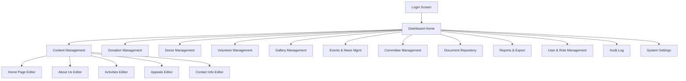

# Admin Modules Specification
## Sai Yadadri Seva Ashram — Website & Donation Platform

| | |
|---|---|
| **Document Version** | 1.0 |
| **Status** | Draft for Client Approval |
| **Date** | 2026-08-03 |

---

## 1. Purpose
This document details every screen and capability of the Admin Dashboard — the back-office application used by the Ashram's committee/staff to run the platform day-to-day. Designed for **non-technical users** per [02-SRS.md §2.3](02-SRS.md#23-user-classes-and-characteristics).

## 2. Admin Dashboard Information Architecture

## 3. A1 — Authentication & Session

| Screen | Capabilities |
|---|---|
| Login | Email + password login; "Forgot Password" flow (email reset link, time-limited token) |
| Session | JWT-based session with configurable expiry; auto-logout on inactivity (recommended 30 min) |

**Access:** All admin roles.

## 4. A2 — Dashboard Home

Landing screen after login. Displays:
- Summary KPI tiles: Total donations (month-to-date), Donation count, New volunteer applications (unreviewed), New contact submissions (unread).
- Recent activity feed (last 10 admin actions, sourced from Audit Log).
- Analytics widget: visits trend (7/30-day), top 5 pages, donation trend chart (see FR-ANL-02).
- Quick-links to the most-used modules (role-dependent — e.g., Finance Admin sees Donation Management shortcut prominently).

**Access:** All admin roles (content scoped/filtered per role permissions).

## 5. A3 — Content Management

Covers Home, About Us, Activities, Appeals, and Contact Info static/structured content.

| Screen | Fields / Capabilities |
|---|---|
| Home Page Editor | Hero image/text (EN/TE), welcome message (EN/TE), impact stats (numeric + label, EN/TE), testimonial CRUD |
| About Us Editor | History (rich text, EN/TE), Vision & Mission (rich text, EN/TE — shows "not yet published" badge until filled), Founder bio (rich text, EN/TE), Treasurer's Message (rich text, EN/TE) |
| Activities Editor | Per-program content blocks (Vanaprasthasramam, Wellness Centre, Annaprasadam, Goshala, Daily Sevas, Medical Support, Education) — rich text + image + linked donation category |
| Appeals Editor | Create/edit/archive appeals: title (EN/TE), description, target amount, start/end date, status, linked donation category |
| Contact Info Editor | Office address, phone, email, timings, map coordinates, WhatsApp number, social media links |

**Access:** Content Admin (full), Super Admin (full). Read-only for Finance Admin, Volunteer Coordinator.

**Publishing workflow:** Draft → Publish, with a "missing translation" warning gate before Publish is enabled (per FR-LANG-02) — never blocks Draft saving.

## 6. A4 — Donation Management

| Screen | Capabilities |
|---|---|
| Donation List | Filterable/sortable table: date range, category, status, payment method, source (online/manual); running total display |
| Donation Detail | View full record: donor info, amount, category, gateway reference, status history, linked receipt |
| Add Manual Donation | Form to record offline (cash/cheque/bank transfer) donations — see UC-05 in [06-Use-Cases.md](06-Use-Cases.md) |
| Refund Flagging | Mark a donation as `refunded` with a reason note (actual refund processed via Razorpay dashboard/API — this module tracks status, does not itself move money outside the payment gateway's own refund mechanism) |
| Export | CSV/Excel export of filtered donation list |

**Access:** Finance Admin (full), Super Admin (full). Content Admin: no access. Volunteer Coordinator: no access.

## 7. A5 — Donor Management

| Screen | Capabilities |
|---|---|
| Donor List | Search/filter donors by name, email, donation total, tier |
| Donor Detail | View donation history for a donor, recognition opt-in status, donor tier assignment |
| Recognition Curation | Toggle a donor's inclusion in "Major Donors" / "Monthly Donors" / "CSR Partners" public lists — **only enabled if `recognition_opt_in = true`** |

**Access:** Finance Admin (full), Super Admin (full), Content Admin (read-only, for Donor Corner page context).

## 8. A6 — Volunteer Management

| Screen | Capabilities |
|---|---|
| Application List | Filter by type (Volunteer/Internship), status (Submitted/Under Review/Accepted/Not Selected) |
| Application Detail | View submitted details, résumé download (for internships), internal notes field |
| Status Update | Change application status; triggers optional notification to applicant |

**Access:** Volunteer Coordinator (full), Super Admin (full). Content Admin, Finance Admin: no access.

## 9. A7 — Gallery Management

| Screen | Capabilities |
|---|---|
| Album List | Create/edit/delete albums (e.g., "Annaprasadam", "Goshala", "Events 2026") |
| Media Upload | Bulk drag-and-drop upload (images/video links); auto-generates optimized/responsive variants via storage provider |
| Media Organize | Reorder within album (drag-and-drop), edit alt text (EN/TE), delete |

**Access:** Content Admin (full), Super Admin (full).

## 10. A8 — Events & News Management

| Screen | Capabilities |
|---|---|
| Post List | Filter by type (Event/News), status (Draft/Published/Archived) |
| Post Editor | Title, body (rich text), featured image, publish date, SEO meta fields — all bilingual |

**Access:** Content Admin (full), Super Admin (full).

## 11. A9 — Committee Management

| Screen | Capabilities |
|---|---|
| Committee List | View all 27 members in display order; drag-to-reorder |
| Member Editor | Name, designation, photo upload, bio (optional, EN/TE), active/inactive toggle (for term transitions, e.g., 2025–2028 → next term) |

**Access:** Content Admin (full), Super Admin (full).

**Note:** This module is the authoritative source for the public Committee grid — it must reflect the full, corrected 27-member roster from `COMMITTEE MEMBERS LIST.docx`, not the incomplete 25-member subset shown in the print brochure (see [DOCUMENT_ANALYSIS.md](../docs/DOCUMENT_ANALYSIS.md)).

## 12. A10 — Document Repository Management

| Screen | Capabilities |
|---|---|
| Document List | Categorized list: Registration Certificate, 12AB, 80G, Annual Reports, Audit Reports, Financial Statements |
| Upload/Edit | Upload PDF, set title (EN/TE), publish date, `public_visible` toggle |

**Access:** Finance Admin (upload financial/audit docs), Super Admin (full, incl. registration/legal docs). Content Admin: read-only.

## 13. A11 — Reports & Export

| Screen | Capabilities |
|---|---|
| Donation Summary Report | By date range, category, payment method — PDF/Excel export |
| Donor Report | List of donors with totals for a period — PDF/Excel export |
| Volunteer Report | List of applications with status — Excel export |
| Appeal Progress Report | Target vs. raised per active appeal |

**Access:** Finance Admin (full for financial reports), Super Admin (full), Volunteer Coordinator (Volunteer Report only).

## 14. A12 — User & Role Management

| Screen | Capabilities |
|---|---|
| Admin User List | View all admin accounts, role, status (active/inactive) |
| Create/Edit Admin User | Assign name, email, role; deactivate/reactivate accounts |
| Role Overview | View permission matrix per role (reference view — see [10-Roles-and-Permissions.md](10-Roles-and-Permissions.md)) |

**Access:** Super Admin only.

## 15. A13 — Audit Log

| Screen | Capabilities |
|---|---|
| Audit Log Viewer | Read-only, filterable by admin user, action type, date range, affected entity; shows before/after state for sensitive changes |

**Access:** Super Admin only.

## 16. A14 — System Settings

| Screen | Capabilities |
|---|---|
| Notification Settings | Configure recipient email(s) per notification type (donation alert, volunteer alert, contact alert) |
| Payment Gateway Settings | Razorpay API key management (stored securely, never displayed in plaintext after entry — see [12-Security-Requirements.md](12-Security-Requirements.md)) |
| SEO Defaults | Site-wide default meta title/description, social share image |
| Language Settings | Default language, enabled locales |

**Access:** Super Admin only.

## 17. Admin Module → Role Access Summary

| Module | Content Admin | Finance Admin | Volunteer Coordinator | Super Admin |
|---|:---:|:---:|:---:|:---:|
| Dashboard Home | ✅ (scoped) | ✅ (scoped) | ✅ (scoped) | ✅ (full) |
| Content Management (A3) | ✅ | 👁 Read-only | ❌ | ✅ |
| Donation Management (A4) | ❌ | ✅ | ❌ | ✅ |
| Donor Management (A5) | 👁 Read-only | ✅ | ❌ | ✅ |
| Volunteer Management (A6) | ❌ | ❌ | ✅ | ✅ |
| Gallery Management (A7) | ✅ | ❌ | ❌ | ✅ |
| Events/News Management (A8) | ✅ | ❌ | ❌ | ✅ |
| Committee Management (A9) | ✅ | ❌ | ❌ | ✅ |
| Document Repository (A10) | 👁 Read-only | ✅ (financial docs) | ❌ | ✅ |
| Reports & Export (A11) | ❌ | ✅ | ✅ (volunteer only) | ✅ |
| User & Role Management (A12) | ❌ | ❌ | ❌ | ✅ |
| Audit Log (A13) | ❌ | ❌ | ❌ | ✅ |
| System Settings (A14) | ❌ | ❌ | ❌ | ✅ |

*Full permission-code-level matrix in [10-Roles-and-Permissions.md](10-Roles-and-Permissions.md).*

---
**Related Documents:** [07-System-Modules.md](07-System-Modules.md) · [10-Roles-and-Permissions.md](10-Roles-and-Permissions.md) · [06-Use-Cases.md](06-Use-Cases.md) · [MASTER_PROJECT_PLAN.md](MASTER_PROJECT_PLAN.md)
