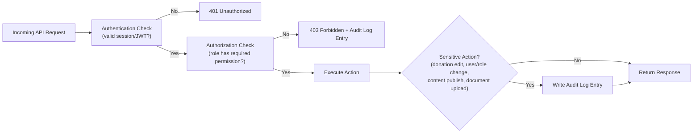

# Roles and Permissions
## Sai Yadadri Seva Ashram — Website & Donation Platform

| | |
|---|---|
| **Document Version** | 1.0 |
| **Status** | Draft for Client Approval |
| **Date** | 2026-08-03 |

---

## 1. Purpose
Defines the Role-Based Access Control (RBAC) model enforced across the platform, at both the admin-dashboard and API level. All authorization checks are enforced **server-side**; the client UI merely reflects (and never substitutes for) these server-side rules — see [12-Security-Requirements.md](12-Security-Requirements.md).

## 2. Roles

| Role | Typical Assignee | Description |
|---|---|---|
| **Super Admin** | General Secretary or designated technical delegate | Full system control, including user/role management, system settings, and audit oversight |
| **Content Admin** | Organizing Secretaries (content-focused) | Manages public-facing content: pages, events, gallery, committee |
| **Finance Admin** | Treasurer, Asst. Treasurer | Manages donations, donor records, financial reports, financial documents |
| **Volunteer Coordinator** | Designated committee member | Manages volunteer/internship applications |
| **Donor** (public, optional account) | Any donor who chooses to register | Can view own donation history and receipts only |
| **Public/Guest** | Any site visitor | No authentication; access limited to public pages and public actions (donate, submit forms) |

> **Design principle:** Roles map to real organizational responsibilities identified in the Committee roster ([PROJECT_CONTEXT.md §6](../docs/PROJECT_CONTEXT.md)) rather than generic technical labels, so the Ashram's non-technical committee members can map themselves to a role intuitively. Exact person-to-role assignment is a client decision made during onboarding (see [14-Project-Timeline.md](14-Project-Timeline.md) UAT phase).

## 3. Permission Catalogue

| Code | Description |
|---|---|
| `content:view` | View content management screens |
| `content:edit` | Create/edit content (draft) |
| `content:publish` | Publish/unpublish content live |
| `donations:view` | View donation records |
| `donations:create_manual` | Record offline/manual donations |
| `donations:flag_refund` | Flag a donation as refunded |
| `donations:export` | Export donation data |
| `donors:view` | View donor records/history |
| `donors:manage_recognition` | Toggle donor public-recognition opt-in status |
| `volunteers:view` | View volunteer/internship applications |
| `volunteers:manage_status` | Update application status |
| `gallery:manage` | Upload/organize/delete gallery media |
| `events:manage` | Create/edit/publish events & news |
| `committee:manage` | Manage committee roster |
| `documents:view` | View document repository |
| `documents:upload` | Upload compliance/financial documents |
| `documents:publish` | Toggle public visibility of a document |
| `reports:generate` | Generate/export reports |
| `users:manage` | Create/edit/deactivate admin accounts, assign roles |
| `audit:view` | View the audit log |
| `settings:manage` | Modify system settings (notifications, payment keys, SEO defaults) |

## 4. Role–Permission Matrix

| Permission | Content Admin | Finance Admin | Volunteer Coordinator | Super Admin |
|---|:---:|:---:|:---:|:---:|
| content:view | ✅ | ✅ | ❌ | ✅ |
| content:edit | ✅ | ❌ | ❌ | ✅ |
| content:publish | ✅ | ❌ | ❌ | ✅ |
| donations:view | ❌ | ✅ | ❌ | ✅ |
| donations:create_manual | ❌ | ✅ | ❌ | ✅ |
| donations:flag_refund | ❌ | ✅ | ❌ | ✅ |
| donations:export | ❌ | ✅ | ❌ | ✅ |
| donors:view | 👁 (limited) | ✅ | ❌ | ✅ |
| donors:manage_recognition | ❌ | ✅ | ❌ | ✅ |
| volunteers:view | ❌ | ❌ | ✅ | ✅ |
| volunteers:manage_status | ❌ | ❌ | ✅ | ✅ |
| gallery:manage | ✅ | ❌ | ❌ | ✅ |
| events:manage | ✅ | ❌ | ❌ | ✅ |
| committee:manage | ✅ | ❌ | ❌ | ✅ |
| documents:view | ✅ | ✅ | ❌ | ✅ |
| documents:upload | ❌ | ✅ (financial only) | ❌ | ✅ |
| documents:publish | ❌ | ✅ (financial only) | ❌ | ✅ |
| reports:generate | ❌ | ✅ | ✅ (volunteer only) | ✅ |
| users:manage | ❌ | ❌ | ❌ | ✅ |
| audit:view | ❌ | ❌ | ❌ | ✅ |
| settings:manage | ❌ | ❌ | ❌ | ✅ |

**Legend:** ✅ Full access · 👁 Read-only/limited scope · ❌ No access

## 5. Donor & Public Access Rules

| Action | Guest (unauthenticated) | Registered Donor |
|---|:---:|:---:|
| Browse public pages | ✅ | ✅ |
| Submit donation (guest checkout) | ✅ | ✅ |
| View own donation history | ❌ | ✅ (own records only) |
| Download own receipts | ❌ (receipt emailed at time of donation) | ✅ |
| View other donors' data | ❌ | ❌ |
| Submit volunteer/internship application | ✅ | ✅ |
| Submit contact form | ✅ | ✅ |

Donor accounts (if implemented per FR-DON-07) are strictly scoped to the donor's own records — there is no concept of a donor viewing or managing another donor's data under any circumstance.

## 6. Enforcement Architecture

## 7. Segregation of Duties Notes

- **Finance Admin cannot manage users or system settings** — prevents a single finance-focused role from also controlling access/security configuration.
- **Content Admin cannot view/export donation data** — protects donor financial privacy from staff without a financial-reporting need.
- **Only Super Admin can view the Audit Log** — ensures accountability oversight isn't self-monitored by the roles being logged.
- **Donor recognition requires explicit opt-in**, enforced independently of any admin role's ability to view donor data — privacy-by-default even for authorized Finance Admin users curating the public Donor Corner list.

## 8. Open Items for Client Confirmation

- Final person-to-role mapping (who specifically holds Super Admin vs. Content Admin vs. Finance Admin vs. Volunteer Coordinator) — to be confirmed during onboarding/UAT (see [14-Project-Timeline.md](14-Project-Timeline.md)).
- Whether more than one Super Admin account is desired for redundancy (recommended: at least 2, to avoid a single point of failure if one committee member is unavailable).

---
**Related Documents:** [09-Admin-Modules.md](09-Admin-Modules.md) · [12-Security-Requirements.md](12-Security-Requirements.md) · [08-Database-Requirements.md](08-Database-Requirements.md) · [MASTER_PROJECT_PLAN.md](MASTER_PROJECT_PLAN.md)
