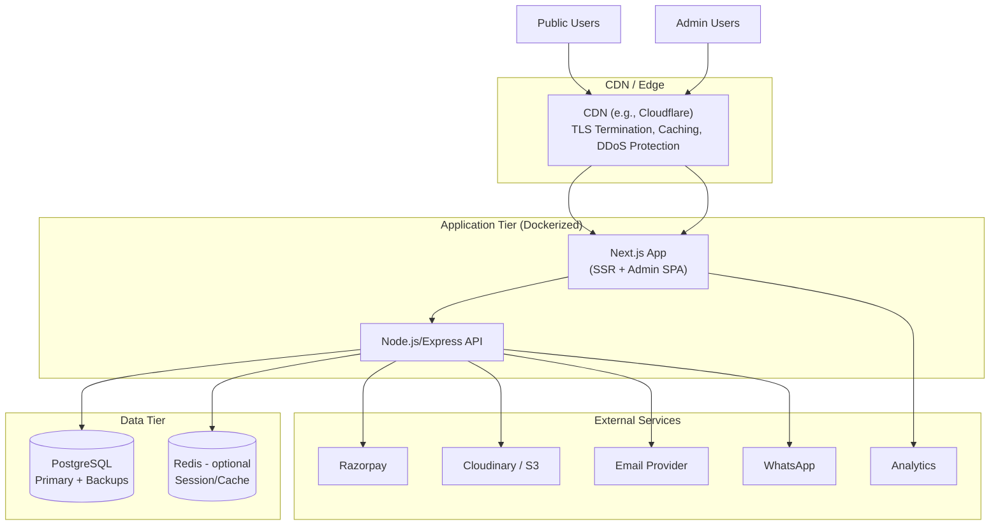

# Technology Stack
## Sai Yadadri Seva Ashram — Website & Donation Platform

| | |
|---|---|
| **Document Version** | 1.0 |
| **Status** | Draft for Client Approval |
| **Date** | 2026-08-03 |
| **Baseline Input** | Client-supplied Requirements doc recommended: Next.js/React, Node.js (Express), PostgreSQL/MongoDB, Razorpay, Hostinger VPS/AWS, Cloudinary/AWS S3 — see [PROJECT_CONTEXT.md §12](../docs/PROJECT_CONTEXT.md) |

---

## 1. Purpose
This document confirms and elaborates the technology stack for the System, validating the client's baseline recommendation against the platform's actual requirements (bilingual content, non-technical CMS users, payment processing, low TCO, scalability).

## 2. Selected Stack

| Layer | Technology | Justification |
|---|---|---|
| **Frontend Framework** | Next.js (React) | Server-side rendering (SSR) + static generation critical for SEO (FR-SEO) and performance (NFR-PERF); built-in internationalized routing supports the EN/TE requirement (FR-LANG) cleanly; large ecosystem reduces long-term maintenance risk |
| **Admin Dashboard** | React (within the Next.js app or a separate SPA build) | Reuses frontend team skillset; component-driven UI suits the many CRUD-heavy admin screens in [09-Admin-Modules.md](09-Admin-Modules.md) |
| **Backend/API** | Node.js with Express (or NestJS for stronger structure at this project's complexity) | Matches client baseline; single-language (JavaScript/TypeScript) stack across frontend and backend simplifies hiring and long-term maintenance for a non-profit with limited ongoing dev budget |
| **Database** | PostgreSQL | Chosen over MongoDB: the data model (§ [08-Database-Requirements.md](08-Database-Requirements.md)) is strongly relational (donations↔donors↔categories↔appeals, RBAC tables) with financial-integrity requirements (transactional consistency for payment records) that map naturally to a relational schema with foreign-key constraints |
| **Payments** | Razorpay | Matches client baseline; strong UPI support (critical for the Indian donor base), hosted Checkout minimizes PCI-DSS scope (see [12-Security-Requirements.md](12-Security-Requirements.md)), native support for Indian non-profit/NGO onboarding |
| **Media/Object Storage** | Cloudinary (primary recommendation) or AWS S3 + CDN | Cloudinary preferred for its built-in image optimization/responsive delivery (directly supports NFR-PERF-05) with less operational overhead than manually configuring S3 + CloudFront for a small technical team |
| **Hosting/Cloud** | Managed VPS (e.g., Hostinger, DigitalOcean) for MVP; AWS/GCP as a scale-up path | Non-profit budget favors a lower-cost managed VPS at launch; containerized deployment (Docker) keeps a future migration to AWS/GCP low-friction if traffic/scale demands it |
| **Containerization** | Docker | Portability across hosting providers (NFR-PORT-03); consistent dev/staging/prod parity |
| **Transactional Email** | Amazon SES or SendGrid | Reliable delivery, DKIM/SPF support for anti-spoofing (see [12-Security-Requirements.md](12-Security-Requirements.md)) |
| **Analytics** | Google Analytics 4 or Plausible (privacy-friendly alternative) | GA4 default per common non-profit familiarity; Plausible offered as a lighter-weight, cookie-consent-simplifying alternative — **client to confirm preference** |
| **CI/CD** | GitHub Actions (or GitLab CI) | Automates lint/test/build/deploy gates per NFR-MAINT-01 |
| **Monitoring** | Uptime monitoring (UptimeRobot/Pingdom) + error tracking (Sentry) | Supports NFR-AVAIL targets and rapid incident response |

## 3. Stack Decision Rationale — Alternatives Considered

| Decision Point | Alternative Considered | Why Not Chosen |
|---|---|---|
| Database: PostgreSQL vs. MongoDB | MongoDB (client's alternate suggestion) | Donation/financial data benefits from ACID transactions and relational integrity constraints (e.g., a donation must reference a valid category and donor); PostgreSQL's JSONB support still allows flexible fields (e.g., audit log snapshots) without sacrificing relational guarantees where they matter most |
| Frontend: Next.js vs. plain React (CRA/Vite SPA) | Client-side-only React SPA | SEO is an explicit, high-priority business objective (BO-04); a pure client-rendered SPA under-serves search engines and initial paint performance compared to Next.js SSR/SSG |
| Hosting: VPS vs. full AWS from day one | Full AWS (ECS/RDS/CloudFront) from launch | Non-profit budget constraint (§ [01-BRD.md §10](01-BRD.md#10-constraints)) — a well-configured managed VPS is materially cheaper at this traffic scale; Docker-based architecture preserves a clean migration path to AWS later without a rewrite |
| Payments: Razorpay vs. PayU/Cashfree | Other Indian gateways | Razorpay explicitly named in client's own baseline; strong UPI + NGO-donation feature support; no compelling reason found in source documents to deviate |

## 4. Architecture Diagram (Deployment View)

## 5. Environment Strategy

| Environment | Purpose | Notes |
|---|---|---|
| Development | Local/dev-server work | Seeded with anonymized/sample data — never real donor PII |
| Staging | Client UAT, QA testing | Mirrors production config; Razorpay in Test Mode |
| Production | Live public site | Razorpay in Live Mode; full monitoring/backup enabled |

## 6. Third-Party Service Dependencies & Client Actions Required

| Service | Action Required From Client |
|---|---|
| Razorpay | Provide/authorize creation of a Razorpay merchant account under the Ashram's legal name; complete KYC (PAN, bank details already available per [PROJECT_CONTEXT.md §2](../docs/PROJECT_CONTEXT.md)) |
| Domain (`sysaindia.org`) | Provide registrar login or DNS access — see [01-BRD.md §7](01-BRD.md#7-information-gaps-requiring-client-input) item 10 |
| Email deliverability | Approve SPF/DKIM DNS record changes for the domain |
| WhatsApp | Confirm the authoritative business WhatsApp number (resolve the phone-number conflicts flagged in [DOCUMENT_ANALYSIS.md](../docs/DOCUMENT_ANALYSIS.md)) |
| Analytics | Confirm GA4 vs. Plausible preference |

## 7. Long-Term Maintainability Considerations

- Single-language stack (JavaScript/TypeScript across frontend + backend) reduces the pool of skills required to maintain the system long-term — important since the Ashram will likely rely on a small, possibly rotating set of developers/volunteers post-launch rather than a large permanent team.
- Docker-based deployment avoids hosting-provider lock-in.
- CMS-driven content model (§ [09-Admin-Modules.md](09-Admin-Modules.md)) ensures 90%+ of day-to-day updates never require a code change or developer engagement, directly supporting BO-05 in [01-BRD.md](01-BRD.md).

---
**Related Documents:** [02-SRS.md](02-SRS.md) · [08-Database-Requirements.md](08-Database-Requirements.md) · [13-API-Requirements.md](13-API-Requirements.md) · [12-Security-Requirements.md](12-Security-Requirements.md) · [MASTER_PROJECT_PLAN.md](MASTER_PROJECT_PLAN.md)
