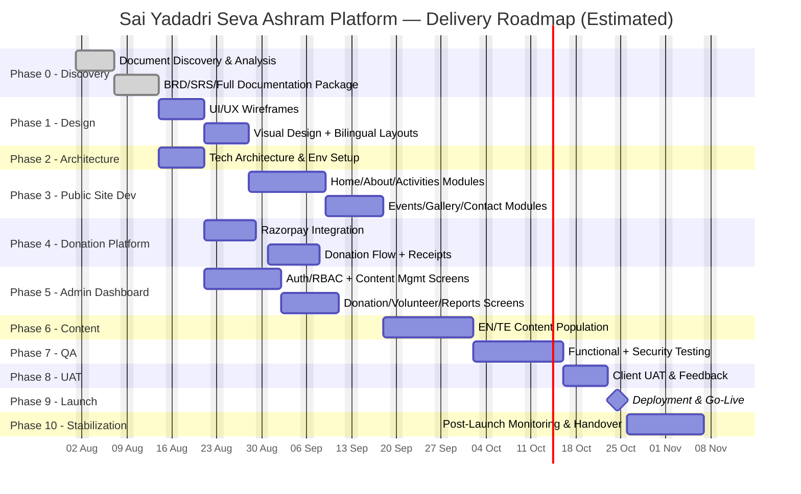
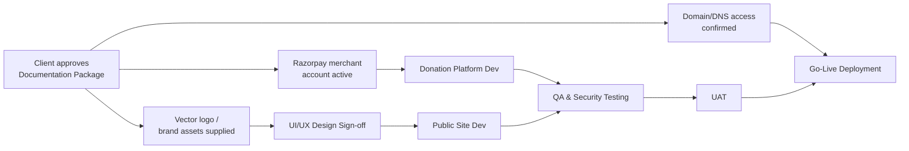

# Project Timeline
## Sai Yadadri Seva Ashram — Website & Donation Platform

| | |
|---|---|
| **Document Version** | 1.0 |
| **Status** | Draft for Client Approval — durations are proposed estimates, not client-confirmed deadlines |
| **Date** | 2026-08-03 |

---

## 1. Purpose
Proposes a phased delivery roadmap. No fixed launch date or budget was supplied by the client (see [01-BRD.md §10](01-BRD.md#10-constraints)); durations below are planning estimates for a project of this scope, calibrated to a small dedicated team, and subject to client confirmation.

## 2. Phase Overview

| Phase | Name | Estimated Duration | Key Dependency |
|---|---|---|---|
| 0 | Discovery & Documentation (this package) | 1 week | Source documents — **complete** |
| 1 | UI/UX Design | 2 weeks | Phase 0 sign-off, brand/logo assets (vector logo pending) |
| 2 | Technical Architecture & Environment Setup | 1 week (overlaps Phase 1) | Technology stack approval |
| 3 | Core Development — Public Site | 3 weeks | Design sign-off |
| 4 | Core Development — Donation Platform | 2 weeks (overlaps Phase 3) | Razorpay merchant account active |
| 5 | Core Development — Admin Dashboard | 3 weeks (overlaps Phase 3/4) | Data model finalized |
| 6 | Content Population & Bilingual Translation | 2 weeks (overlaps Phase 5) | Client-supplied content (§ [01-BRD.md §7](01-BRD.md#7-information-gaps-requiring-client-input)) |
| 7 | QA & Security Testing | 2 weeks | Feature-complete build |
| 8 | UAT (User Acceptance Testing) with Client | 1 week | QA sign-off |
| 9 | Deployment & Go-Live | 3 days | UAT sign-off, DNS/domain access |
| 10 | Post-Launch Stabilization & Handover | 2 weeks | Go-live complete |

**Total estimated timeline: ~14–16 weeks** from design kickoff to stabilized launch, assuming no extended delays waiting on client-supplied content/documents.

## 3. Gantt Chart

## 4. Phase Detail

### Phase 0 — Discovery & Documentation *(Complete)*
Deliverables: `DOCUMENT_ANALYSIS.md`, `PROJECT_CONTEXT.md`, and this full `documentation/` package (16 documents + master plan). **Status: done, pending final client approval to proceed.**

### Phase 1 — UI/UX Design
- Wireframes for all pages in [07-System-Modules.md §7](07-System-Modules.md#7-page-inventory-public-site).
- Visual design system incorporating the Ashram's brand colors (green/yellow/white, per logo) and bilingual typography (Latin + Telugu script pairing).
- **Blocker risk**: vector logo source not yet supplied (PDF only) — design team will need either the vector file or authorization to recreate one from the PDF render.

### Phase 2 — Technical Architecture & Environment Setup
- Finalize technology stack per [11-Technology-Stack.md](11-Technology-Stack.md).
- Provision dev/staging/production environments, CI/CD pipeline, and initial database schema per [08-Database-Requirements.md](08-Database-Requirements.md).

### Phase 3 — Core Development: Public Site
- Build all public modules per [07-System-Modules.md](07-System-Modules.md).
- SEO foundation (FR-SEO-01–04) implemented alongside each page, not retrofitted.

### Phase 4 — Core Development: Donation Platform
- Razorpay sandbox integration, checkout flow, webhook handling, receipt generation.
- **Blocker risk**: requires an active Razorpay merchant account — client action required (see [11-Technology-Stack.md §6](11-Technology-Stack.md#6-third-party-service-dependencies--client-actions-required)).

### Phase 5 — Core Development: Admin Dashboard
- All 14 admin modules per [09-Admin-Modules.md](09-Admin-Modules.md), RBAC enforcement per [10-Roles-and-Permissions.md](10-Roles-and-Permissions.md).

### Phase 6 — Content Population & Bilingual Translation
- Populate committee roster, activities, donation categories/pricing (verified data — see [PROJECT_CONTEXT.md](../docs/PROJECT_CONTEXT.md)).
- Telugu translation of all content — **client to confirm translation resourcing** (Ashram-provided vs. professional translation service; see [16-Assumptions-and-Dependencies.md](16-Assumptions-and-Dependencies.md)).
- **Blocker risk**: multiple content items pending from client (Vision/Mission, Founder bio, compliance certificates, reports) will delay full publication of the About Us, Reports & Transparency, and Donor Corner (CSR) modules specifically — these can launch in a "content pending" state per [03-Functional-Requirements.md](03-Functional-Requirements.md) and be completed post-launch without blocking the overall go-live.

### Phase 7 — QA & Security Testing
- Functional test pass against [03-Functional-Requirements.md](03-Functional-Requirements.md) and [06-Use-Cases.md](06-Use-Cases.md).
- Security checklist execution per [12-Security-Requirements.md §10](12-Security-Requirements.md#10-pre-launch-security-checklist).
- Cross-browser/device and accessibility testing per [04-Non-Functional-Requirements.md](04-Non-Functional-Requirements.md).

### Phase 8 — UAT
- Structured walkthrough with designated Ashram committee representatives (President, General Secretary, Treasurer, at least one Organizing Secretary).
- Non-technical usability validation (NFR-USE-02) specifically with a non-technical admin user.
- Role/person assignment finalized per [10-Roles-and-Permissions.md §8](10-Roles-and-Permissions.md#8-open-items-for-client-confirmation).

### Phase 9 — Deployment & Go-Live
- DNS cutover for `sysaindia.org` (or new domain, per client decision on rebuild vs. parallel build — see [01-BRD.md](01-BRD.md) note in §2).
- Razorpay switched from Test Mode to Live Mode.
- Final smoke test in production.

### Phase 10 — Post-Launch Stabilization & Handover
- Monitoring window with heightened attention to donation-flow errors and performance.
- Admin training session(s) for committee staff.
- Handover documentation and support-transition plan.

## 5. Milestones

| Milestone | Target (relative to kickoff) |
|---|---|
| M1 — Documentation Approved | Week 0 (this package) |
| M2 — Design Sign-off | End of Week 3 |
| M3 — Feature-Complete Build | End of Week 10 |
| M4 — QA Sign-off | End of Week 12 |
| M5 — UAT Sign-off | End of Week 13 |
| M6 — Go-Live | Week 14 |
| M7 — Stabilization Complete / Handover | Week 16 |

## 6. Critical Path Dependencies

The three items on this critical path most likely to slip the schedule are: **(1)** vector logo/brand asset delivery, **(2)** Razorpay merchant account activation, **(3)** domain/DNS access — all currently open items per [01-BRD.md §7](01-BRD.md#7-information-gaps-requiring-client-input) and [16-Assumptions-and-Dependencies.md](16-Assumptions-and-Dependencies.md).

---
**Related Documents:** [01-BRD.md](01-BRD.md) · [15-Risk-Analysis.md](15-Risk-Analysis.md) · [16-Assumptions-and-Dependencies.md](16-Assumptions-and-Dependencies.md) · [MASTER_PROJECT_PLAN.md](MASTER_PROJECT_PLAN.md)
