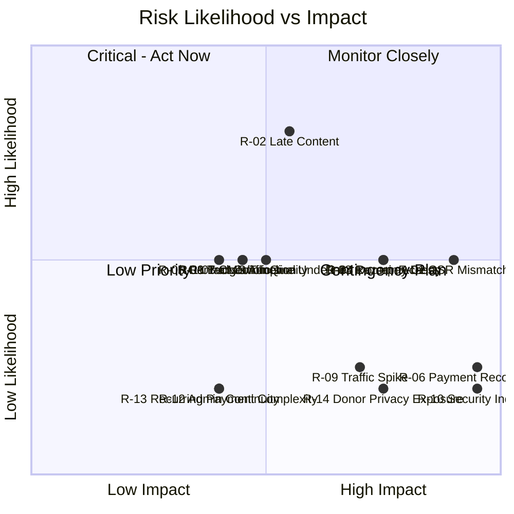

# Risk Analysis
## Sai Yadadri Seva Ashram — Website & Donation Platform

| | |
|---|---|
| **Document Version** | 1.0 |
| **Status** | Draft for Client Approval |
| **Date** | 2026-08-03 |

---

## 1. Purpose
Registers identified risks to the project's successful delivery and to the platform's ongoing operation, with likelihood, impact, and mitigation strategy. Reviewed and updated at each project phase gate.

## 2. Risk Scoring Model

- **Likelihood**: Low / Medium / High
- **Impact**: Low / Medium / High / Critical
- **Risk Level** = combination of the two (Critical impact + any likelihood ≥ Medium is always flagged High priority)

## 3. Risk Register

| ID | Risk | Category | Likelihood | Impact | Risk Level | Mitigation |
|---|---|---|---|---|---|---|
| R-01 | **CSR registration entity mismatch is not resolved before launch**, risking publication of incorrect/misleading CSR claims. | Compliance/Legal | Medium | Critical | **High** | CSR Partner section remains hidden/unpublished until the Ashram confirms its actual CSR status; documented explicitly in [DOCUMENT_ANALYSIS.md](../docs/DOCUMENT_ANALYSIS.md) and [01-BRD.md §7](01-BRD.md#7-information-gaps-requiring-client-input). No CSR claim will be published without client written confirmation. |
| R-02 | Client-supplied content (Vision/Mission, Founder bio, compliance certificates, reports) arrives significantly late, delaying full-content go-live. | Schedule | High | Medium | High | Platform architecture explicitly supports partial/"Coming Soon" publication (see FR-ABOUT-02/03, FR-RPT-01) so the technical launch is decoupled from content-completeness; content backlog tracked and chased post-launch. |
| R-03 | Razorpay merchant account activation (KYC) takes longer than expected, delaying the Donation Platform. | Schedule/Dependency | Medium | High | High | Initiate Razorpay onboarding at project kickoff (Phase 0/1), in parallel with design work, not after development begins; bank-transfer/UPI-QR display (FR-DON-04) remains available as a fallback donation method regardless. |
| R-04 | Domain/DNS access for `sysaindia.org` is unavailable or held by a third party no longer affiliated with the Ashram. | Technical/Dependency | Medium | High | High | Confirm registrar access early (Phase 0/1); prepare a fallback plan (new domain + 301 redirect strategy) if original access cannot be recovered in time. |
| R-05 | Two conflicting mobile numbers for President and Treasurer (per [DOCUMENT_ANALYSIS.md](../docs/DOCUMENT_ANALYSIS.md)) lead to incorrect public contact information. | Data Quality | Medium | Medium | Medium | Numbers withheld from public display until the Ashram confirms the correct current number for each; committee data change tracked via Committee Management admin module. |
| R-06 | Donation payment failures or webhook delivery issues cause a donor to be charged without a corresponding system record (or vice versa). | Financial/Technical | Low | Critical | High | Signature-verified webhooks + fallback reconciliation polling job (UC-01 Alt Flow); manual reconciliation workflow (UC-04) as a safety net; documented in [12-Security-Requirements.md](12-Security-Requirements.md) and [13-API-Requirements.md](13-API-Requirements.md). |
| R-07 | Non-technical committee admin users find the CMS difficult to use, leading to content stagnation post-launch (undermining BO-05). | Adoption/UX | Medium | Medium | Medium | Usability validation session with a real non-technical admin before launch (NFR-USE-02); admin training in Phase 10; simple, guided CMS UI design prioritized in Phase 1. |
| R-08 | Telugu translation quality/coverage is inconsistent if sourced informally rather than professionally. | Content Quality | Medium | Medium | Medium | Client to confirm translation resourcing approach (see [16-Assumptions-and-Dependencies.md](16-Assumptions-and-Dependencies.md)); admin CMS flags missing/incomplete translations before publish (FR-LANG-02). |
| R-09 | Traffic spike during a festival/appeal campaign causes performance degradation or donation-flow failures at the exact moment donation intent is highest. | Technical/Scalability | Low | High | Medium | Load testing before launch (NFR-SCALE-01), horizontally scalable stateless architecture (NFR-SCALE-02), CDN caching for static/public content. |
| R-10 | Security incident (data breach, admin account compromise) damages donor trust in a charitable organization. | Security | Low | Critical | Medium | Full OWASP mitigation checklist (see [12-Security-Requirements.md](12-Security-Requirements.md)), incident response plan defined, no card data stored on Ashram infrastructure. |
| R-11 | Budget/timeline not yet confirmed by client, risking scope creep or misaligned expectations. | Project Management | Medium | Medium | Medium | [01-BRD.md](01-BRD.md) and [14-Project-Timeline.md](14-Project-Timeline.md) explicitly flag durations/budget as estimates pending client confirmation; formal change-request process recommended for any scope addition post-approval. |
| R-12 | Key committee members (e.g., sole Super Admin) become unavailable, creating an access/continuity gap. | Operational | Low | Medium | Low | Recommend ≥ 2 Super Admin accounts (see [10-Roles-and-Permissions.md §8](10-Roles-and-Permissions.md#8-open-items-for-client-confirmation)); account recovery procedure documented in handover materials. |
| R-13 | Recurring/subscription donations (Goseva monthly tiers) introduce payment-retry and dunning complexity if implemented in Phase 1 rather than Phase 2. | Technical/Financial | Low | Medium | Low | Recurring donations scoped as Should/Could Have (FR-DON-08) for a later phase, reducing MVP complexity and risk. |
| R-14 | Public-facing donor recognition (Major/Monthly/CSR lists) inadvertently exposes a donor who did not consent to public listing. | Privacy | Low | High | Medium | Strict `recognition_opt_in` enforcement at the data and query layer (SEC-DATA-05), never inferred/default-true. |

## 4. Risk Heat Map

## 5. Risk Ownership & Review Cadence

| Risk Category | Owner | Review Cadence |
|---|---|---|
| Compliance/Legal (R-01, R-05) | Project Manager + Client Liaison | Before each content-publishing milestone |
| Schedule/Dependency (R-02, R-03, R-04) | Project Manager | Weekly during active development |
| Technical/Financial (R-06, R-09, R-13) | Backend Architect + DevOps Engineer | Each sprint review, plus dedicated pre-launch review |
| Security (R-10, R-14) | Security Engineer | Pre-launch checklist + quarterly post-launch review |
| Adoption/UX (R-07, R-08) | UI/UX Designer + Project Manager | UAT phase, then 30 days post-launch |
| Project Management (R-11, R-12) | Project Manager | Kickoff, then monthly |

---
**Related Documents:** [01-BRD.md](01-BRD.md) · [14-Project-Timeline.md](14-Project-Timeline.md) · [16-Assumptions-and-Dependencies.md](16-Assumptions-and-Dependencies.md) · [MASTER_PROJECT_PLAN.md](MASTER_PROJECT_PLAN.md)
