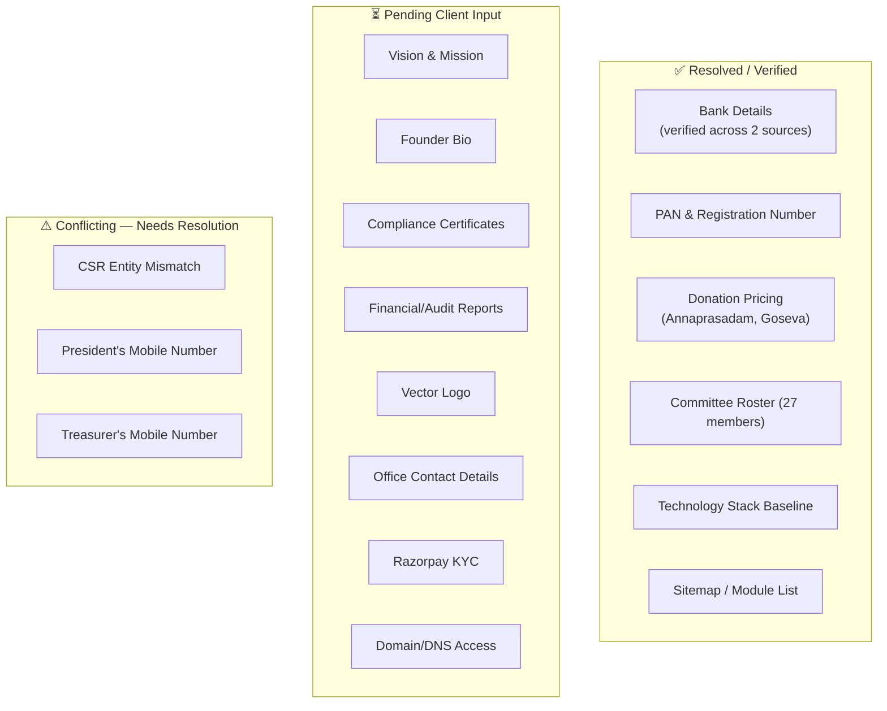

# Assumptions and Dependencies
## Sai Yadadri Seva Ashram — Website & Donation Platform

| | |
|---|---|
| **Document Version** | 1.0 |
| **Status** | Draft for Client Approval |
| **Date** | 2026-08-03 |

---

## 1. Purpose
Consolidates every assumption made in this documentation package due to missing or unconfirmed client information, and every external dependency the project relies on. This is the authoritative "things that must be confirmed or supplied" register — cross-referenced from every other document in this package.

## 2. Assumptions

| ID | Assumption | Basis | Impact if Wrong |
|---|---|---|---|
| A-01 | This project is a full redesign/replatform of the existing `sysaindia.org`, not a parallel second site. | Brochure lists this URL as the current site; no explicit client statement of intent found in source documents. | Domain/DNS/migration plan in [14-Project-Timeline.md](14-Project-Timeline.md) would need rework if a parallel/new-domain build is actually intended. |
| A-02 | Donation pricing (Annaprasadam, Goseva tiers) printed in the 26-08-2025 brochure is current and accurate at project start. | Brochure is the only pricing source supplied; cross-verified internally consistent across brochure pages. | Any pricing change must be communicated by the Ashram and updated in the admin CMS — the system is designed to make this a non-technical content update (FR-DON-01). |
| A-03 | The committee roster in `COMMITTEE MEMBERS LIST.docx` (27 members) is more current/authoritative than the brochure's 25-member photo grid. | Docx is a dedicated, structured data file; brochure is a print design with a visibly incomplete subset. | If the brochure grid is actually more current, the committee data must be corrected via the Committee Management admin module before launch. |
| A-04 | Razorpay is an acceptable and sufficient payment gateway for the Ashram's needs (no specific alternate gateway preference exists). | Explicitly recommended in the client's own Website Requirements document. | Gateway swap would affect [11-Technology-Stack.md](11-Technology-Stack.md) and [13-API-Requirements.md](13-API-Requirements.md) integration work. |
| A-05 | English and Telugu are the only languages required at launch (no Hindi or other regional language requirement). | Explicitly stated as EN/Telugu in the client's Website Requirements document. | Additional language support would require Multi-Language Engine scope expansion. |
| A-06 | The Ashram will designate specific individuals to hold each admin role (Super Admin, Content Admin, Finance Admin, Volunteer Coordinator) before UAT. | Standard project onboarding requirement; not yet specified by client. | Admin onboarding/training in Phase 10 cannot proceed without this. |
| A-07 | No native mobile app is required for Phase 1 — a responsive website is sufficient. | Not requested in any source document. | Would require a new scope/budget discussion if incorrect. |
| A-08 | The Ashram will supply or approve legal text for a Privacy Policy and Terms of Use, rather than requiring the delivery team to draft these independently as legal counsel. | Standard practice; no legal counsel identified in source documents. | Vinofyx can provide a template starting point, but final legal responsibility for policy content rests with the Ashram unless explicitly contracted otherwise. |
| A-09 | Donation and donor records will be retained indefinitely by default for audit/compliance purposes, absent an Ashram-specified retention/deletion policy. | No retention policy supplied. | If the Ashram requires a specific retention/deletion schedule (e.g., for privacy-law compliance), [08-Database-Requirements.md §6](08-Database-Requirements.md#6-data-retention--privacy) must be revised accordingly. |
| A-10 | The two CSR-related entities (Sai Yadadri Seva Ashram vs. Sri Shiridi Sai Seva Society) are either unrelated, or their relationship has not yet been clarified to the documentation team — no assumption is made about which is correct. | Direct conflict identified in supplied CSR-1 letter vs. PAN card. | See [DOCUMENT_ANALYSIS.md](../docs/DOCUMENT_ANALYSIS.md) §5 — **no CSR content will be published under either assumption until the client clarifies.** |

## 3. External Dependencies

| ID | Dependency | Required From | Blocks |
|---|---|---|---|
| D-01 | Razorpay merchant account activation (KYC using PAN ABKAS9261K and SBI bank details) | Client (Ashram) | Donation Platform Phase 4 (Live Mode) |
| D-02 | Domain registrar/DNS access for `sysaindia.org` | Client (Ashram) | Go-Live deployment (Phase 9) |
| D-03 | Vector logo source file (SVG/AI) | Client (Ashram's designer) or authorization to recreate from supplied PDF | UI/UX Design Phase 1 |
| D-04 | Vision & Mission statement text | Client (Ashram) | About Us full publication (FR-ABOUT-02) |
| D-05 | Founder biography (for the Ashram itself) | Client (Ashram) | About Us full publication (FR-ABOUT-03) |
| D-06 | Treasurer's Message text | Client (Treasurer, K. Vidyasagar Reddy) | About Us full publication (FR-ABOUT-05) |
| D-07 | Society Registration Certificate, 12AB Certificate, 80G Certificate (scanned copies) | Client (Ashram) | Reports & Transparency, tax-deduction donor messaging |
| D-08 | Annual Reports, Audit Reports, Financial Statements | Client (Treasurer/Finance team) | Reports & Transparency module (FR-RPT-01) |
| D-09 | Testimonials (beneficiary/donor quotes, with consent to publish) | Client (Ashram) | Homepage testimonials (FR-HOME-05) |
| D-10 | Gallery photos/videos (rights-cleared, higher resolution than brochure embeds) | Client (Ashram) | Gallery module (FR-GAL-01/02) |
| D-11 | Official office phone, email, and hours | Client (Ashram) | Contact Us module (FR-CON-02) |
| D-12 | Exact Google Maps location/coordinates | Client (Ashram) | Contact Us map embed (FR-CON-03) |
| D-13 | Confirmed WhatsApp business number (resolving R-05 phone conflicts) | Client (Ashram) | WhatsApp integration (FR-NOTIF-02) |
| D-14 | Social media profile links | Client (Ashram) | Contact Us / footer (FR-CON-04) |
| D-15 | Resolution of CSR entity mismatch | Client (Ashram) | CSR Partner section (FR-DONOR-03) |
| D-16 | Correct current mobile numbers for President and Treasurer | Client (Ashram) | Public contact display accuracy |
| D-17 | Translation resourcing decision (in-house Ashram volunteer vs. professional translation service) for Telugu content | Client (Ashram) | Phase 6 Content Population timeline |
| D-18 | Budget and firm launch-date confirmation | Client (Ashram) | Finalization of [14-Project-Timeline.md](14-Project-Timeline.md) as a committed (not estimated) schedule |
| D-19 | Designation of specific individuals to each admin role | Client (Ashram) | UAT (Phase 8) and admin training (Phase 10) |
| D-20 | Preset/suggested donation amounts for "Old Age Home (general)" and "General Donation" categories | Client (Ashram) | Donation UI preset-amount buttons for these two categories (currently free-text only) |

## 4. Dependency Status Dashboard

## 5. Process for Resolving Open Items

1. This document is shared with the Ashram's designated point of contact (per [01-BRD.md §5](01-BRD.md#5-stakeholders)) alongside the rest of the documentation package.
2. Each open item (D-01 through D-20, C-flagged conflicts) is tracked to closure before its corresponding blocked feature enters its final QA/UAT gate.
3. Items not resolved by the relevant phase gate in [14-Project-Timeline.md](14-Project-Timeline.md) result in that specific feature/section launching in a "pending" state (per the graceful-degradation pattern established throughout [03-Functional-Requirements.md](03-Functional-Requirements.md)) rather than blocking the entire platform's go-live.

---
**Related Documents:** [01-BRD.md](01-BRD.md) · [15-Risk-Analysis.md](15-Risk-Analysis.md) · `docs/DOCUMENT_ANALYSIS.md` · `docs/PROJECT_CONTEXT.md` · [MASTER_PROJECT_PLAN.md](MASTER_PROJECT_PLAN.md)
