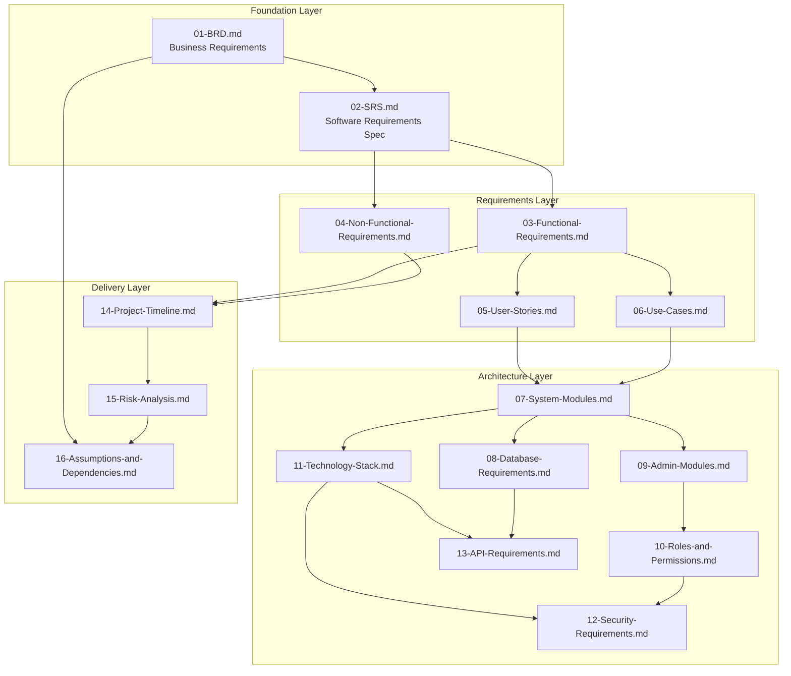
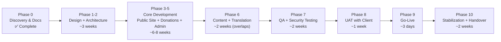

# Master Project Plan
## Sai Yadadri Seva Ashram — Website & Donation Platform

| | |
|---|---|
| **Document Version** | 1.0 |
| **Status** | Draft for Client Approval — Phase 1 Deliverable |
| **Date** | 2026-08-03 |
| **Prepared By** | Vinofyx — acting as Business Analyst, Solution Architect, and Technical Project Manager |
| **Source of Truth** | `docs/PROJECT_CONTEXT.md`, `docs/DOCUMENT_ANALYSIS.md` |

---

## 1. Purpose of This Document

This is the top-level index and implementation roadmap for the entire documentation package. It explains how the 16 numbered documents fit together, in what order they should be read and approved, and how the project moves from documentation to a live, production platform. **No application code has been written or generated as part of this phase**, per the engagement scope.

## 2. Project Summary

Sai Yadadri Seva Ashram (Regd. No. 423/2019, Hyderabad) requires a bilingual (English/Telugu), enterprise-grade website with an integrated online donation platform and a role-based admin back office, to replace/replatform its existing presence at `sysaindia.org` and support its growing programs (Vanaprasthasramam Old Age Home, Annaprasadam, Goseva, Education, Medical Support) and an upcoming ₹2.25 Crore building-expansion capital campaign.

Full business context: [01-BRD.md](01-BRD.md).

## 3. Document Map

## 4. Reading & Approval Order

| Order | Document | Why This Order |
|---|---|---|
| 1 | [01-BRD.md](01-BRD.md) | Establishes *why* — business objectives, scope, stakeholders. Everything else derives from this. |
| 2 | [02-SRS.md](02-SRS.md) | Translates business objectives into a technical requirements baseline. |
| 3 | [03-Functional-Requirements.md](03-Functional-Requirements.md) | Every feature the system must have, module by module. |
| 4 | [04-Non-Functional-Requirements.md](04-Non-Functional-Requirements.md) | Quality bar the features must meet (performance, security, accessibility). |
| 5 | [05-User-Stories.md](05-User-Stories.md) | Requirements reframed from each persona's point of view — useful for validating nothing was missed. |
| 6 | [06-Use-Cases.md](06-Use-Cases.md) | Step-by-step workflows for the most important interactions (donation, volunteering, admin operations). |
| 7 | [07-System-Modules.md](07-System-Modules.md) | How requirements map to actual pages/modules and their dependencies. |
| 8 | [08-Database-Requirements.md](08-Database-Requirements.md) | The data model underlying every module. |
| 9 | [09-Admin-Modules.md](09-Admin-Modules.md) | Full back-office specification for the Ashram's own staff. |
| 10 | [10-Roles-and-Permissions.md](10-Roles-and-Permissions.md) | Who can do what — governs both admin UX and API security. |
| 11 | [11-Technology-Stack.md](11-Technology-Stack.md) | What the system will be built with, and why. |
| 12 | [12-Security-Requirements.md](12-Security-Requirements.md) | How donor data and payments are protected. |
| 13 | [13-API-Requirements.md](13-API-Requirements.md) | The contract between frontend, admin dashboard, and backend. |
| 14 | [14-Project-Timeline.md](14-Project-Timeline.md) | The proposed delivery roadmap, phase by phase. |
| 15 | [15-Risk-Analysis.md](15-Risk-Analysis.md) | What could go wrong and how it's being managed. |
| 16 | [16-Assumptions-and-Dependencies.md](16-Assumptions-and-Dependencies.md) | Everything still needed from the client — **the single most important document for the client to action before Phase 2 begins.** |

## 5. Critical Client Action Items (Consolidated)

The following must be resolved before the corresponding project phase can complete — full detail in [16-Assumptions-and-Dependencies.md](16-Assumptions-and-Dependencies.md):

### ⚠️ Conflicts Requiring Clarification (highest priority)
1. **CSR registration mismatch** — the supplied CSR-1 letter belongs to a different legal entity than Sai Yadadri Seva Ashram. No CSR content will be published until resolved.
2. **President's and Treasurer's mobile numbers** differ between the committee list and the brochure — confirm the correct current numbers.

### 📋 Content & Documents Needed
3. Vision & Mission statement · 4. Founder biography · 5. Treasurer's Message · 6. Society Registration/12AB/80G certificates · 7. Annual/Audit Reports & Financial Statements · 8. Testimonials · 9. Higher-resolution gallery media · 10. Office phone/email/hours · 11. Map coordinates · 12. Confirmed WhatsApp number · 13. Social media links · 14. Preset donation amounts for two remaining categories.

### 🔧 Technical/Business Setup Needed
15. Vector logo file (SVG/AI) · 16. Razorpay merchant account KYC · 17. Domain/DNS access for `sysaindia.org` · 18. Confirmation of rebuild vs. parallel-build intent · 19. Budget and firm launch-date · 20. Named individuals for each admin role · 21. Translation resourcing decision (EN→TE).

## 6. Implementation Roadmap (Executive Summary)

Full detail in [14-Project-Timeline.md](14-Project-Timeline.md). High-level flow:

**Estimated total: 14–16 weeks from design kickoff**, assuming client action items in §5 are progressed in parallel rather than sequentially blocking development.

## 7. Team Roles for This Engagement

Consistent with the multi-disciplinary team structure requested for this project:

| Role | Primary Deliverables in This Package |
|---|---|
| Business Analyst | [01-BRD.md](01-BRD.md), [05-User-Stories.md](05-User-Stories.md) |
| Solution Architect | [02-SRS.md](02-SRS.md), [07-System-Modules.md](07-System-Modules.md), [11-Technology-Stack.md](11-Technology-Stack.md) |
| UI/UX Designer | Consumes [03-Functional-Requirements.md](03-Functional-Requirements.md) + [07-System-Modules.md](07-System-Modules.md) to produce wireframes/visual design in Phase 1 (next phase, not part of this documentation deliverable) |
| Frontend Architect | Consumes [13-API-Requirements.md](13-API-Requirements.md), [11-Technology-Stack.md](11-Technology-Stack.md) |
| Backend Architect | Consumes [08-Database-Requirements.md](08-Database-Requirements.md), [13-API-Requirements.md](13-API-Requirements.md), [12-Security-Requirements.md](12-Security-Requirements.md) |
| Database Architect | [08-Database-Requirements.md](08-Database-Requirements.md) |
| DevOps Engineer | [11-Technology-Stack.md §4-5](11-Technology-Stack.md#4-architecture-diagram-deployment-view), [04-Non-Functional-Requirements.md](04-Non-Functional-Requirements.md) (Availability/Scalability) |
| QA Engineer | [06-Use-Cases.md](06-Use-Cases.md), [03-Functional-Requirements.md](03-Functional-Requirements.md), [04-Non-Functional-Requirements.md](04-Non-Functional-Requirements.md) |
| SEO Specialist | FR-SEO requirements in [03-Functional-Requirements.md §13](03-Functional-Requirements.md#13-search-engine-optimization-fr-seo) |
| Security Engineer | [12-Security-Requirements.md](12-Security-Requirements.md) |
| Technical Writer | This full documentation package |
| Project Manager | [14-Project-Timeline.md](14-Project-Timeline.md), [15-Risk-Analysis.md](15-Risk-Analysis.md), [16-Assumptions-and-Dependencies.md](16-Assumptions-and-Dependencies.md) |

## 8. What Happens Next

This Phase 1 documentation package is now **complete and awaiting your approval**, per your instruction to stop at this gate.

Upon your approval, the recommended next steps are:
1. You review and respond to the **Critical Client Action Items** in §5 (can proceed in parallel with Phase 1 design work — does not need to be 100% complete before design starts).
2. You confirm or adjust the proposed technology stack ([11-Technology-Stack.md](11-Technology-Stack.md)) and timeline ([14-Project-Timeline.md](14-Project-Timeline.md)).
3. The team proceeds to **Phase 1: UI/UX Design** (wireframes and visual design), which is the next phase after this documentation gate — not started until you give explicit approval, consistent with your "never continue automatically" instruction.

**No code will be written until you separately approve moving into the design/development phases.**

## 9. Document Change Control

| Version | Date | Change |
|---|---|---|
| 1.0 | 2026-08-03 | Initial complete documentation package (Phase 1) |

Future revisions to any document in this package should increment that document's individual version number and be reflected in this table if the change is material to the overall roadmap.

---

## Full Document Index

1. [01-BRD.md](01-BRD.md) — Business Requirements Document
2. [02-SRS.md](02-SRS.md) — Software Requirements Specification
3. [03-Functional-Requirements.md](03-Functional-Requirements.md)
4. [04-Non-Functional-Requirements.md](04-Non-Functional-Requirements.md)
5. [05-User-Stories.md](05-User-Stories.md)
6. [06-Use-Cases.md](06-Use-Cases.md)
7. [07-System-Modules.md](07-System-Modules.md)
8. [08-Database-Requirements.md](08-Database-Requirements.md)
9. [09-Admin-Modules.md](09-Admin-Modules.md)
10. [10-Roles-and-Permissions.md](10-Roles-and-Permissions.md)
11. [11-Technology-Stack.md](11-Technology-Stack.md)
12. [12-Security-Requirements.md](12-Security-Requirements.md)
13. [13-API-Requirements.md](13-API-Requirements.md)
14. [14-Project-Timeline.md](14-Project-Timeline.md)
15. [15-Risk-Analysis.md](15-Risk-Analysis.md)
16. [16-Assumptions-and-Dependencies.md](16-Assumptions-and-Dependencies.md)

*Supporting source data: `../docs/PROJECT_CONTEXT.md`, `../docs/DOCUMENT_ANALYSIS.md`*
